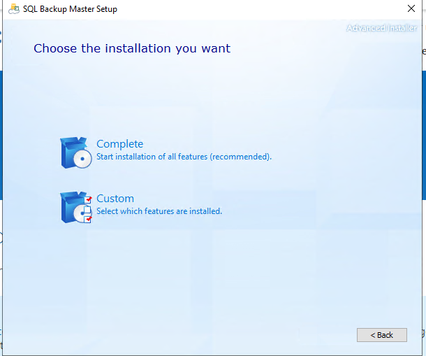
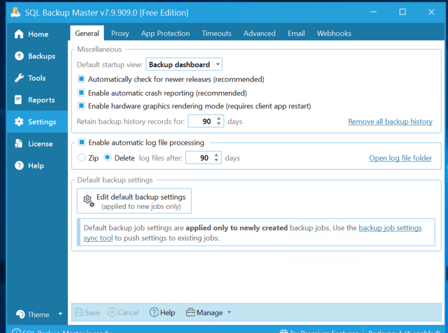
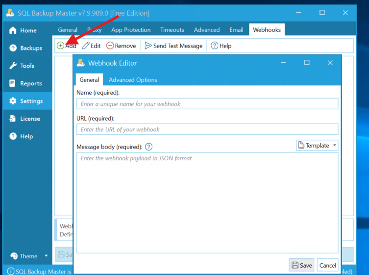
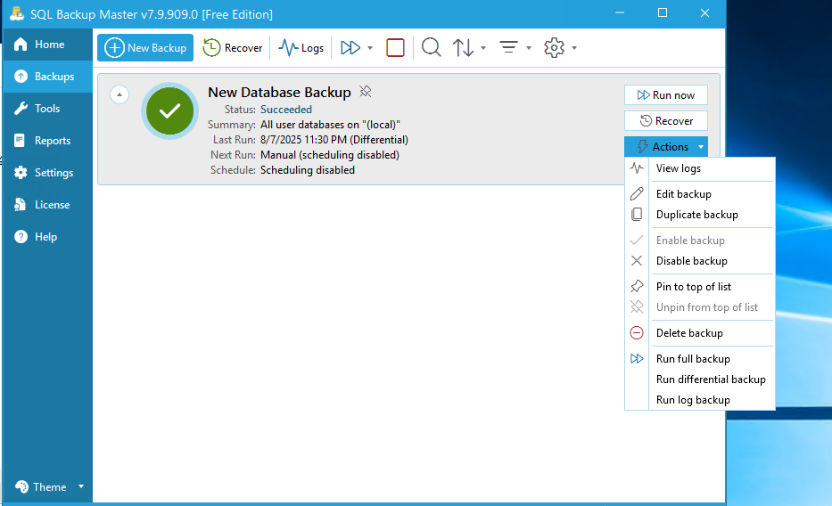
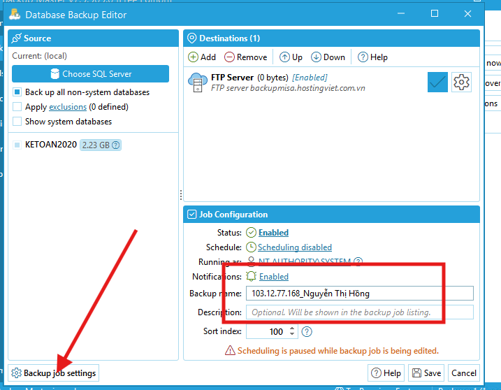
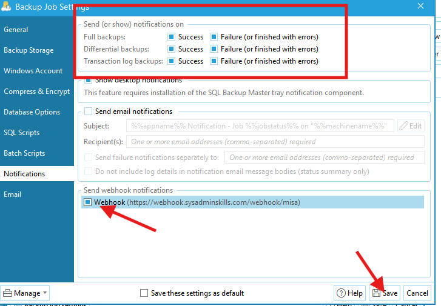
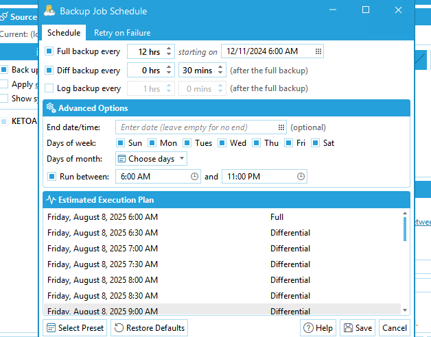
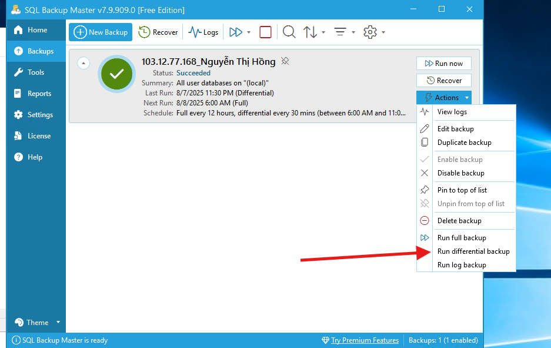

# Cấu hình SQL backup Master để chuyển log về Webhook
# 0. Chuẩn bị

Đối với linux, truy cập vào máy tính của khách hàng bằng `xfreerdp3`. Trước đó tạo thư mục chia sẻ chung giữa hai máy để tiện sao chép dữ liệu sang,

```zsh
sudo mkdir /mnt/share
```

```zsh
cat /mnt/share/config 
Webhook


https://webhook.sysadminskills.com/webhook/misa


{ "job": "%%jobname%%", "status": "%%jobstatus%%", "machine": "%%machinename%%", "backuptype": "%%backuptype%%", "error": "%%error%%" }


103.12.77.212_Lê Luyện

```

Ví dụ nội dung mà ta cần thao tác như trên để chia sẻ cho nhanh.

Kết nối đến máy chủ của khách hàng:

```zsh
xfreerdp3 /v:<ip> /u:administrator /p:<password> /dynamic-resolution /drive:linux,/mnt/share
```


# 1. Cài lại MySQL backup Master

- GỠ cài đặt bản cũ: Control Panel -> Uninstall Program -> Uninstall Mysql Backup Master

Tải file setup mới về và cài đặt

- Run SQL backup master.
- 


Ở bước này chọn complete
# 2. Cấu hình để gửi log đến Webhook

Vào setting, chọn Webhook



Chọn Add



Cấu hình như sau:

Name:

```
Webhook
```

URL:

```url
https://webhook.sysadminskills.com/webhook/misa
```

Message body

```json
{ "job": "%%jobname%%", "status": "%%jobstatus%%", "machine": "%%machinename%%", "backuptype": "%%backuptype%%", "error": "%%error%%" }
```

Chú ý save lại.

Tiếp sang mục backup -> Action -> Edit backup



Nhập backup name như hình



Chọn backup Job settings -> Notifications -> Setting như hình



Chọn lại task schedule cho đủ 12 hours



Lưu lại, chọn action -> Run Differemtial back up



Tiếp theo truy cập vào: https://webhook.sysadminskills.com/
Kiểm tra log xem thành công hay lỗi.