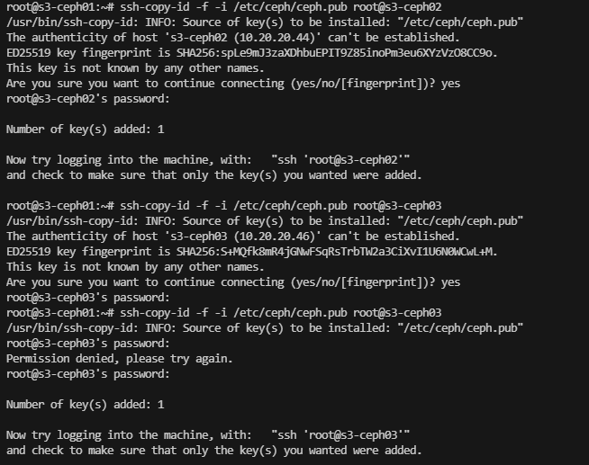
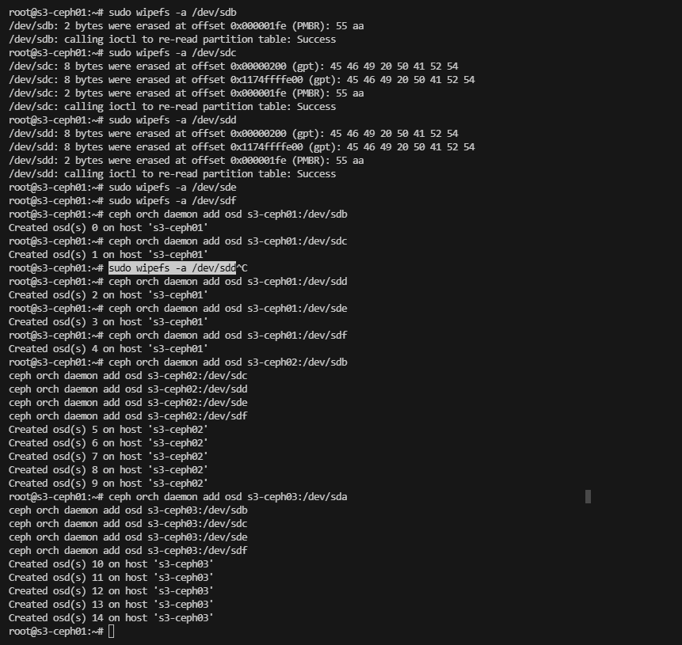
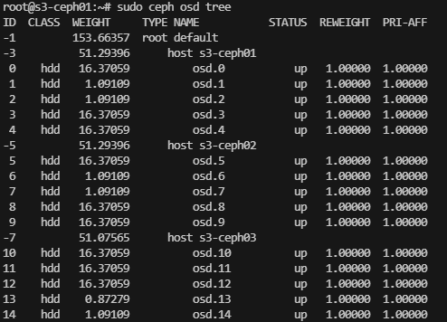
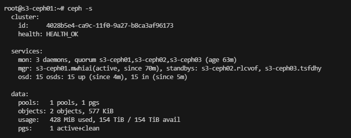
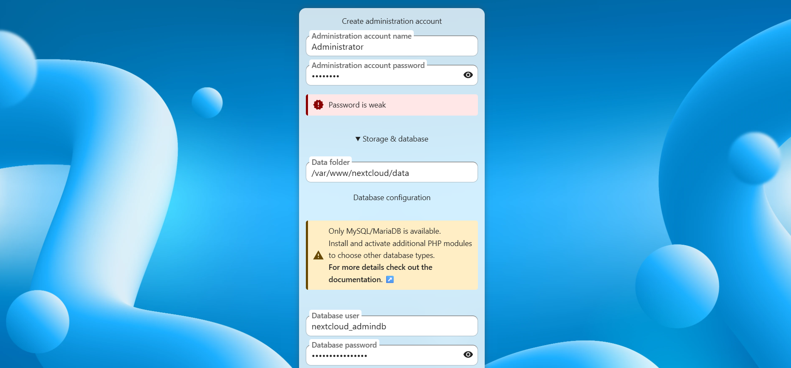
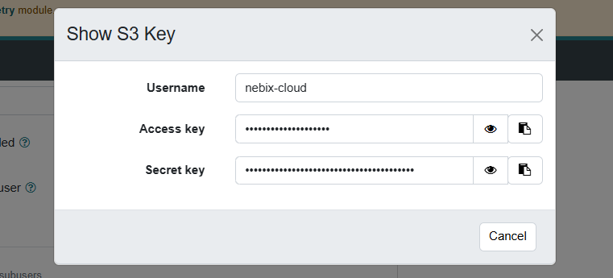
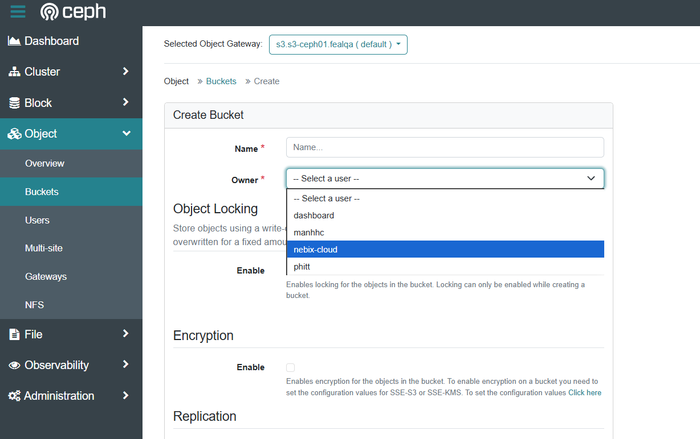

# 1.Sơ đồ chung

```

```

# 2. Cấu hình mạng

## 2.1 Cấu hình cho Switch

Cấu hình để remote switch

```zsh
enable  
configure terminal  
vrf context management  
ip route 0.0.0.0 0.0.0.0 10.110.200.60
interface mgmt0  
ip address 10.110.200.254 255.255.255.0  
no shutdown  
feature ssh  
end

copy running-config startup-config
```

Bật 4 port 10G ở bên trái thay cho port1 40G (E1/1) trên Cisco 3132Q-V, port 1 40G lúc này không dùng được nữa

```zsh
conf t
hardware profile front portmode sfp-plus
copy running-config startup-config
reload
```

Cách chia 1 port 40G thành 4 port 10G

```zsh
conf t
interface breakout module 1 port 1 map 10g-4x
copy running-config startup-config
reload
```


Cấu hình vlan

```zsh
! Kích hoạt các tính năng cần thiết
feature vpc
feature lacp
  
SW1&SW2(config)# vlan 20
SW1&SW2(config-vlan)# name vlancluster
SW1&SW2(config-vlan)# vlan 30
SW1&SW2(config-vlan)# name vlanpublic
SW1&SW2(config-vlan)# exit

```

**Cấu Hình VPC Domain 1 & Peer link**  
Cấu hình domain và peer link.

_Trên SW1:_

```zsh
vpc domain 1
role priority 1000
peer-keepalive destination 10.110.200.61 source 10.110.200.60 vrf management
peer-gateway
auto-recovery
exit
```

_Trên SW2:_

```zsh
vpc domain 1
role priority 2000
peer-keepalive destination 10.110.200.60 source 10.110.200.61 vrf management
peer-gateway
auto-recovery
exit
```

Cấu hình peering, port-channel 1, làm trên 2 sw giống nhau

TRƯỚC TIÊN - cấu hình port-channel 1

```zsh
interface port-channel1
  description vPC-peer-link
  switchport mode trunk
  switchport trunk native vlan 999
  switchport trunk allowed vlan 1,20,30,999
  spanning-tree port type network
  vpc peer-link
  no shutdown
  exit
```

Port 31

```zsh
interface ethernet1/31
  description to-SW2-peer-link-1
  switchport mode trunk
  switchport trunk native vlan 999
  switchport trunk allowed vlan 1,20,30,999
  channel-group 1 mode active
  no shutdown
```

Port 32

```zsh
interface ethernet1/32
  description to-SW2-peer-link-2
  switchport mode trunk
  switchport trunk native vlan 999
  switchport trunk allowed vlan 1,20,30,999
  channel-group 1 mode active
  no shutdown
```


Kiểm tra peering (nếu đã cắm dây)

```zsh
show vpc


Legend:
                (*) - local vPC is down, forwarding via vPC peer-link

vPC domain id                     : 1
Peer status                       : peer link is down
vPC keep-alive status             : Suspended (Destination IP not reach
Configuration consistency status  : failed
Per-vlan consistency status       : success
Configuration inconsistency reason: Consistency Check Not Performed
Type-2 inconsistency reason       : Consistency Check Not Performed
vPC role                          : none established
Number of vPCs configured         : 0
Peer Gateway                      : Enabled
Dual-active excluded VLANs        : -
Graceful Consistency Check        : Disabled (due to peer configuration
Auto-recovery status              : Enabled, timer is off.(timeout = 24
Delay-restore status              : Timer is off.(timeout = 30s)
Delay-restore SVI status          : Timer is off.(timeout = 10s)
Operational Layer3 Peer-router    : Disabled

vPC Peer-link status
---------------------------------------------------------------------
id    Port   Status Active vlans
--    ----   ------ -------------------------------------------------
1     Po1    up     -

```

### **Cấu hình interface e1/1/3 cho keepalive link**

Trên SW1

```zsh
interface ethernet1/1/3
  description Keepalive-link-to-SW2
  no switchport
  vrf member management
  ip address 10.110.200.60/29
  no shutdown
```

Trên SW2

```zsh
interface ethernet1/1/3
  description Keepalive-link-to-SW1
  no switchport
  vrf member management
  ip address 10.110.200.61/29
  no shutdown
```

## Cấu hình các Po 10->13 cho ceph và esxi

Check current stat

```zsh
show vpc
show port-channel summary
```

Nếu peer-link đã up, chúng ta tiếp tục:

## 🛠 CẤU HÌNH CÁC VPC MEMBER

### **1. CẤU HÌNH VPC 10 CHO CEPH1**

**Trên CẢ HAI SWITCH:**

```zsh
interface port-channel10
  description vPC10-to-Ceph1
  switchport mode trunk
  switchport trunk native vlan 999
  switchport trunk allowed vlan 20,30
  spanning-tree port type edge trunk
  vpc 10
  no shutdown

interface ethernet1/3
  description to-Ceph1-40G-port
  switchport mode trunk
  switchport trunk native vlan 999
  switchport trunk allowed vlan 20,30
  channel-group 10 mode active
  no shutdown
```

### **2. CẤU HÌNH VPC 11 CHO CEPH2**

**Trên CẢ HAI SWITCH:**

```zsh
interface port-channel11
  description vPC11-to-Ceph2
  switchport mode trunk
  switchport trunk native vlan 999
  switchport trunk allowed vlan 20,30
  spanning-tree port type edge trunk
  vpc 11
  no shutdown

interface ethernet1/5
  description to-Ceph2-40G-port
  switchport mode trunk
  switchport trunk native vlan 999
  switchport trunk allowed vlan 20,30
  channel-group 11 mode active
  no shutdown
```

### **3. CẤU HÌNH VPC 12 CHO CEPH3**

**Trên CẢ HAI SWITCH:**

```zsh
interface port-channel12
  description vPC12-to-Ceph3
  switchport mode trunk
  switchport trunk native vlan 999
  switchport trunk allowed vlan 20,30
  spanning-tree port type edge trunk
  vpc 12
  no shutdown

interface ethernet1/7
  description to-Ceph3-40G-port
  switchport mode trunk
  switchport trunk native vlan 999
  switchport trunk allowed vlan 20,30
  channel-group 12 mode active
  no shutdown
```

### **4. CẤU HÌNH VPC 13 CHO KẾT NỐI MỚI (SFP+ PORT 1)**

**Trên CẢ HAI SWITCH:**

```zsh
interface port-channel13
  description vPC13-Public-Uplink
  switchport mode trunk
  switchport trunk native vlan 999
  switchport trunk allowed vlan 30
  spanning-tree port type edge trunk
  vpc 13
  no shutdown

interface ethernet1/1/1
  description Esxi-Public-Connection
  switchport mode trunk
  switchport trunk native vlan 999
  switchport trunk allowed vlan 30
  channel-group 13 mode active
  no shutdown
```
### ✅ KIỂM TRA SAU KHI CẤU HÌNH

#### Kiểm tra tổng quan vPC

```zsh
show vpc
show vpc brief
```
##### Kiểm tra từng vPC cụ thể

```zsh
show vpc consistency-parameters vpc 10
show vpc consistency-parameters vpc 11  
show vpc consistency-parameters vpc 12
show vpc consistency-parameters vpc 13
```

#### Kiểm tra port-channel

```zsh
show port-channel summary
show lacp neighbor
```

#### Kiểm tra interface trạng thái

```zsh
show interface e1/3,e1/5,e1/7,e1/1/1 brief
```

#### 🎯 KẾT QUẢ MONG ĐỢI:

bash

```zsh
switch# show vpc brief
Legend:
                (*) - local vPC is down, forwarding via vPC peer-link

vPC status
----------------------------------------------------------------------------
Id    Port          Status Consistency Reason                Active vlans
--    ------------  ------ ----------- ------                ---------------
10    Po10          up     success     success               20,30
11    Po11          up     success     success               20,30
12    Po12          up     success     success               20,30  
13    Po13          up     success     success               30
```

#### ⚠️ LƯU Ý QUAN TRỌNG:

1. **Thực hiện trên CẢ HAI SWITCH** - cấu hình phải giống nhau
    
2. **Kiểm tra tính nhất quán** - nếu có lỗi consistency, sửa ngay
    
3. **Trên Ceph nodes** - cần cấu hình bond interface với LACP mode 4


### Tạo policy mtu 9000

```zsh
configure terminal  
policy-map type network-qos jumbo  
  class type network-qos class-default  
    mtu 9000  
  exit  
exit
system qos  
service-policy type network-qos jumbo  
exit
```

### Ép system theo policy vừa tạo

```zsh
system qos  
service-policy type network-qos jumbo  
exit
```


```zsh
system jumbomtu 9000
```

#### **Cấu hình MTU trên từng interface**

Nếu đã cho port vào channel thì port sẽ theo rule của channel nên chỉ cần set MTU cho port channel là được

```zsh
configure terminal

# Cấu hình cho port-channel
interface port-channel10
  mtu 9000
  exit

interface port-channel11
  mtu 9000
  exit

interface port-channel12
  mtu 9000
  exit

interface port-channel13
  mtu 9000
  exit
```

Kiểm tra:

```zsh
show running-config all | include jumbomtu
show policy-map system type network-qos
show queuing interface ethernet 1/31
```

```zsh
# Kiểm tra interface MTU
show interface port-channel10 | include MTU
show interface ethernet1/3 | include MTU

# Kiểm tra running config
show running-config interface port-channel10
show running-config interface ethernet1/3
```

Ping thử

```zsh
# Trên switch
ping 10.110.200.61 packet-size 8008 df-bit
# Trên Windows
ping 10.110.200.61 -f -l 8008 
# Trên Linux
ping -M do -s 8008 10.110.200.61
```

## 2.2 Cấu hình cho Ceph

#### Cấu hình chung cho mgmt

```zsh
network:
  version: 2
  renderer: networkd
  ethernets:
    eno1:
      addresses:
        - 10.110.200.42/24
      routes:
        - to: default
          via: 10.110.200.254
      nameservers:
        addresses: [8.8.8.8, 8.8.4.4]
```

### 2.2.1 Cấu hình Bond và không chia VLAN

Giả sử tách biệt các cổng mạng thành các vlan public và cluster. Giả sử dùng 4 NIC tách biệt thành 2 bonds

```zsh
# /etc/netplan/bonding.yaml
network:
  version: 2
  renderer: networkd
  ethernets:
    ens35: {dhcp4: no}
    ens36: {dhcp4: no}
    ens37: {dhcp4: no}
    ens38: {dhcp4: no}

  bonds:
    bondC:
      interfaces: [ens35, ens36]
      parameters:
        mode: 802.3ad
        lacp-rate: fast
        mii-monitor-interval: 100
        transmit-hash-policy: layer3+4
      addresses: [10.30.30.120/24]
      mtu: 9000

    bondP:
      interfaces: [ens37, ens38]
      parameters:
        mode: 802.3ad
        lacp-rate: fast
        mii-monitor-interval: 100
        transmit-hash-policy: layer3+4
      addresses: [10.20.20.120/24]
      mtu: 9000
```

### 2.2.2 Cấu hình Bond và chia VLAN

Giả sử 2 port 40G trunk cho 2 VLAN (dùng chung ceph public và ceph cluster với nhau)

```zsh
6: enp129s0: <BROADCAST,MULTICAST> mtu 1500 qdisc noop state DOWN group default qlen 1000
    link/ether 7c:fe:90:bd:5d:01 brd ff:ff:ff:ff:ff:ff
7: enp129s0d1: <BROADCAST,MULTICAST> mtu 1500 qdisc noop state DOWN group default qlen 1000
    link/ether 7c:fe:90:bd:5d:02 brd ff:ff:ff:ff:ff:ff
```

Lúc này chúng ta bond thành 80G nhưng chỉ tạo 1 Bond và chia 2 VLAN vì chỉ có 2 NIC để tránh lãng phí và xung đột

```zsh
# /etc/netplan/bonding.yaml
network:
  version: 2
  renderer: networkd

  ethernets:
    enp129s0: {dhcp4: no}
    enp129s0d1: {dhcp4: no}

  bonds:
    bond0:
      interfaces: [enp129s0, enp129s0d1]
      parameters:
        mode: 802.3ad
        lacp-rate: fast
        mii-monitor-interval: 100
        transmit-hash-policy: layer3+4
      mtu: 9000

  vlans:
    vlan20:
      id: 20
      link: bond0
      addresses: [10.20.20.42/24]
      mtu: 9000

    vlan30:
      id: 30
      link: bond0
      addresses: [10.30.30.42/24]
      mtu: 9000
```


Thêm vào `/etc/hosts` để tiện quản lý, tùy chọn sửa trên các node khác, IP ở đây phải là dải ceph public (VLAN 30) 

```zsh
# Ceph Cluster
10.30.30.42     s3-ceph01
10.30.30.44     s3-ceph02
10.30.30.46     s3-ceph03
```


# 3. Cài đặt Ceph

Cài các công cụ cần thiết trên các node quản lý, ví dụ `ceph-mgmt01`

```zsh
sudo apt install podman cephadm ceph-common ceph-base -y
```

Trên tất cả các node data nếu tách data và mon

```zsh
sudo apt install -y podman
```

## 3.1 Cấu hình chung

### Bootstrap Ceph cluster (trên s3-ceph01)

Dùng IP trên public network (ví dụ 10.30.30.42):

```zsh
cephadm bootstrap --mon-ip 10.30.30.42 --cluster-network 10.20.20.0/24 --initial-dashboard-user admin --initial-dashboard-password 'password'
```

Lệnh này sẽ:

- Tạo MON & MGR đầu tiên,
- Sinh key SSH và thêm vào `/root/.ssh/authorized_keys`,
- Tạo file config `/etc/ceph/ceph.conf` & keyring.
- Tạo dashboard admin

### Kết nối tới cluster và quản lý từ management nodes khác:

Trên `s3-ceph01` (bootstrap), chạy:

- **Copy SSH key đến các node**:

```zsh
ssh-copy-id -f -i /etc/ceph/ceph.pub root@s3-ceph02
ssh-copy-id -f -i /etc/ceph/ceph.pub root@s3-ceph03
```

Trên các máy

```zsh
nano /etc/ssh/sshd_config
```

Bỏ comment phần này

```zsh
PubkeyAuthentication yes
```

Restart ssh

```zsh
systemctl restart sshd
```

Thêm các node vào Cluster

```zsh
ceph orch host add s3-ceph02 10.30.30.44
ceph orch host add s3-ceph03 10.30.30.46
```



Thêm nhãn cho các node quản lý

```zsh
ceph orch host label add s3-ceph01 rgw
ceph orch host label add s3-ceph01 mon

ceph orch host label add s3-ceph02 _admin
ceph orch host label add s3-ceph02 mon
ceph orch host label add s3-ceph02 rgw

ceph orch host label add s3-ceph03 _admin
ceph orch host label add s3-ceph03 mon
ceph orch host label add s3-ceph03 rgw
```

Các máy data thêm các ổ cứng
Thêm nhãn:

```zsh
ceph orch host label add s3-ceph01 osd
ceph orch host label add s3-ceph02 osd
ceph orch host label add s3-ceph03 osd
```

Triển khai các dịch vụ cơ bản

```zsh
sudo ceph orch apply mon s3-ceph01,s3-ceph02,s3-ceph03
sudo ceph orch apply mgr s3-ceph01,s3-ceph02,s3-ceph03
```

Cấu hình một vài thông số

```zsh
# Cẩn trọng trước khi áp dụng trong môi trường production
ceph config set global osd_pool_default_pg_autoscale_mode off
ceph balancer off
ceph config set global osd_pool_default_size 2
ceph config set global osd_pool_default_min_size 1
ceph config set global mon_osd_min_in_ratio 0.5
ceph config set osd osd_memory_target_autotune false
```

Kiểm tra trạng thái cluster:

```zsh
sudo ceph -s
```

Đảm bảo tất cả các MON và MGR đều đang hoạt động và cluster ở trạng thái HEALTH_OK.

## 3.2 Triển khai ceph object
### Cấu hình OSDs

trên node quản lý, chạy lệnh sau để cephadm tự động phát hiện các ổ đĩa trống và triển khai OSDs:

Bash

```zsh
sudo ceph orch apply osd --all-available-devices
```

Lệnh này sẽ tạo OSDs trên tất cả các ổ đĩa trống có sẵn trên các data nodes. cephadm sẽ tự động sử dụng SSD làm block.db và block.wal nếu có.

Nếu bạn muốn kiểm soát chi tiết hơn, bạn có thể chỉ định từng ổ đĩa:

Trên `s3-ceph01` kiểm tra ổ đĩa

```zsh
root@s3-ceph01:~# lsblk
NAME   MAJ:MIN RM   SIZE RO TYPE MOUNTPOINTS
sda      8:0    0 446.6G  0 disk 
├─sda1   8:1    0     1M  0 part 
└─sda2   8:2    0 446.6G  0 part /var/lib/containers/storage/overlay
                                 /
sdb      8:16   0  16.4T  0 disk 
sdc      8:32   0   1.1T  0 disk 
├─sdc1   8:33   0     1G  0 part 
└─sdc2   8:34   0   1.1T  0 part 
sdd      8:48   0   1.1T  0 disk 
├─sdd1   8:49   0     1G  0 part 
└─sdd2   8:50   0   1.1T  0 part 
sde      8:64   0  16.4T  0 disk 
sdf      8:80   0  16.4T  0 disk 
sdg      8:96   1     0B  0 disk 
sr0     11:0    1  1024M  0 rom
```

Ở đây phải xác định các ổ đĩa sẽ trở thành `osd` của ceph. Có tổng 5 ổ, 2 ổ ssd 1.1T và 3 ổ hdd 16.4 T

Trước hết cần format sạch ổ cứng

```zsh
sudo wipefs -a /dev/sdb
sudo wipefs -a /dev/sdc
sudo wipefs -a /dev/sdd
sudo wipefs -a /dev/sde
sudo wipefs -a /dev/sdf
```

```zsh
ceph orch daemon add osd s3-ceph01:/dev/sdb
ceph orch daemon add osd s3-ceph01:/dev/sdc
ceph orch daemon add osd s3-ceph01:/dev/sdd
ceph orch daemon add osd s3-ceph01:/dev/sde
ceph orch daemon add osd s3-ceph01:/dev/sdf
```

Tương tự trên `s3-ceph02`

```zsh
root@s3-ceph02:~# lsblk
NAME                      MAJ:MIN RM   SIZE RO TYPE MOUNTPOINTS
sda                         8:0    0 446.6G  0 disk 
├─sda1                      8:1    0     1G  0 part /boot/efi
└─sda2                      8:2    0 445.6G  0 part /var/lib/containers/storage/overlay
                                                    /
sdb                         8:16   0  16.4T  0 disk 
sdc                         8:32   0   1.1T  0 disk 
├─sdc1                      8:33   0     1G  0 part 
├─sdc2                      8:34   0     2G  0 part 
└─sdc3                      8:35   0   1.1T  0 part 
  └─ubuntu--vg-ubuntu--lv 252:0    0   1.1T  0 lvm  
sdd                         8:48   0   1.1T  0 disk 
├─sdd1                      8:49   0     1M  0 part 
└─sdd2                      8:50   0   223G  0 part 
sde                         8:64   0  16.4T  0 disk 
sdf                         8:80   0  16.4T  0 disk 
```

```zsh
sudo wipefs -a /dev/sdb
sudo wipefs -a /dev/sdc
sudo wipefs -a /dev/sdd
sudo wipefs -a /dev/sde
sudo wipefs -a /dev/sdf
```

```zsh
ceph orch daemon add osd s3-ceph02:/dev/sdb
ceph orch daemon add osd s3-ceph02:/dev/sdc
ceph orch daemon add osd s3-ceph02:/dev/sdd
ceph orch daemon add osd s3-ceph02:/dev/sde
ceph orch daemon add osd s3-ceph02:/dev/sdf
```

Cuối cùng là `s3-ceph03`

```zsh
root@s3-ceph03:~# lsblk
NAME   MAJ:MIN RM   SIZE RO TYPE MOUNTPOINTS
sda      8:0    0  16.4T  0 disk 
sdb      8:16   0  16.4T  0 disk 
sdc      8:32   0  16.4T  0 disk 
sdd      8:48   0 446.6G  0 disk 
├─sdd1   8:49   0     1G  0 part /boot/efi
└─sdd2   8:50   0 445.6G  0 part /var/lib/containers/storage/overlay
                                 /
sde      8:64   0 893.8G  0 disk 
sdf      8:80   0   1.1T  0 disk 
```

```zsh
sudo wipefs -a /dev/sda
sudo wipefs -a /dev/sdb
sudo wipefs -a /dev/sdc
sudo wipefs -a /dev/sde
sudo wipefs -a /dev/sdf
```

```zsh
ceph orch daemon add osd s3-ceph03:/dev/sda
ceph orch daemon add osd s3-ceph03:/dev/sdb
ceph orch daemon add osd s3-ceph03:/dev/sdc
ceph orch daemon add osd s3-ceph03:/dev/sde
ceph orch daemon add osd s3-ceph03:/dev/sdf
```



Kiểm tra trạng thái OSDs:

```zsh
sudo ceph osd tree
```



Đảm bảo tất cả các OSDs đều đang hoạt động (up và in).

Đợi một lát và kiểm tra lại nếu không thấy.

Kiểm tra xem HEAL ok không.

```zsh
ceph -s
```



### Cấu hình Pool

#### Fix nhận full hdd

Ví dụ như sau

```zsh
ceph osd tree
ID  CLASS  WEIGHT     TYPE NAME           STATUS  REWEIGHT  PRI-AFF
-1         153.66357  root default                                 
-3          51.29396      host s3-ceph01                           
 0    hdd   16.37059          osd.0           up   1.00000  1.00000
 1    hdd    1.09109          osd.1           up   1.00000  1.00000
 2    hdd    1.09109          osd.2           up   1.00000  1.00000
 3    hdd   16.37059          osd.3           up   1.00000  1.00000
 4    hdd   16.37059          osd.4           up   1.00000  1.00000
-5          51.29396      host s3-ceph02                           
 5    hdd   16.37059          osd.5           up   1.00000  1.00000
 6    hdd    1.09109          osd.6           up   1.00000  1.00000
 7    hdd    1.09109          osd.7           up   1.00000  1.00000
 8    hdd   16.37059          osd.8           up   1.00000  1.00000
 9    hdd   16.37059          osd.9           up   1.00000  1.00000
-7          51.07565      host s3-ceph03                           
10    hdd   16.37059          osd.10          up   1.00000  1.00000
11    hdd   16.37059          osd.11          up   1.00000  1.00000
12    hdd   16.37059          osd.12          up   1.00000  1.00000
13    hdd    0.87279          osd.13          up   1.00000  1.00000
14    hdd    1.09109          osd.14          up   1.00000  1.00000
```

Quan sát phân WEIGJT là dung lượng ước tính của ổ cứng. Ở đây mỗi node có 3 ổ HDD 18TB xấp xỉ 16.xxx và 2 ổ SSD là 1.09xxx nên ta tìm OSD nào có WEIGHT tương ứng là được
Chúng ta set mỗi node data 2 ổ SSD như đã nhận dạng từ trước

```zsh
ceph osd crush rm-device-class osd.1
ceph osd crush set-device-class ssd osd.1
ceph osd crush rm-device-class osd.2
ceph osd crush set-device-class ssd osd.2
ceph osd crush rm-device-class osd.6
ceph osd crush set-device-class ssd osd.6
ceph osd crush rm-device-class osd.7
ceph osd crush set-device-class ssd osd.7
ceph osd crush rm-device-class osd.13
ceph osd crush set-device-class ssd osd.13
ceph osd crush rm-device-class osd.14
ceph osd crush set-device-class ssd osd.14
```

Sau khi set xong:

```zsh
root@s3-ceph01:~# ceph osd tree
ID  CLASS  WEIGHT     TYPE NAME           STATUS  REWEIGHT  PRI-AFF
-1         153.66357  root default                                 
-3          51.29396      host s3-ceph01                           
 0    hdd   16.37059          osd.0           up   1.00000  1.00000
 3    hdd   16.37059          osd.3           up   1.00000  1.00000
 4    hdd   16.37059          osd.4           up   1.00000  1.00000
 1    ssd    1.09109          osd.1           up   1.00000  1.00000
 2    ssd    1.09109          osd.2           up   1.00000  1.00000
-5          51.29396      host s3-ceph02                           
 5    hdd   16.37059          osd.5           up   1.00000  1.00000
 8    hdd   16.37059          osd.8           up   1.00000  1.00000
 9    hdd   16.37059          osd.9           up   1.00000  1.00000
 6    ssd    1.09109          osd.6           up   1.00000  1.00000
 7    ssd    1.09109          osd.7           up   1.00000  1.00000
-7          51.07565      host s3-ceph03                           
10    hdd   16.37059          osd.10          up   1.00000  1.00000
11    hdd   16.37059          osd.11          up   1.00000  1.00000
12    hdd   16.37059          osd.12          up   1.00000  1.00000
13    ssd    0.87279          osd.13          up   1.00000  1.00000
14    ssd    1.09109          osd.14          up   1.00000  1.00000
```

## 3.3 Tạo Pool cho RGW (Object Gateway)

Tạo CRUSH rules
#### Tạo rule cho SSD

```zsh
ceph osd crush rule create-replicated ssd_rule default host ssd
```

#### Tạo rule cho HDD

```zsh
ceph osd crush rule create-replicated hdd_rule default host hdd
```

Mặc định nó sẽ có pool `.mgr` theo rule  `replicated`. Cần chú ý chuyển nó về ssd rule

```zsh
ceph osd crush rule ls                                           
replicated_rule                                                                    
ssd_rule                                                                           
hdd_rule
```

Chuyển về chỉ ssd

```zsh
ceph osd pool set .mgr crush_rule ssd_rule
```

Kiểm tra chắc chắn không còn pool nào thuộc replicated rule thì xóa rule để tránh ảnh hưởng rebalance về sau.

```zsh
ceph osd pool ls detail | grep -E "pool |crush_rule"
```

Kết quả:

```zsh
pool 1 '.mgr' replicated size 2 min_size 1 crush_rule 1 object_hash rjenkins pg_num 1 pgp_num 1 autoscale_mode on last_change 112 flags hashpspool stripe_width 0 pg_num_max 32 pg_num_min 1 application mgr read_balance_score 6.06
```

Kiểm tra xem pool .mgr đang ở crush_rule 1 thì nó là rule nào

```zsh
ceph osd crush rule dump
```

```json
[
    {
        "rule_id": 0,
        "rule_name": "replicated_rule",
        "type": 1,
        "steps": [
            {
                "op": "take",
                "item": -1,
                "item_name": "default"
            },
            {
                "op": "chooseleaf_firstn",
                "num": 0,
                "type": "host"
            },
            {
                "op": "emit"
            }
        ]
    },
    {
        "rule_id": 1,
        "rule_name": "ssd_rule",
        "type": 1,
        "steps": [
            {
                "op": "take",
                "item": -12,
                "item_name": "default~ssd"
            },
            {
                "op": "chooseleaf_firstn",
                "num": 0,
                "type": "host"
            },
            {
                "op": "emit"
            }
        ]
    },
    {
        "rule_id": 2,
        "rule_name": "hdd_rule",
        "type": 1,
        "steps": [
            {
                "op": "take",
                "item": -2,
                "item_name": "default~hdd"
            },
            {
                "op": "chooseleaf_firstn",
                "num": 0,
                "type": "host"
            },
            {
                "op": "emit"
            }
        ]
    }
]
```

Ở đây tùy mục đích sử dụng, ví dụ chỉ để lưu trữ như dưới đây, phần rule sẽ để là hdd. Còn nếu dữ liệu vào ra liên tục, pool dùng lưu trữ sẽ để là ssd.

Tùy vào chiến lược lưu trữ, ta có thể để full 1 máy là một loại ổ, ở đây để một máy cả ssd và hdd giả định chúng ta cần tận dụng các slot ổ cứng cho tiết kiệm chẳng hạn...

Chiến lược ở đây khi cung cấp dịch vụ cho khách hàng, chúng ta để ssd chỉ lưu index, config (metatada),.. còn hdd sẽ lưu dữ liệu.

## 3.4 Triển khai RGW (S3) & cấu hình realm/zone cho loại dữ liệu Object

Vào cephadm shell, **Kích hoạt module RGW** (cần để dùng lệnh bootstrap realm).

```zsh
cephadm shell
ceph mgr module enable rgw
exit
```

Tạo bucket/rule theo class & pool cho RGW

### 3.5 Nhắc lại nguyên tắc tính PG (tóm tắt)

- Công thức baseline:  
    `Total_PGs ≈ (Total_OSDs * Target_PGs_per_OSD) / replica_size`.  
    Target_PGs_per_OSD thường là 50–100 (với cluster nhỏ <50 OSD thường chọn 50–100; bạn có 15 OSD nên 100 là OK làm baseline). [docs.ceph.com](https://docs.ceph.com/en/latest/rados/operations/pgcalc/?utm_source=chatgpt.com)
    
- PG là đơn vị phân phối: object → PG → OSDs. PG quyết định cân bằng, recovery granularity và overhead quản lý. Quá ít → hot-spot; quá nhiều → overhead. [Ceph](https://ceph.io/en/news/blog/2014/how-data-is-stored-in-ceph-cluster/?utm_source=chatgpt.com)
    
- Có **PG autoscaler** (ceph có cơ chế autoscale PGs theo usage) — bạn có thể bật/tận dụng nó thay vì set cố định. [docs.ceph.com](https://docs.ceph.com/en/latest/rados/operations/placement-groups/?utm_source=chatgpt.com)
- **Index pools** (bucket index/metadata) nên nằm trên SSD/NVMe để có IOPS/latency tốt, đó là lý do dưới đây set hdd.index pool theo rule ssd -> lưu vào ssd pool. Red Hat / Ceph docs gợi ý ít nhất **1 PG cho mỗi OSD trên đó**, và index pools thường cần _hệ số bias_ (tức cần nhiều PG hơn) — nên không để index pool quá nhỏ.

Mục tiêu: cân bằng PG-load trên **HDD OSD (9 OSD)** và **SSD OSD (6 OSD)** sao cho mỗi OSD ~100 PGs (tổng load = 100 × 15 = 1500 PG copies; với replica=2 → 750 PGs total).

→ Tổng hợp: **satisfies ~100 PGs/OSD** và index pools có PG đủ lớn (>> 1 per OSD) để tránh metadata hotspot. (Đây là một thiết kế cân bằng, non-power-of-two). [docs.ceph.com](https://docs.ceph.com/en/latest/rados/operations/pgcalc/?utm_source=chatgpt.com)

#### Pool và set PGs

Với 15 OSD và `target_per_osd = 100`, `replica = 2` ta có:

```zsh
# Pool S3 (ví dụ tên s3.ssd.* / s3.hdd.*)
ceph osd pool create s3.data 512 512 replicated hdd_rule
ceph osd pool create s3.index 128 128 replicated ssd_rule
ceph osd pool application enable s3.data  rgw
ceph osd pool application enable s3.index rgw
ceph osd pool set s3.data  size 2
ceph osd pool set s3.index size 2
```

Lưu ý khi triển khai RGW, nó sẽ tự tạo các pool có sẵn nên cần để ý, có thể không cần tạo như trên

**Nếu pool đã tồn tại thì dùng `ceph osd pool set <pool> pg_num <n>` (tăng theo bước nhỏ). Nhớ monitor `ceph -s` và chờ `active+clean` sau mỗi thay đổi. [docs.ceph.com](https://docs.ceph.com/en/reef/rados/operations/placement-groups/?utm_source=chatgpt.com)**

### 3.6 Khi mở rộng (thêm node / OSD) — có cần tính lại PGs không? làm thế nào nhanh & an toàn

- **Có**: khi số OSD tăng nhiều, tỷ lệ PG/OSD thay đổi → bạn _cần_ điều chỉnh PGs để dữ liệu vẫn được phân bố đều. Công thức cơ bản vẫn là:  
    `Total_PGs ≈ (Total_OSDs * Target_PGs_per_OSD) / Replica_Size` (target thường 50–200; 100 là phổ biến). [docs.ceph.com](https://docs.ceph.com/en/octopus/rados/configuration/pool-pg-config-ref/?utm_source=chatgpt.com)
    
- **Hai cách thực hiện (khuyên dùng):**
    
    1. **Bật PG autoscaler** (tự động, dễ quản lý):
        
        - `ceph osd pool set <pool> pg_autoscale_mode on` → Ceph sẽ khuyến nghị/auto tăng PG khi cần, chia PG theo dung lượng/usage. Bạn có thể set `pg_num_min`/`pg_num_max` để giới hạn. Autoscaler hoạt động thận trọng (chỉ thay đổi khi cần nhiều). Đây là cách **nhanh & an toàn** khi mở rộng. [docs.ceph.com](https://docs.ceph.com/en/reef/rados/operations/placement-groups/?utm_source=chatgpt.com)
            
    2. **Tính toán thủ công** bằng công thức trên và tăng `pg_num` từng bước nhỏ (ví dụ +20–50% mỗi lần), chờ `active+clean` trước bước tiếp theo. **Không** giảm `pg_num`. Nếu làm thủ công, tăng theo incremental steps để tránh “PG-split storm”. [Proxmox Support Forum](https://forum.proxmox.com/threads/increase-pg_num-on-running-ceph-pool.55608/?utm_source=chatgpt.com)
        
- **Nên làm gì thực tế:** bật autoscaler cho pools RGW/index (và đặt bias cao cho index pools nếu muốn ưu tiên nhiều PG cho metadata). Cũng có thể đặt `pg_num_min`/`pg_num_max` để giữ autoscaler trong giới hạn bạn cho phép. [Red Hat Docs](https://docs.redhat.com/en/documentation/red_hat_ceph_storage/4/html/storage_strategies_guide/placement_groups_pgs?utm_source=chatgpt.com)
    
#### Một vài lời khuyên vận hành ngắn gọn

- **Không giảm** `pg_num` (Ceph không cho giảm). Nếu bạn muốn thay đổi lớn, phải tạo pool mới và migrate dữ liệu. [Stack Overflow](https://stackoverflow.com/questions/57268093/is-it-ever-possible-to-reduce-pg-num-for-specific-pool?utm_source=chatgpt.com)
    
- **Tăng pg_num từng bước**, chờ `ceph -s` về trạng thái `active+clean` trước bước tiếp. [Proxmox Support Forum](https://forum.proxmox.com/threads/increase-pg_num-on-running-ceph-pool.55608/?utm_source=chatgpt.com)
    
- **Bật autoscaler** cho pool nếu bạn muốn cluster tự điều chỉnh khi thêm OSD/node. Thiết lập `pg_autoscale_mode on` + `pg_num_min`/`pg_num_max` + (nếu cần) `pg_autoscale_bias` (ví dụ bias=4 cho index pools). [docs.ceph.com](https://docs.ceph.com/en/reef/rados/operations/placement-groups/?utm_source=chatgpt.com)
    
- Nếu bạn muốn **tuân power-of-two** (ít người làm theo ngày nay vì autoscaler và Ceph chấp nhận non-power-of-two), hãy hiểu trade-off: dễ tư duy nhưng thường dẫn tới PG lớn hơn và PG/OSD cao hơn. [docs.ceph.com](https://docs.ceph.com/en/mimic/rados/operations/placement-groups/?utm_source=chatgpt.com)
    

#### Các lệnh kiểm tra & trạng thái hữu ích

- `ceph -s` — overall status
    
- `ceph osd pool get <pool> pg_num` — xem pg_num hiện tại
    
- `ceph osd pool autoscale-status` — trạng thái autoscaler & PG_NUM khuyến nghị.
    
- `ceph osd pool set <pool> pg_autoscale_mode on|off|warn` — bật/tắt autoscale. [docs.ceph.com](https://docs.ceph.com/en/reef/rados/operations/placement-groups/?utm_source=chatgpt.com)

Thiết lập Realm, Zonegroup, Zone (Multi-site)

1. Chức năng chính: Multi-Site (Đa vùng) trong Ceph là một cơ chế sao chép dữ liệu địa lý (Geo-Replication). Nó cho phép liên kết nhiều cụm Ceph độc lập ở các vị trí vật lý khác nhau (ví dụ: Hà Nội và TP.HCM) để tạo ra một hệ thống lưu trữ object thống nhất. 
2. Nó giải quyết vấn đề gì? Phục hồi thảm họa (Disaster Recovery): Khi toàn bộ một data center gặp sự cố, dữ liệu và dịch vụ vẫn có thể hoạt động từ data center khác. Phân phối nội dung (Content Delivery): Cho phép người dùng ở các khu vực địa lý khác nhau truy cập dữ liệu từ cụm gần nhất, giảm độ trễ. 
3. Cô lập sự cố: Sự cố tại một vùng (như nâng cấp phần mềm lỗi, mất điện) sẽ không lan sang vùng khác.

```zsh
# Tạo realm
# Realm / ZoneGroup / Zone
radosgw-admin realm create --rgw-realm s3 --default
radosgw-admin zonegroup create --rgw-zonegroup default --master --default
radosgw-admin zone create --rgw-zone htv-cmc --master --default

# Khai báo endpoint cho zonegroup
radosgw-admin zonegroup add \
  --rgw-zonegroup default \
  --rgw-zone htv-cmc \
  --endpoints http://10.30.30.42:8080,http://10.30.30.44:8080,http://10.30.30.46:8080

# Gắn placement target SSD/HDD vào zonegroup
radosgw-admin zonegroup placement add \
  --rgw-zonegroup default \
  --placement-id default \
  --data-pool s3.data \
  --index-pool s3.index
```

Tham khảo thêm nếu cần thêm nhãn lưu cho RGW

```zsh
radosgw-admin zone placement add \
  --rgw-zone=htv \
  --placement-id=ssd \
  --storage-class=STANDARD \
  --data-pool=s3.ssd.data \
  --index-pool=s3.ssd.index
  
radosgw-admin zonegroup placement add \
  --rgw-zonegroup default \
  --placement-id hdd \
  --data-pool s3.hdd.data \
  --index-pool s3.hdd.index

radosgw-admin zone placement add \
  --rgw-zone=htv \
  --placement-id=hdd \
  --storage-class=STANDARD \
  --data-pool=s3.hdd.data \
  --index-pool=s3.hdd.index
```

```zsh
radosgw-admin period update --commit
```

Nếu muốn thay đổi thông tin

```zsh
radosgw-admin zonegroup modify \
    --rgw-zonegroup default \
    --rgw-zone htv-cmc \
    --master --default \
    --endpoints http://10.30.30.42:8080,http://10.30.30.44:8080,http://10.30.30.46:8080 \
    --data-pool s3.data \
    --index-pool s3.index \
    --placement-id default-placement
```

```zsh
radosgw-admin period update --commit
```

Triển khai RGW trên mon1, mon2, mon3 (port 8080):

```zsh
cat << 'EOF' > rgw.yaml
service_type: rgw
service_id: s3
placement:
  hosts:
    - s3-ceph01
    - s3-ceph02
    - s3-ceph03
spec:
  rgw_realm: s3
  rgw_zonegroup: default
  rgw_zone: htv-cmc
  rgw_frontend_port: 8080
EOF
```

```zsh
ceph orch apply -i rgw.yaml
```

```zsh
# HDD
ceph osd pool set htv-cmc.rgw.buckets.data pg_num 512
ceph osd pool set htv-cmc.rgw.buckets.data pgp_num 512

ceph osd pool set htv-cmc.rgw.buckets.non-ec pg_num 32
ceph osd pool set htv-cmc.rgw.buckets.non-ec pgp_num 32

# SSD
ceph osd pool set htv-cmc.rgw.buckets.index pg_num 128
ceph osd pool set htv-cmc.rgw.buckets.index pgp_num 128

ceph osd pool set htv-cmc.rgw.meta pg_num 64
ceph osd pool set htv-cmc.rgw.meta pgp_num 64

ceph osd pool set htv-cmc.rgw.log pg_num 32
ceph osd pool set htv-cmc.rgw.log pgp_num 32

ceph osd pool set htv-cmc.rgw.control pg_num 32
ceph osd pool set htv-cmc.rgw.control pgp_num 32

ceph osd pool set .rgw.root pg_num 16
ceph osd pool set .rgw.root pgp_num 16

# .mgr: recommend keep 1; if you want 8, see note below.
ceph osd pool set .mgr pg_num 1
ceph osd pool set .mgr pgp_num 1
```

```zsh
# HDD
ceph osd pool set htv-cmc.rgw.buckets.data crush_rule hdd_rule
ceph osd pool set htv-cmc.rgw.buckets.non-ec crush_rule hdd_rule

# SSD
ceph osd pool set htv-cmc.rgw.buckets.index crush_rule ssd-rule
ceph osd pool set htv-cmc.rgw.meta crush_rule ssd-rule
ceph osd pool set htv-cmc.rgw.log crush_rule ssd-rule
ceph osd pool set htv-cmc.rgw.control crush_rule ssd-rule
ceph osd pool set .rgw.root crush_rule ssd-rule
ceph osd pool set .mgr crush_rule ssd-rule
```

Tạo user S3 và gán mặc định dùng SSD (có cả tag hdd khi cần):

```zsh
radosgw-admin user create --uid=phitt --display-name="Phi Dep Trai"
```

### Kiểm tra & xác nhận

```zsh
# Trạng thái tổng thể
ceph -s

# Xem OSD & class đã sửa đúng chưa
ceph osd tree
ceph osd df tree

# Thiết bị được orch nhận
ceph orch device ls

# Dịch vụ
ceph orch ls

# RGW realm/zone
radosgw-admin realm list
radosgw-admin zonegroup list
radosgw-admin zone list
```


# Cấu hình cụm Load Balancer cho API Ceph

Trước hết, đảm bảo các node có IP public cho NIC đó và phải trong cùng dải.

```zsh
# This is the network config written by 'subiquity'
network:
  renderer: networkd
  ethernets:
    ens160:
      addresses:
      - 10.110.200.70/24
    ens192:
      addresses:
       - 103.12.77.116/24
      nameservers:
        addresses: [8.8.8.8, 8.8.4.4]
      routes:
        - to: default
          via: 103.12.77.1
  version: 2
```

```zsh
# This is the network config written by 'subiquity'
network:
  renderer: networkd
  ethernets:
    ens160:
      addresses:
      - 10.110.200.71/24
    ens192:
      addresses:
        - 103.12.77.141/24
      routes:
        - to: default
          via: 103.12.77.1
      nameservers:
        addresses: [8.8.8.8, 8.8.4.4]
  version: 2
```

```zsh
# This is the network config written by 'subiquity'
network:
  ethernets:
    ens160:
      addresses:
      - 10.110.200.72/24
    ens192:
      addresses:
      - 103.12.77.238/24
      nameservers:
        addresses:
        - 8.8.8.8
        - 8.8.4.4
        search: []
      routes:
      - to: default
        via: 103.12.77.1
  version: 2
```

```zsh
sudo apt install -y haproxy keepalived
```


Cấu hình HAproxy

```zsh
# Frontend - Lắng nghe trên cổng 80 (HTTP) hoặc 443 (HTTPS)
frontend s3_frontend
    bind *:80
    mode http
    option forwardfor
    default_backend rgw_backend
# Nếu dùng HTTPS, hãy bind cổng 443 và chỉ định certificate
#frontend s3_frontend_ssl
	#bind *:443 ssl crt /etc/ssl/private/your-domain.pem
	#mode http
	#option forwardfor
# Backend - Định nghĩa nhóm các máy chủ RGW
backend rgw_backend
    balance roundrobin  # Thuật toán cân bằng tải
    option forwardfor   # Thêm header X-Forwarded-For
    server rgw1 10.30.30.42:8080 check
    server rgw2 10.30.30.44:8080 check
    server rgw3 10.30.30.46:8080 check
```

Cấu hình keepalived

Node chính
```zsh
vrrp_instance VI_1 {
    state MASTER
    interface ens192  # <-- Sử dụng interface bond hoặc NIC thường
    virtual_router_id 51
    priority 101
    authentication {
        auth_type PASS
        auth_pass 6SVOOAgcPP
    }
    virtual_ipaddress {
        103.12.77.104
    }
}
```

Node backup
```zsh
vrrp_instance VI_1 {
    state BACKUP
    interface ens192  # <-- Sử dụng interface bond hoặc NIC thường
    virtual_router_id 51
    priority 100 # <-- Nhớ giảm độ ưu tiên xuống
    authentication {
        auth_type PASS
        auth_pass 6SVOOAgcPP
    }
    virtual_ipaddress {
        103.12.77.104
    }
}
```

Restart lại service

```zsh
sudo systemctl enable haproxy keepalived
sudo systemctl restart haproxy keepalived
```

Triển khai NextCloud trên ubuntu

Cài đặt các ứng dụng và thư viện cần thiết.

```zsh
sudo apt update && sudo apt upgrade -y
sudo apt install apache2 mariadb-server php php-common libapache2-mod-php \
  php-bz2 php-gd php-mysql php-curl php-mbstring php-imagick php-zip \
  php-common php-curl php-xml php-json php-bcmath php-xml php-intl php-gmp \
  unzip wget -y
```

```zsh
sudo systemctl enable mariadb
sudo systemctl start mariadb
sudo mariadb-secure-installation
```

Tạo database và user cho Nextcloud:

```zsh
mysql -u root -p
```

```sql
CREATE DATABASE nextcloud_db;
CREATE USER 'nextcloud_admindb'@'localhost' IDENTIFIED BY 'QXlBcWNpuDEWxY4q';
GRANT ALL PRIVILEGES ON nextcloud_db.* TO 'nextcloud_admindb'@'localhost';
FLUSH PRIVILEGES;
```

### Tải và cài đặt Nextcloud

```zsh
cd /var/www
sudo wget https://download.nextcloud.com/server/releases/latest.zip
sudo unzip latest.zip
sudo chown -R www-data:www-data /var/www/nextcloud/
```

### Cài SSL của Let's encrypt (Apache)

```zsh
sudo apt update
sudo apt install certbot python3-certbot-apache
sudo certbot --apache -d nebix.cloud -d www.nebix.cloud
```
### Cấu hình Apache

Chuyển hướng sang port 443 cho SSL

```zsh
# /etc/apache2/sites-enabled/nextcloud.conf 
<VirtualHost *:80>
        Redirect permanent / https://nebix.cloud/
</VirtualHost
```

Cấu hình SSL

```zsh
# /etc/apache2/sites-enabled/000-default-le-ssl.conf 
<IfModule mod_ssl.c>
<VirtualHost *:443>
        # The ServerName directive sets the request scheme, hostname and port that
        # the server uses to identify itself. This is used when creating
        # redirection URLs. In the context of virtual hosts, the ServerName
        # specifies what hostname must appear in the request's Host: header to
        # match this virtual host. For the default virtual host (this file) this
        # value is not decisive as it is used as a last resort host regardless.
        # However, you must set it for any further virtual host explicitly.
        #ServerName www.example.com

        ServerAdmin webmaster@localhost
        DocumentRoot /var/www/nextcloud
        <Directory /var/www/nextcloud/>

                Options +FollowSymlinks
                AllowOverride All
                Require all granted

                <IfModule mod_dav.c>
                        Dav off
                </IfModule>
                SetEnv HOME /var/www/nextcloud
                SetEnv HTTP_HOME /var/www/nextcloud
        </Directory>

        # Available loglevels: trace8, ..., trace1, debug, info, notice, warn,
        # error, crit, alert, emerg.
        # It is also possible to configure the loglevel for particular
        # modules, e.g.
        #LogLevel info ssl:warn

        ErrorLog ${APACHE_LOG_DIR}/nextcloud_error.log
        CustomLog ${APACHE_LOG_DIR}/nextcloud_access.log combined

        # For most configuration files from conf-available/, which are
        # enabled or disabled at a global level, it is possible to
        # include a line for only one particular virtual host. For example the
        # following line enables the CGI configuration for this host only
        # after it has been globally disabled with "a2disconf".
        #Include conf-available/serve-cgi-bin.conf

ServerName nebix.cloud
SSLCertificateFile /etc/letsencrypt/live/nebix.cloud/fullchain.pem
SSLCertificateKeyFile /etc/letsencrypt/live/nebix.cloud/privkey.pem
Include /etc/letsencrypt/options-ssl-apache.conf
</VirtualHost>
</IfModule>
```

Tiếp theo thiết lập người dùng admin (nếu không có gui)

```zsh
cd /var/www/nextcloud
sudo -u www-data php occ maintenance:install \
--database "mysql" --database-name "nextcloud_db" \
--database-user "nextcloud_user" --database-pass "your_password" \
--admin-user "admin" --admin-pass "admin_password"
```

Nếu có gui, truy cập vào https://<ip/domain-nextcloud/ và cấu hình và làm như dưới.

Truy cập vào nextcloud ở https://nebix.cloud để đăng nhập và cấu hình quản trị và đợi quá trình này kết thúc.



Trên ceph dashboard, tạo bucket mới như đã cấu hình ở trên là nextcloud

Sửa file config

```zsh
sudo nano /var/www/nextcloud/config/config.php
```

Phần key và secret là phần đã lấy từ dashboard của ceph. Port như port đã cấu hình `rgw`

Tạo User cho Nextcloud, lấy cặp key và secret cho cấu hình nextcloud



Tạo bucket và gán User chứa cặp key và secret



Cấu hình Nextcloud

```zsh
<?php
$CONFIG = array (
  'instanceid' => '___tpzt_____',
  'passwordsalt' => 'ipQdsDQawh4oz_________________',
  'secret' => '_______9qmasTYmjhjMgGNGDBV+asvo_____',
  'trusted_domains' => 
  array (
    0 => 'nebix.cloud',
    1 => 'www.nebix.cloud',
  ),
  'datadirectory' => '/var/www/nextcloud/data',
  'dbtype' => 'mysql',
  'version' => '32.0.2.2',
  'overwrite.cli.url' => 'https://nebix.cloud',
  'dbname' => 'nextcloud_db',
  'dbhost' => 'localhost',
  'dbtableprefix' => 'oc_',
  'objectstore' =>
  array (
    'class' => '\\OC\\Files\\ObjectStore\\S3',
    'arguments' =>
    array (
      'bucket' => 'nextcloud-ssd',
      'autocreate' => false,
      'key' => 'your-key-here',
      'secret' => 'your-secret-here',
      'hostname' => 'phitt-cephs3.hostingviet.com.vn',
      'port' => 80,
      'use_ssl' => false,
      'use_path_style' => true,
      'region' => 'auto',
      'verify_bucket_exists' => false,
    ),
  ),
  'mysql.utf8mb4' => true,
  'dbuser' => 'nextcloud_admindb',
  'dbpassword' => 'DB_password',
  'installed' => true,
);
```


# Benmark cụm Ceph

### 🎯 Mục Tiêu Kịch Bản

Mô phỏng 100 người dùng đồng thời thực hiện các thao tác hỗn hợp (upload, download, list) với các cỡ file khác nhau trong thời gian dài (10-15 phút), nhằm tìm ra điểm giới hạn và độ ổn định của toàn bộ hệ thống.

### 👥 Phân Phối 100 Users Trên 4 Client

Mỗi máy client sẽ chịu trách nhiệm tạo tải cho **25 users**. Warp gọi mỗi user là một "concurrent operation".

| Máy Client   | Số Users (Concurrent) | Vai Trò trong Test                                                              |
| ------------ | --------------------- | ------------------------------------------------------------------------------- |
| **Client 1** | 25                    | Chạy workload **hỗn hợp (Mixed)** – mô phỏng user thường.                       |
| **Client 2** | 25                    | Chạy workload **upload nặng (Write Heavy)** – mô phỏng user đang sync dữ liệu.  |
| **Client 3** | 25                    | Chạy workload **download nặng (Read Heavy)** – mô phỏng user đang xem/tải file. |
| **Client 4** | 25                    | Chạy workload **với file nhỏ (Small Objects)** – test IOPS và metadata.         |
### 📝 Chi Tiết 4 Workload Con (Kịch Bản Con)

Mỗi workload con chạy **đồng thời** từ một máy client riêng, trong cùng cửa sổ thời gian.

**1. Workload Hỗn hợp (Client 1 - Mixed)**

- **Mục đích**: Mô phỏng hành vi phổ biến nhất.
    
- **Cấu hình `mixed-client1.yaml`**:
```yaml
warp:
  api: v1
  benchmark: mixed
  host: phitt-cephs3.hostingviet.com.vn
  access-key: 66FMXEP3XT2TEQY7ZS1H  # Ben_user1
  secret-key: aKNx8MwMKu5pJFe3z9OATbnYx3M6YCVOAh288mYW
  tls: false
  bucket: benchmark-mixed-1  # Bucket riêng
  duration: 30m
  concurrent: 50  # Tăng từ 25 lên 50
  warp-client:
    - 10.10.210.120:6000
  distribution:
    get: 60
    put: 30
    stat: 10
  obj:
    size: 8MiB
    randsize: true
```

**2. Workload Upload Nặng (Client 2 - Write Heavy)**

- **Mục đích**: Thử sức chịu tải ghi của cụm.
    
- **Cấu hình `write-client2.yaml`**:

```yaml
warp:
  api: v1
  benchmark: put
  host: phitt-cephs3.hostingviet.com.vn
  access-key: BPTMY6SAEP73ZMP0B343  # KEY ben user2
  secret-key: GmWDWTCZCdvmjha2JirzM9aVUV6psITcUfdQfbkP
  tls: false
  bucket: benchmark-write-put  # Bucket riêng cho PUT
  duration: 32m  # Chạy lâu hơn 2 phút để client 3 có dữ liệu đọc
  concurrent: 50
  warp-client:
    - 10.10.210.121:6000
  obj:
    size: 16MiB
    randsize: true
```

**3. Workload Download Nặng (Client 3 - Read Heavy)**

- **Lưu ý**: Phải có dữ liệu sẵn trong bucket trước. Chạy Workload 2 (Upload) ít nhất 1-2 phút trước khi bắt đầu workload này.
    
- **Cấu hình `read-client3.yaml`**:

```yaml
warp:
  api: v1
  benchmark: get
  host: phitt-cephs3.hostingviet.com.vn
  access-key: BPTMY6SAEP73ZMP0B343  # Ben user3
  secret-key: GmWDWTCZCdvmjha2JirzM9aVUV6psITcUfdQfbkP
  tls: false
  bucket: benchmark-write-put2  # Đọc từ bucket của client 2
  duration: 30m
  concurrent: 50
  warp-client:
    - 10.10.210.122:6000
  obj:
    size: 16MiB
    randsize: true
```

**4. Workload File Nhỏ (Client 4 - Small Objects)**

- **Mục đích**: Thử sức xử lý metadata và IOPS.
    
- **Cấu hình `small-client4.yaml`**:

```yaml
warp:
  api: v1
  benchmark: mixed
  host: phitt-cephs3.hostingviet.com.vn
  access-key: X0K3BGMVFU2V1FPWUNC3  # Ben user4
  secret-key: ZC79pQimULu9mz0eyfUmIbZvF08UQU5kPL7QQtA7
  tls: false
  bucket: benchmark-small-1  # Bucket riêng
  duration: 30m
  concurrent: 50
  distribution:
    get: 40
    put: 40
    stat: 20
  warp-client:
    - 10.10.210.127:6000
  obj:
    size: 512KiB
    randsize: true
```
### 🚀 Kế Hoạch Triển Khai & Chạy Test

**Bước 0: Chuẩn bị và Giám sát (Quan trọng)**  
Trên các server Ceph và HAProxy, chạy các lệnh giám sát này trước khi bắt đầu:

```zsh
# Trên HAProxy node:
watch -n 1 'echo "show info" | sudo socat /var/run/haproxy.sock stdio | grep -E "CurrConns|MaxConn|ReqRate"'
# Trên bất kỳ Ceph node nào:
watch ceph -s
ceph osd perf
top # Theo dõi CPU, RAM tổng thể
```

**Bước 1: Khởi động Warp Server trên 4 Client**  
Trên **từng** máy client, chạy:

```zsh
warp server --address :6000
```

**Bước 2: Chạy Tuần Tự Từng Workload Từ Máy Điều Khiển (Controller)**  
Giả sử máy điều khiển là Client 1, IP các client là `10.0.1.[11-14]`.

1. **Đầu tiên, khởi tạo dữ liệu (Upload)**: Chạy workload Upload nặng **trước** 1 phút.

```zsh
warp.exe run mixed-client2.yaml
```

2. **Sau 1 phút, chạy ĐỒNG THỜI cả 4 workload** từ 4 terminal khác nhau:  
    _Terminal 1 (Mixed)_:
    
```zsh
warp.exe run mixed-client3.yaml
```
    
    *Terminal 2 (Write - Đang chạy tiếp)*: Để yên terminal từ Bước 2.1.  
_Terminal 3 (Read)_:

```zsh
warp.exe run mixed-client4.yaml
```

_Terminal 4 (Small Objects)_:

```zsh
warp.exe run mixed-client1.yaml
```
### 🔍 Phân Tích Kết Quả & Tối Ưu

Sau khi test, bạn sẽ có 4 file `.csv`. Dùng lệnh `warp analyze <file.csv>` cho từng file. Tập trung vào:

1. **Tổng hợp toàn cục**:
    
    - **Total Throughput** = Cộng tổng `Throughput` của 4 workload. So sánh với bandwidth public (ví dụ: nếu ~125 MB/s, có thể đã chạm trần 1Gbps).
        
    - **Total Operations/s** = Cộng tổng `Operations/s` (đặc biệt từ workload file nhỏ). Đây là chỉ số IOPS thực tế.
        
2. **Độ trễ (Latency) - Chỉ số quan trọng nhất**:
    
    - **P99 (99th percentile)**: Nếu > 1-2 giây, người dùng sẽ cảm thấy chậm. Nguyên nhân thường do: OSD quá tải, network latency, hoặc HAProxy queue.
        
    - So sánh độ trễ giữa các workload. Workload nào có độ trễ cao bất thường chính là điểm cần tối ưu.
        
3. **Tỷ lệ lỗi (Errors)**:
    
    - Nếu lỗi tập trung ở một workload (vd: upload), có thể do bucket hoặc RGW backend gặp vấn đề.
        
    - Lỗi `5xx` từ HAProxy: có thể do quá tải kết nối.
        
    - Lỗi `SlowDown` từ S3: Ceph RGW đang bảo vệ backend, cần điều chỉnh các tham số như `rgw_max_concurrent_requests`.
        

### 🛠️ Hành Động Tiếp Theo Nếu Phát Hiện Vấn Đề

|Vấn Đề Phát Hiện|Nguyên Nhân Có Thể|Hành Động Khắc Phục|
|---|---|---|
|**Độ trễ P99 cao toàn hệ thống**|1. **HAProxy** là cổ chai.  <br>2. **OSD** chậm (HDD).|1. **Test bỏ qua HAProxy**: Direct tới 1 RGW để so sánh.  <br>2. Kiểm tra `iostat` trên OSD node, xem `await` cao không.|
|**Throughput không vượt quá X MB/s**|**Bandwidth mạng bị giới hạn** (X thường là 125, 625 MB/s tương ứng 1Gbps, 5Gbps).|Dùng `iftop` trên HAProxy node để xác nhận. Cân nhắc nâng cấp đường truyền.|
|**Chỉ workload file nhỏ có độ trễ cao**|**Metadata performance** của pool `.rgw.buckets.index` kém (đang ở trên HDD).|Chuyển index pool sang SSD (như bạn đã có rule `ssd_rule`).|
|**Nhiều lỗi `Connection reset`**|**HAProxy** hết file descriptor hoặc `maxconn`.|Tăng `ulimit -n` và tham số `maxconn` trong cấu hình HAProxy.|