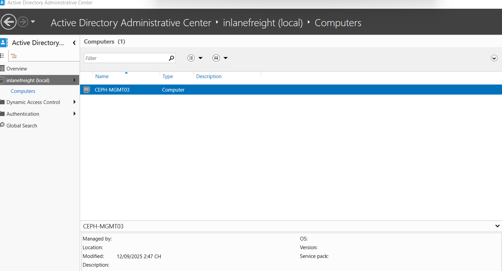

# Cài các gói cần thiết và tham gia AD

```zsh
sudo apt install smbclient samba winbind krb5-user libcephfs2 samba-vfs-modules ceph-common realmd libnss-winbind libpam-winbind -y
```

Sửa `/etc/resolv.conf`

```zsh
nameserver 10.10.210.128
search INLANEFREIGHT.LOCAL
```

Sửa `/etc/netplan/50-cloud-init.yaml`

```zsh
network:
  version: 2
  ethernets:
    ens33:
      addresses:
      - "10.10.210.122/24"
      nameservers:
        addresses:
        - 10.10.210.128
        - 8.8.8.8
        - 8.8.4.4
        - 1.1.1.1
        search: [INLANEFREIGHT.LOCAL]
      routes:
      - to: "default"
        via: "10.10.210.254"
```

```zsh
netplan apply
sudo systemctl restart systemd-resolved
resolvectl status
```

```zsh
# Xác nhận module vfs_ceph_new đã được cài đặt
find /usr/lib/x86_64-linux-gnu/samba/vfs/ -name "*ceph*" | grep ceph_new
```

Check xem đã tìm thấy domain chưa

```zsh
realm discover INLANEFREIGHT.LOCAL
```

Ví dụ

```zsh
realm discover INLANEFREIGHT.LOCAL
inlanefreight.local
  type: kerberos
  realm-name: INLANEFREIGHT.LOCAL
  domain-name: inlanefreight.local
  configured: no
  server-software: active-directory
  client-software: sssd
  required-package: sssd-tools
  required-package: sssd
  required-package: libnss-sss
  required-package: libpam-sss
  required-package: adcli
  required-package: samba-common-bin
```

Gia nhập miền

```zsh
sudo systemctl stop smbd nmbd winbind
sudo cp /etc/samba/smb.conf /etc/samba/smb.conf.bak
sudo tee /etc/samba/smb.conf > /dev/null <<EOF
[global]
    workgroup = INLANEFREIGHT
    realm = INLANEFREIGHT.LOCAL
    security = ads
    encrypt passwords = yes
    
    # Winbind configuration
    idmap config * : backend = tdb
    idmap config * : range = 10000-20000
    idmap config INLANEFREIGHT : backend = rid
    idmap config INLANEFREIGHT : range = 20001-999999
    winbind use default domain = yes
    winbind offline logon = yes
    winbind normalize names = yes
EOF
sudo net ads join -U Administrator
Password for [INLANEFREIGHT\Administrator]:
Using short domain name -- INLANEFREIGHT
Joined 'CEPH-MGMT03' to dns domain 'inlanefreight.local'
sudo systemctl start winbind
```

Kiểm tra xem đã join miền chưa

```zsh
root@ceph-mgmt03:~# realm list
inlanefreight.local
  type: kerberos
  realm-name: INLANEFREIGHT.LOCAL
  domain-name: inlanefreight.local
  configured: kerberos-member
  server-software: active-directory
  client-software: winbind
  required-package: libnss-winbind
  required-package: winbind
  required-package: libpam-winbind
  required-package: samba-common-bin
  login-formats: %U
  login-policy: allow-any-login
  
root@ceph-mgmt03:~# net ads testjoin
Join is OK
```

Trên máy DC kiểm tra sẽ thấy



Kiểm tra xác thực kerberos


#### 2. **Tạo Ceph Client cho Samba Gateway**

- Tạo keyring để Samba truy cập Ceph Cluster:

```zsh
# Tạo keyring cho Samba
sudo ceph auth get-or-create client.samba.gw mon 'allow *' osd 'allow *' mds 'allow *' -o /etc/ceph/ceph.client.samba.gw.keyring

# Phân quyền keyring
sudo chown root:root /etc/ceph/ceph.client.samba.gw.keyring
sudo chmod 600 /etc/ceph/ceph.client.samba.gw.keyring
```

Nếu tạo lỗi ,xóa đi tạo lại

```zsh
sudo ceph auth del client.samba.gw || true
```

- Copy keyring này đến node Samba Gateway nếu bạn cần triển khai trên node không phải monitor

```zsh
scp /etc/ceph/ceph.client.samba.gw.keyring root@ceph-data01:/etc/ceph/
scp /etc/ceph/ceph.conf root@ceph-data01:/etc/ceph/
```

Kiểm tra xem có file `/etc/krb5.keytab` không

```zsh
ll /etc/krb5.keytab

# Tạo keytab mới với đầy đủ SPN
sudo net ads keytab create -U Administrator
```

Kiểm tra có CIFS chưa, nếu chưa có như ở đây, vào DC

```zsh
root@ceph-mgmt03:~# sudo klist -ke /etc/krb5.keytab
Keytab name: FILE:/etc/krb5.keytab
KVNO Principal
---- --------------------------------------------------------------------------
   1 CEPH-MGMT03$@INLANEFREIGHT.LOCAL (aes256-cts-hmac-sha1-96) 
   1 CEPH-MGMT03$@INLANEFREIGHT.LOCAL (aes128-cts-hmac-sha1-96) 
   1 CEPH-MGMT03$@INLANEFREIGHT.LOCAL (DEPRECATED:arcfour-hmac) 
   1 RestrictedKrbHost/CEPH-MGMT03@INLANEFREIGHT.LOCAL (aes256-cts-hmac-sha1-96) 
   1 RestrictedKrbHost/CEPH-MGMT03@INLANEFREIGHT.LOCAL (aes128-cts-hmac-sha1-96) 
   1 RestrictedKrbHost/CEPH-MGMT03@INLANEFREIGHT.LOCAL (DEPRECATED:arcfour-hmac) 
   1 HOST/CEPH-MGMT03@INLANEFREIGHT.LOCAL (aes256-cts-hmac-sha1-96) 
   1 HOST/CEPH-MGMT03@INLANEFREIGHT.LOCAL (aes128-cts-hmac-sha1-96) 
   1 HOST/CEPH-MGMT03@INLANEFREIGHT.LOCAL (DEPRECATED:arcfour-hmac) 
   1 RestrictedKrbHost/CEPH-MGMT03.inlanefreight.local@INLANEFREIGHT.LOCAL (aes256-cts-hmac-sha1-96) 
   1 RestrictedKrbHost/CEPH-MGMT03.inlanefreight.local@INLANEFREIGHT.LOCAL (aes128-cts-hmac-sha1-96) 
   1 RestrictedKrbHost/CEPH-MGMT03.inlanefreight.local@INLANEFREIGHT.LOCAL (DEPRECATED:arcfour-hmac) 
   1 HOST/CEPH-MGMT03.inlanefreight.local@INLANEFREIGHT.LOCAL (aes256-cts-hmac-sha1-96) 
   1 HOST/CEPH-MGMT03.inlanefreight.local@INLANEFREIGHT.LOCAL (aes128-cts-hmac-sha1-96) 
   1 HOST/CEPH-MGMT03.inlanefreight.local@INLANEFREIGHT.LOCAL (DEPRECATED:arcfour-hmac) 
   1 host/ceph-mgmt03.inlanefreight.local@INLANEFREIGHT.LOCAL (aes256-cts-hmac-sha1-96) 
   1 host/ceph-mgmt03.inlanefreight.local@INLANEFREIGHT.LOCAL (aes128-cts-hmac-sha1-96) 
   1 host/ceph-mgmt03.inlanefreight.local@INLANEFREIGHT.LOCAL (DEPRECATED:arcfour-hmac) 
   1 host/CEPH-MGMT03@INLANEFREIGHT.LOCAL (aes256-cts-hmac-sha1-96) 
   1 host/CEPH-MGMT03@INLANEFREIGHT.LOCAL (aes128-cts-hmac-sha1-96) 
   1 host/CEPH-MGMT03@INLANEFREIGHT.LOCAL (DEPRECATED:arcfour-hmac) 
```

Chạy các lệnh sau trên cmd

```cmd
setspn -S CIFS/ceph-mgmt03.inlanefreight.local CEPH-MGMT03$
setspn -S CIFS/ceph-mgmt03 CEPH-MGMT03$
setspn -L CEPH-MGMT03$
```

Về lại máy samba (linux ceph)

```zsh
# Xóa keytab cũ
sudo rm /etc/krb5.keytab

# Tạo keytab mới với đầy đủ SPN
sudo net ads keytab create -U Administrator
```

Kiểm tra

```zsh
root@ceph-mgmt03:~# klist -ke /etc/krb5.keytab 
Keytab name: FILE:/etc/krb5.keytab
KVNO Principal
---- --------------------------------------------------------------------------
   1 CEPH-MGMT03$@INLANEFREIGHT.LOCAL (aes256-cts-hmac-sha1-96) 
   1 CEPH-MGMT03$@INLANEFREIGHT.LOCAL (aes128-cts-hmac-sha1-96) 
   1 CEPH-MGMT03$@INLANEFREIGHT.LOCAL (DEPRECATED:arcfour-hmac) 
   1 CIFS/ceph-mgmt03@INLANEFREIGHT.LOCAL (aes256-cts-hmac-sha1-96) 
   1 CIFS/ceph-mgmt03@INLANEFREIGHT.LOCAL (aes128-cts-hmac-sha1-96) 
   1 CIFS/ceph-mgmt03@INLANEFREIGHT.LOCAL (DEPRECATED:arcfour-hmac) 
   1 CIFS/ceph-mgmt03.inlanefreight.local@INLANEFREIGHT.LOCAL (aes256-cts-hmac-sha1-96) 
   1 CIFS/ceph-mgmt03.inlanefreight.local@INLANEFREIGHT.LOCAL (aes128-cts-hmac-sha1-96) 
   1 CIFS/ceph-mgmt03.inlanefreight.local@INLANEFREIGHT.LOCAL (DEPRECATED:arcfour-hmac) 
   1 RestrictedKrbHost/CEPH-MGMT03@INLANEFREIGHT.LOCAL (aes256-cts-hmac-sha1-96) 
   1 RestrictedKrbHost/CEPH-MGMT03@INLANEFREIGHT.LOCAL (aes128-cts-hmac-sha1-96) 
   1 RestrictedKrbHost/CEPH-MGMT03@INLANEFREIGHT.LOCAL (DEPRECATED:arcfour-hmac) 
   1 HOST/CEPH-MGMT03@INLANEFREIGHT.LOCAL (aes256-cts-hmac-sha1-96) 
   1 HOST/CEPH-MGMT03@INLANEFREIGHT.LOCAL (aes128-cts-hmac-sha1-96) 
   1 HOST/CEPH-MGMT03@INLANEFREIGHT.LOCAL (DEPRECATED:arcfour-hmac) 
   1 RestrictedKrbHost/CEPH-MGMT03.inlanefreight.local@INLANEFREIGHT.LOCAL (aes256-cts-hmac-sha1-96) 
   1 RestrictedKrbHost/CEPH-MGMT03.inlanefreight.local@INLANEFREIGHT.LOCAL (aes128-cts-hmac-sha1-96) 
   1 RestrictedKrbHost/CEPH-MGMT03.inlanefreight.local@INLANEFREIGHT.LOCAL (DEPRECATED:arcfour-hmac) 
   1 HOST/CEPH-MGMT03.inlanefreight.local@INLANEFREIGHT.LOCAL (aes256-cts-hmac-sha1-96) 
   1 HOST/CEPH-MGMT03.inlanefreight.local@INLANEFREIGHT.LOCAL (aes128-cts-hmac-sha1-96) 
   1 HOST/CEPH-MGMT03.inlanefreight.local@INLANEFREIGHT.LOCAL (DEPRECATED:arcfour-hmac) 
   1 host/ceph-mgmt03.inlanefreight.local@INLANEFREIGHT.LOCAL (aes256-cts-hmac-sha1-96) 
   1 host/ceph-mgmt03.inlanefreight.local@INLANEFREIGHT.LOCAL (aes128-cts-hmac-sha1-96) 
   1 host/ceph-mgmt03.inlanefreight.local@INLANEFREIGHT.LOCAL (DEPRECATED:arcfour-hmac) 
   1 host/CEPH-MGMT03@INLANEFREIGHT.LOCAL (aes256-cts-hmac-sha1-96) 
   1 host/CEPH-MGMT03@INLANEFREIGHT.LOCAL (aes128-cts-hmac-sha1-96) 
   1 host/CEPH-MGMT03@INLANEFREIGHT.LOCAL (DEPRECATED:arcfour-hmac) 
```
### 3.2. Cấu hình /etc/samba/smb.conf

```zsh
[global]
    netbios name = CEPH-MGMT03
    workgroup = INLANEFREIGHT
    realm = INLANEFREIGHT.LOCAL
    security = ads
    encrypt passwords = no
    
    # Network
    interfaces = 10.10.210.122
    bind interfaces only = yes
    
    # Kerberos
    kerberos method = secrets and keytab

    # Winbind
    idmap config * : backend = tdb
    idmap config * : range = 10000-20000
    idmap config INLANEFREIGHT : backend = rid
    idmap config INLANEFREIGHT : range = 20001-999999
    winbind use default domain = yes
    winbind offline logon = yes
    winbind normalize names = yes
    winbind nss info = rfc2307

    # VFS Module
    vfs objects = acl_xattr ceph_new
    ceph_new:config_file = /etc/ceph/ceph.conf
    ceph_new:user_id = samba.gw

    # Performance
    oplocks = yes
    kernel share modes = no
    map acl inherit = yes
    store dos attributes = yes

[cephfs_share]
    path = /
    comment = CephFS Share via Samba
    browseable = yes
    writable = yes
    read only = no
    valid users = @"INLANEFREIGHT\Domain Users"
    inherit acls = yes
    create mask = 0664
    force create mode = 0664
    directory mask = 0775
    force directory mode = 0775
    inherit permissions = yes
```

Restart lại

```zsh
sudo systemctl restart smbd nmbd winbind
```

