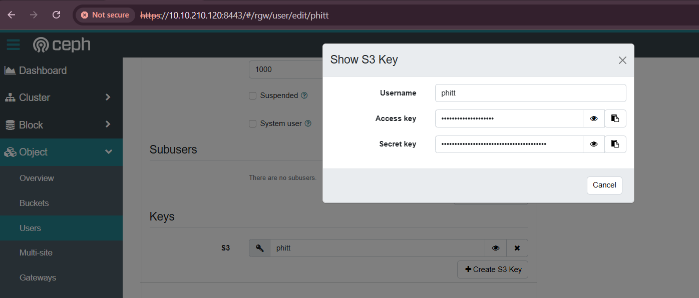
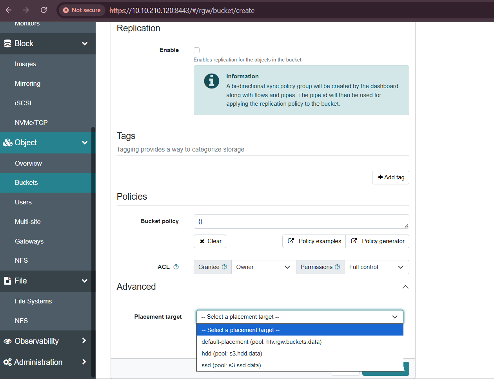

# 1. Tích hợp NextCloud cho loại data Object (S3)

Tại dashboard của ceph, vào object -> users.
Chọn user cần lấy key -> edit và lấy ACCESSKEY và SECRETKEY



Tiếp theo, lấy CA SSL của ceph

```zsh
ceph config-key get mgr/cephadm/cert_store.cert.agent_endpoint_root_cert | jq > cert.json

jq -r '.cert' cert.json > cert_tr_escaped.txt
```

Verify xem đã đúng định dạng chưa:

```zsh
openssl x509 -in /usr/local/share/ca-certificates/rootCA_ceph.crt -noout -text
```

Tiếp đó copy sang máy nextcloud
Đổi tên

```zsh
mv cert_tr_escaped.txt rootCA_ceph.crt
```

Tin cậy trong trust store

```zsh
sudo cp rootCA_ceph.crt /usr/local/share/ca-certificates/
sudo update-ca-certificates
```

# 2. Triển khai NextCloud trên ubuntu

Cài đặt các ứng dụng và thư viện cần thiết.

```zsh
sudo apt update && sudo apt upgrade -y
sudo apt install apache2 mariadb-server php php-common libapache2-mod-php \
  php-bz2 php-gd php-mysql php-curl php-mbstring php-imagick php-zip \
  php-common php-curl php-xml php-json php-bcmath php-xml php-intl php-gmp \
  unzip wget -y
```

```zsh
sudo systemctl enable mariadb
sudo systemctl start mariadb
sudo mariadb-secure-installation
```

Tạo database và user cho Nextcloud:

```zsh
mysql -u root -p
```

```sql
CREATE DATABASE nextcloud_db;
CREATE USER 'nextcloud_user'@'localhost' IDENTIFIED BY 'your_password';
GRANT ALL PRIVILEGES ON nextcloud_db.* TO 'nextcloud_user'@'localhost';
FLUSH PRIVILEGES;
```

### Tải và cài đặt Nextcloud

```zsh
cd /var/www
sudo wget https://download.nextcloud.com/server/releases/latest.zip
sudo unzip latest.zip
sudo chown -R www-data:www-data /var/www/nextcloud/
```

### Cấu hình Apache

```zsh
sudo a2enmod rewrite headers env dir mime
cat << EOF | sudo tee /etc/apache2/sites-available/nextcloud.conf
<VirtualHost *:80>
    DocumentRoot /var/www/nextcloud
    ServerName 10.10.210.127

    <Directory /var/www/nextcloud/>
        Options +FollowSymlinks
        AllowOverride All
        Require all granted

        <IfModule mod_dav.c>
            Dav off
        </IfModule>
        SetEnv HOME /var/www/nextcloud
        SetEnv HTTP_HOME /var/www/nextcloud
    </Directory>
</VirtualHost>
EOF

sudo a2ensite nextcloud.conf
sudo a2dissite 000-default.conf
sudo systemctl restart apache2
```

Tiếp theo thiết lập người dùng admin (nếu không có gui)

```zsh
cd /var/www/nextcloud
sudo -u www-data php occ maintenance:install \
--database "mysql" --database-name "nextcloud_db" \
--database-user "nextcloud_user" --database-pass "your_password" \
--admin-user "admin" --admin-pass "admin_password"
```

Nếu có gui, truy cập vào http://<ip-nextcloud/ và cấu hình

Sửa file config

```zsh
sudo nano /var/www/nextcloud/config/config.php
```

Phần key và secret là phần đã lấy từ dashboard của ceph. Port như port đã cấu hình `rgw`

```zsh
<?php
$CONFIG = array (
  'instanceid' => 'ocgh7wnthfxu',
  'passwordsalt' => 'ytW8mghmV2Fq2Tb2I6r8YUd3IvhsrI',
  'secret' => '6XHWYh0hjaDodvFkt+T23Jfe4iZn5UKGBLfml0FbPdhUKXXx',
  'trusted_domains' =>
  array (
    0 => '10.10.210.127',
  ),
  'datadirectory' => '/var/www/nextcloud/data',
  'dbtype' => 'mysql',
  'version' => '31.0.8.1',
  'overwrite.cli.url' => 'http://10.10.210.127',
  'dbname' => 'nextcloud_db',
  'dbhost' => 'localhost',
  'dbport' => '',
  'dbtableprefix' => 'oc_',
  'objectstore' =>
  array (
    'class' => '\\OC\\Files\\ObjectStore\\S3',
    'arguments' =>
    array (
      'bucket' => 'nextcloud',
      'autocreate' => false,
      'key' => 'PR8JEDI1ML8NP0CO2YP2',
      'secret' => 'vVDFpKtFOy3U1hSzY6iwArXGpfB5gtHWICA9FocU',
      'hostname' => '10.20.20.121',
      'port' => 8080,
      'use_ssl' => false,
      'use_path_style' => true,
      'region' => 'auto',
      'verify_bucket_exists' => false,
    ),
  ),
  'mysql.utf8mb4' => true,
  'dbuser' => 'nextcloud_user',
  'dbpassword' => 'your-password',
  'installed' => true,
);
```

Truy cập vào nextcloud ở http://ip để đăng nhập xem có hoạt động chưa.

Trên ceph dashboard, tạo bucket mới như đã cấu hình ở trên là nextcloud



Xuống phần advance chọn pool lưu như các pool đã set tùy chọn rule hdd hoặc ssd theo nhu cầu. Ví dụ ở đây tôi chọn pool ssd.