# 1. Tổng quan về quy mô và sơ đồ triển khai

- OS: Ubuntu Server 25.4
- 3 nodes management
- 4 nodes data
- Mỗi node 4 ổ cứng (2 node ssd + 2 node hdd)
- 5 NICs mỗi node (2 cluster, 2 public, 1 management)

| Node Type     | Hostname          | IP Management | IP Cluster (bondC) | IP Public (bondP) | Disk             |
| ------------- | ----------------- | ------------- | ------------------ | ----------------- | ---------------- |
| Management    | ceph-mgmt01       | 10.10.210.120 | 10.30.30.120       | 10.20.20.120      | 40GB             |
| Management    | ceph-mgmt02       | 10.10.210.121 | 10.30.30.121       | 10.20.20.121      | 40GB             |
| Management    | ceph-mgmt03       | 10.10.210.122 | 10.30.30.122       | 10.20.20.122      | 40GB             |
| Data          | ceph-data01       | 10.10.210.123 | 10.30.30.123       | 10.20.20.123      | 4 x SSD x 100GB  |
| Data          | ceph-data02       | 10.10.210.124 | 10.30.30.124       | 10.20.20.124      | 4 x SSD x 100 GB |
| Data          | ceph-data03       | 10.10.210.125 | 10.30.30.125       | 10.20.20.125      | 4 x HDD x 100GB  |
| Data          | ceph-data04       | 10.10.210.126 | 10.30.30.126       | 10.20.20.126      | 4 x HDD x 100GB  |
| Reverse Proxy | nginx_reverse_all | 10.10.240.165 | -                  | 10.20.20.119      | 40GB             |
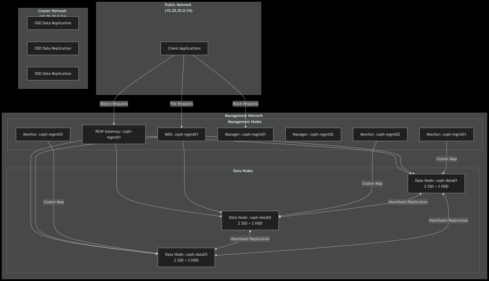
# 2. Cấu hình chung

## 2.1 Đồng bộ thời gian

- Chuyển timezone về Việt Nam

```zsh
sudo timedatectl set-timezone Asia/Ho_Chi_Minh
```

- Cài đặt chrony để đồng bộ thời gian với một máy chủ NTP chỉ định

```zsh
sudo apt install chrony -y
```

Enable and start

```zsh
sudo systemctl enable chrony
sudo systemctl start chrony
```


Thêm pool local để đồng bộ

```zsh
sudo nano /etc/chrony/chrony.conf
```

Thêm dòng sau (tùy chọn, ntp local để đồng bộ time)

```zsh
pool 10.10.240.161 iburst
```

Khởi động lại chrony

```zsh
sudo systemctl restart chrony
```

Kiểm tra

```zsh
sudo chronyc sources -v
```


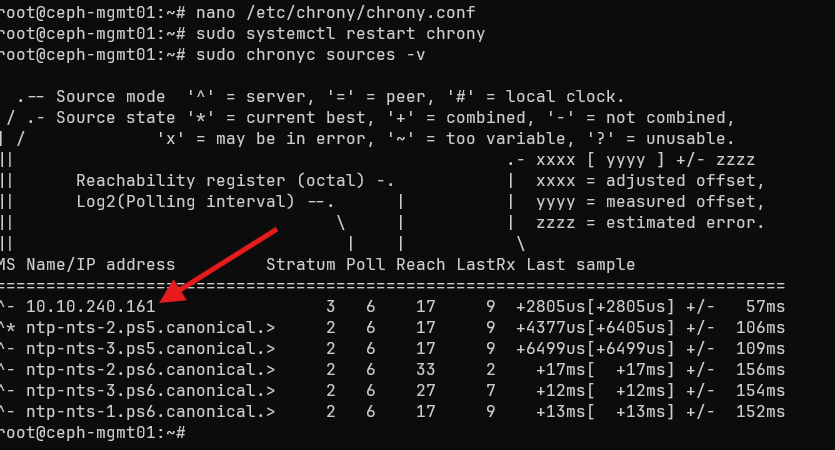

Set timezone then resync

```zsh
sudo timedatectl set-timezone Asia/Ho_Chi_Minh
sudo chronyc makestep
```

## 2.2 Cấu hình mạng

Thêm mỗi node 4 NIC thuộc 2 dải mạng dành cho Local Cluster và Public

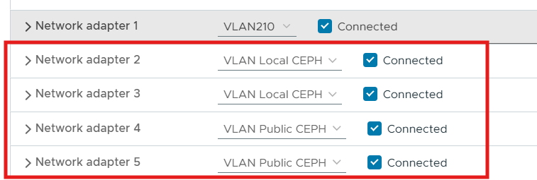

Trong shell, kiểm tra bằng lệnh `ip a`

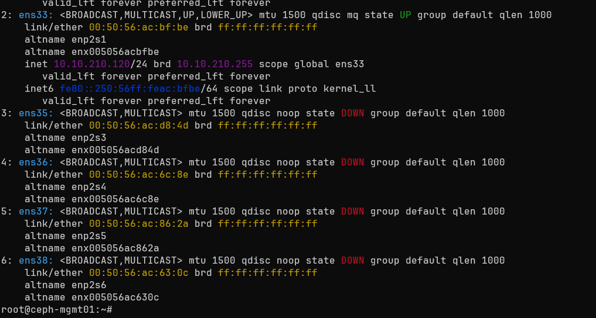

Chúng ta sẽ cấu hình IP cho các NIC này, do chúng chi giao tiếp trong nội bộ nên không cần gateway tức là set bond (Netword bonding).

Tạo cấu hình cho các NIC

```zsh
sudo nano /etc/netplan/01-netcfg.yaml
```

```zsh
# /etc/netplan/01-netcfg.yaml
network:
  version: 2
  renderer: networkd
  ethernets:
    ens35: {dhcp4: no}
    ens36: {dhcp4: no}
    ens37: {dhcp4: no}
    ens38: {dhcp4: no}

  bonds:
    bondC:
      interfaces: [ens35, ens36]
      parameters:
        mode: active-backup
        lacp-rate: fast
        mii-monitor-interval: 100
      addresses: [10.30.30.120/24]
      mtu: 9000

    bondP:
      interfaces: [ens37, ens38]
      parameters:
        mode: active-backup
        lacp-rate: fast
        mii-monitor-interval: 100
      addresses: [10.20.20.120/24]
      mtu: 9000
```

Chú ý thay ip cho các node khác, vd addresses: \[10.30.30.121/24]

Sau khi cấu hình xong, đặt lại quyền cho file và apply changes.

```zsh
sudo chmod 600 /etc/netplan/01-netcfg.yaml
sudo netplan apply
```

Kiểm tra bằng `ip a`

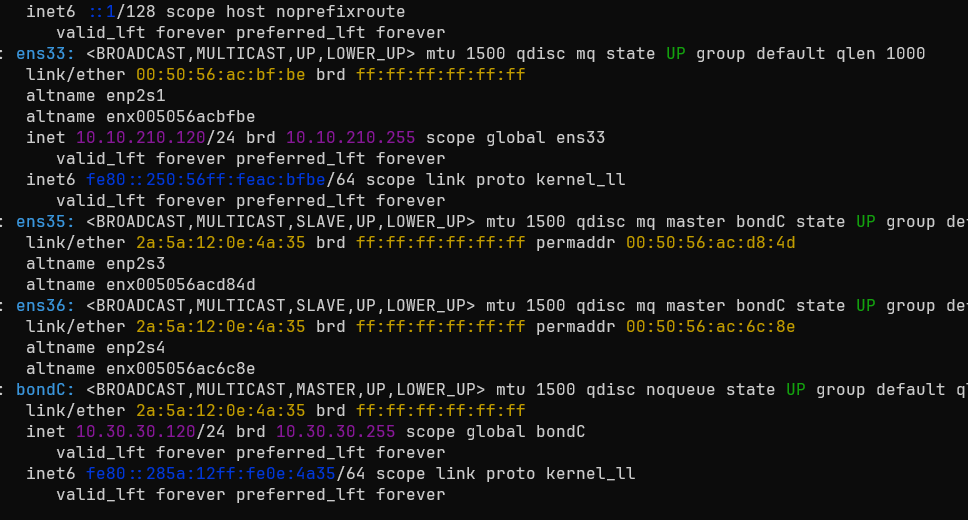

Nếu các NIC và bond up hết, cấu hình tiếp cho node khác và ping thử.

## 2.3 Cấu hình /etc/hosts

Trong tất cả các node

```zsh
sudo nano /etc/hosts
```

Thêm vào cuối file, ip phải là ip của bond public.

```zsh
10.20.20.120   ceph-mgmt01
10.20.20.121   ceph-mgmt02
10.20.20.122   ceph-mgmt03
10.20.20.123   ceph-data01
10.20.20.124   ceph-data02
10.20.20.125   ceph-data03
10.20.20.126   ceph-data04
```

# 3. Cấu hình ceph

Cài các công cụ cần thiết trên  các node quản lý, ví dụ `ceph-mgmt01`

```zsh
sudo apt install podman cephadm ceph-common ceph-base -y
```

Trên tất cả các node data nếu tách data và mon

```zsh
sudo apt install -y podman
```

## 3.1 Cấu hình chung

### Bootstrap Ceph cluster (trên mgmt1)

Dùng IP trên public network (ví dụ 10.20.20.120):

```zsh
cephadm bootstrap --mon-ip 10.20.20.120 --cluster-network 10.30.30.0/24 --initial-dashboard-user admin --initial-dashboard-password 'htv@2024'
```

Lệnh này sẽ:
- Tạo MON & MGR đầu tiên,
- Sinh key SSH và thêm vào `/root/.ssh/authorized_keys`,
- Tạo file config `/etc/ceph/ceph.conf` & keyring.
- Tạo dashboard admin

### Kết nối tới cluster và quản lý từ management nodes khác:

Trên `mgmt1` (bootstrap), chạy:

- **Copy SSH key đến các node**:

```zsh
ssh-copy-id -f -i /etc/ceph/ceph.pub root@ceph-mgmt02
ssh-copy-id -f -i /etc/ceph/ceph.pub root@ceph-mgmt03
ssh-copy-id -f -i /etc/ceph/ceph.pub root@ceph-data01
ssh-copy-id -f -i /etc/ceph/ceph.pub root@ceph-data02
ssh-copy-id -f -i /etc/ceph/ceph.pub root@ceph-data03
ssh-copy-id -f -i /etc/ceph/ceph.pub root@ceph-data04
```

Trên các máy

```zsh
nano /etc/ssh/sshd_config
```

Bỏ comment phần này

```zsh
PubkeyAuthentication yes
```

Restart ssh

```zsh
systemctl restart sshd
```

Thêm các node vào Cluster

```zsh
ceph orch host add ceph-mgmt02 10.20.20.121
ceph orch host add ceph-mgmt03 10.20.20.122
ceph orch host add ceph-data01 10.20.20.123
ceph orch host add ceph-data02 10.20.20.124
ceph orch host add ceph-data03 10.20.20.125
ceph orch host add ceph-data04 10.20.20.126
```

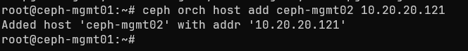

Thêm nhãn cho các node quản lý

```zsh
ceph orch host label add ceph-mgmt01 rgw
ceph orch host label add ceph-mgmt01 mon

ceph orch host label add ceph-mgmt02 _admin
ceph orch host label add ceph-mgmt02 mon
ceph orch host label add ceph-mgmt02 rgw

ceph orch host label add ceph-mgmt03 _admin
ceph orch host label add ceph-mgmt03 mon
ceph orch host label add ceph-mgmt03 rgw
```

Các máy data thêm các ổ cứng

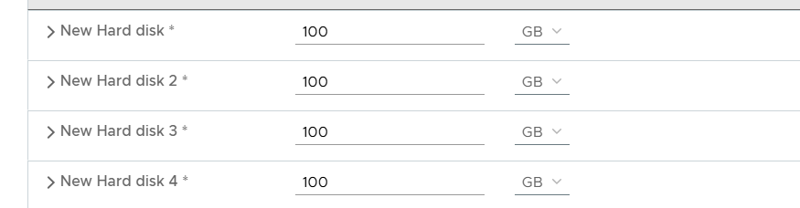

Thêm nhãn:

```zsh
ceph orch host label add ceph-data01 osd
ceph orch host label add ceph-data02 osd
ceph orch host label add ceph-data03 osd
ceph orch host label add ceph-data04 osd
```

Triển khai các dịch vụ cơ bản

```zsh
sudo ceph orch apply mon ceph-mgmt01,ceph-mgmt02,ceph-mgmt03
sudo ceph orch apply mgr ceph-mgmt01,ceph-mgmt02,ceph-mgmt03
```

Cấu hình một vài thông số

```zsh
# Cẩn trọng trước khi áp dụng trong môi trường production
ceph config set global osd_pool_default_pg_autoscale_mode off
ceph balancer off
ceph config set global osd_pool_default_size 2
ceph config set global osd_pool_default_min_size 1
ceph config set global mon_osd_min_in_ratio 0.5
ceph config set osd osd_memory_target_autotune false
```

Kiểm tra trạng thái cluster:

```zsh
sudo ceph -s
```

Đảm bảo tất cả các MON và MGR đều đang hoạt động và cluster ở trạng thái HEALTH_OK.

### Cấu hình OSDs

trên node quản lý, chạy lệnh sau để cephadm tự động phát hiện các ổ đĩa trống và triển khai OSDs:

Bash

```zsh
sudo ceph orch apply osd --all-available-devices
```

Lệnh này sẽ tạo OSDs trên tất cả các ổ đĩa trống có sẵn trên các data nodes. cephadm sẽ tự động sử dụng SSD làm block.db và block.wal nếu có.

Nếu bạn muốn kiểm soát chi tiết hơn, bạn có thể chỉ định từng ổ đĩa:

```zsh
ceph orch daemon add osd ceph-data04:/dev/sdb
ceph orch daemon add osd ceph-data04:/dev/sdc
ceph orch daemon add osd ceph-data04:/dev/sdd
ceph orch daemon add osd ceph-data04:/dev/sde
# Lặp lại cho các node data còn lại
```

Kiểm tra trạng thái OSDs:

```zsh
sudo ceph osd tree
```

Đảm bảo tất cả các OSDs đều đang hoạt động (up và in).

Đợi một lát và kiểm tra lại nếu không thấy.

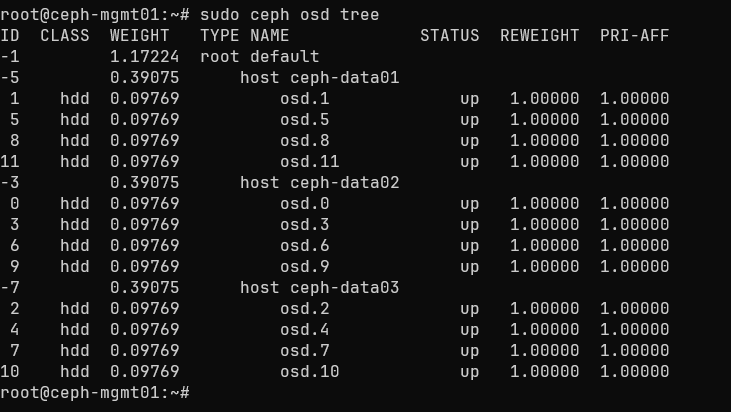

Kiểm tra xem HEAL ok không.

```zsh
ceph -s
```

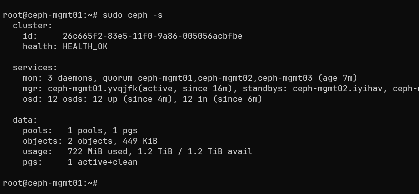
# Cấu hình Pool

### Fix nhận full hdd

Ví dụ như sau

```zsh
root@ceph-mgmt01:~# ceph osd tree
ID  CLASS  WEIGHT   TYPE NAME             STATUS  REWEIGHT  PRI-AFF
-1         1.56299  root default
-5         0.39075      host ceph-data01
 1    hdd  0.09769          osd.1             up   1.00000  1.00000
 2    hdd  0.09769          osd.2             up   1.00000  1.00000
 5    hdd  0.09769          osd.5             up   1.00000  1.00000
 7    hdd  0.09769          osd.7             up   1.00000  1.00000
-3         0.39075      host ceph-data02
 0    hdd  0.09769          osd.0             up   1.00000  1.00000
 3    hdd  0.09769          osd.3             up   1.00000  1.00000
 4    hdd  0.09769          osd.4             up   1.00000  1.00000
 6    hdd  0.09769          osd.6             up   1.00000  1.00000
-7         0.39075      host ceph-data03
 8    hdd  0.09769          osd.8             up   1.00000  1.00000
 9    hdd  0.09769          osd.9             up   1.00000  1.00000
10    hdd  0.09769          osd.10            up   1.00000  1.00000
11    hdd  0.09769          osd.11            up   1.00000  1.00000
-9         0.39075      host ceph-data04
12    hdd  0.09769          osd.12            up   1.00000  1.00000
13    hdd  0.09769          osd.13            up   1.00000  1.00000
14    hdd  0.09769          osd.14            up   1.00000  1.00000
15    hdd  0.09769          osd.15            up   1.00000  1.00000
```

Chúng ta set mỗi node data 2 ổ SSD

```zsh
ceph osd crush rm-device-class osd.0
ceph osd crush set-device-class ssd osd.0
ceph osd crush rm-device-class osd.1
ceph osd crush set-device-class ssd osd.1
ceph osd crush rm-device-class osd.2
ceph osd crush set-device-class ssd osd.2
ceph osd crush rm-device-class osd.3
ceph osd crush set-device-class ssd osd.3
ceph osd crush rm-device-class osd.4
ceph osd crush set-device-class ssd osd.4
ceph osd crush rm-device-class osd.5
ceph osd crush set-device-class ssd osd.5
ceph osd crush rm-device-class osd.6
ceph osd crush set-device-class ssd osd.6
ceph osd crush rm-device-class osd.7
ceph osd crush set-device-class ssd osd.7
```

Sau khi set xong:

```zsh
root@ceph-mgmt01:~# ceph osd tree
ID  CLASS  WEIGHT   TYPE NAME             STATUS  REWEIGHT  PRI-AFF
-1         1.56299  root default
-5         0.39075      host ceph-data01
 1    ssd  0.09769          osd.1             up   1.00000  1.00000
 2    ssd  0.09769          osd.2             up   1.00000  1.00000
 5    ssd  0.09769          osd.5             up   1.00000  1.00000
 7    ssd  0.09769          osd.7             up   1.00000  1.00000
-3         0.39075      host ceph-data02
 0    ssd  0.09769          osd.0             up   1.00000  1.00000
 3    ssd  0.09769          osd.3             up   1.00000  1.00000
 4    ssd  0.09769          osd.4             up   1.00000  1.00000
 6    ssd  0.09769          osd.6             up   1.00000  1.00000
-7         0.39075      host ceph-data03
 8    hdd  0.09769          osd.8             up   1.00000  1.00000
 9    hdd  0.09769          osd.9             up   1.00000  1.00000
10    hdd  0.09769          osd.10            up   1.00000  1.00000
11    hdd  0.09769          osd.11            up   1.00000  1.00000
-9         0.39075      host ceph-data04
12    hdd  0.09769          osd.12            up   1.00000  1.00000
13    hdd  0.09769          osd.13            up   1.00000  1.00000
14    hdd  0.09769          osd.14            up   1.00000  1.00000
15    hdd  0.09769          osd.15            up   1.00000  1.00000
```
### 4.4.3. Tạo Pool cho RGW (Object Gateway)

Tạo CRUSH rules
#### Tạo rule cho SSD

```zsh
ceph osd crush rule create-replicated ssd_rule default host ssd
```
#### Tạo rule cho HDD

```zsh
ceph osd crush rule create-replicated hdd_rule default host hdd
```

Ở đây tùy mục đích sử dụng, ví dụ chỉ để lưu trữ như dưới đây, phần rule sẽ để là hdd. Còn nếu dữ liệu vào ra liên tục, pool dùng lưu trữ sẽ để là ssd.

Tùy vào chiến lược lưu trữ, ta nên để full 1 máy là một loại ổ, ở đây để một máy cả ssd và hdd giả định chúng ta cần tận dụng các slot ổ cứng cho tiết kiệm chẳng hạn...

Chiến lược ở đây khi cung cấp dịch vụ cho khách hàng, cả 3 loại dữ liệu cùng lúc (điều này không nên, chỉ nên 1 loại dữ liệu), chúng ta nên chia thành các pool cho ssd và hdd. Sau đó tùy chọn lưu trữ vào ssd hoặc hdd cho từng loại dữ liệu.

### Triển khai RGW (S3) & cấu hình realm/zone cho loại dữ liệu Object

Vào cephadm shell, **Kích hoạt module RGW** (cần để dùng lệnh bootstrap realm).

```zsh
cephadm shell
ceph mgr module enable rgw
exit
```

Tạo bucket/rule theo class & pool cho RGW

```zsh
# Tạo host bucket theo class
ceph osd crush add-bucket ssd host
ceph osd crush add-bucket hdd host

# Tạo crush rule tách theo class
ceph osd crush rule create-replicated ssd_rule default host ssd
ceph osd crush rule create-replicated hdd_rule default host hdd

# Pool S3 (ví dụ tên s3.ssd.* / s3.hdd.*)
ceph osd pool create s3.ssd.data  32 32 replicated ssd_rule
ceph osd pool create s3.ssd.index  8  8 replicated ssd_rule
ceph osd pool application enable s3.ssd.data  rgw
ceph osd pool application enable s3.ssd.index rgw
ceph osd pool set s3.ssd.data  size 2
ceph osd pool set s3.ssd.index size 2

ceph osd pool create s3.hdd.data  32 32 replicated hdd_rule
ceph osd pool create s3.hdd.index  8  8 replicated hdd_rule
ceph osd pool application enable s3.hdd.data  rgw
ceph osd pool application enable s3.hdd.index rgw
ceph osd pool set s3.hdd.data  size 2
ceph osd pool set s3.hdd.index size 2
```

Thiết lập Realm, Zonegroup, Zone (Multi-site)

```zsh
# Tạo realm
# Realm / ZoneGroup / Zone
radosgw-admin realm create --rgw-realm s3 --default
radosgw-admin zonegroup create --rgw-zonegroup default --master --default
radosgw-admin zone create --rgw-zone htv --master --default

# Khai báo endpoint cho zonegroup
radosgw-admin zonegroup add \
  --rgw-zonegroup default \
  --rgw-zone htv \
  --endpoints http://10.20.20.120:8080

# Gắn placement target SSD/HDD vào zonegroup
radosgw-admin zonegroup placement add \
  --rgw-zonegroup default \
  --placement-id ssd \
  --data-pool s3.ssd.data \
  --index-pool s3.ssd.index

radosgw-admin zone placement add \
  --rgw-zone=htv \
  --placement-id=ssd \
  --storage-class=STANDARD \
  --data-pool=s3.ssd.data \
  --index-pool=s3.ssd.index
  
radosgw-admin zonegroup placement add \
  --rgw-zonegroup default \
  --placement-id hdd \
  --data-pool s3.hdd.data \
  --index-pool s3.hdd.index

radosgw-admin zone placement add \
  --rgw-zone=htv \
  --placement-id=hdd \
  --storage-class=STANDARD \
  --data-pool=s3.hdd.data \
  --index-pool=s3.hdd.index
  
radosgw-admin period update --commit
```

Triển khai RGW trên mon1, mon2, mon3 (port 8080):

```zsh
cat << 'EOF' > rgw.yaml
service_type: rgw
service_id: s3
placement:
  hosts:
    - ceph-mgmt01
    - ceph-mgmt02
    - ceph-mgmt03
spec:
  rgw_realm: s3
  rgw_zonegroup: default
  rgw_zone: htv
  rgw_frontend_port: 8080
EOF
```

```zsh
ceph orch apply -i rgw.yaml
```

Tạo user S3 và gán mặc định dùng SSD (có cả tag hdd khi cần):

```zsh
radosgw-admin user create --uid=phitt --display-name="Phi Dep Trai"
```

# Kiểm tra & xác nhận

```zsh
# Trạng thái tổng thể
ceph -s

# Xem OSD & class đã sửa đúng chưa
ceph osd tree
ceph osd df tree

# Thiết bị được orch nhận
ceph orch device ls

# Dịch vụ
ceph orch ls

# RGW realm/zone
radosgw-admin realm list
radosgw-admin zonegroup list
radosgw-admin zone list
```

# Cấu hình reverse HA trên nginx_reverse

Trên node nginx, cấu hình như sau:

```zsh
sudo nano /etc/nginx/conf.d/phitt-s3-ceph.conf
```

```zsh
upstream rgw_backend {
    server 10.20.20.120:8080;
    server 10.20.20.121:8080;
    server 10.20.20.122:8080;
}

server {
    listen 80;
    server_name s3.sysadminskills.com;

    # Chuyển toàn bộ HTTP → HTTPS
    return 301 https://$host$request_uri;
}

server {
    listen 443 ssl;
    server_name s3.sysadminskills.com;

    ssl_certificate     /etc/letsencrypt/live/s3.sysadminskills.com/fullchain.pem;
    ssl_certificate_key /etc/letsencrypt/live/s3.sysadminskills.com/privkey.pem;

    ssl_protocols       TLSv1.2 TLSv1.3;
    ssl_ciphers         HIGH:!aNULL:!MD5;

    client_max_body_size 10G;   # chỉnh theo nhu cầu upload

    location / {
        proxy_pass http://rgw_backend;

        proxy_set_header Host              $host;
        proxy_set_header X-Real-IP         $remote_addr;
        proxy_set_header X-Forwarded-For   $proxy_add_x_forwarded_for;
        proxy_set_header X-Forwarded-Proto $scheme;

        # Fix S3 signature issues
        proxy_http_version 1.1;
        proxy_request_buffering off;
    }
}
```


# CEPHFS


### 1. Kiểm Tra và Chuẩn Bị Cụm Ceph Hiện Tại

- **Kiểm tra trạng thái cluster**:
    
    
```zsh
ceph -s
ceph osd tree
ceph osd crush rule ls  # Xác nhận ssd-rule và hdd-rule đã tồn tại
```
    
- **Đảm bảo MDS daemon đã được cài đặt và chạy** trên ít nhất một node management (ví dụ: `ceph-mgmt01`):

```zsh
sudo systemctl status ceph-mds@ceph-mgmt01
```
    
Nếu chưa, cài đặt MDS trên node management
```zsh
sudo apt install ceph-mds  # Trên Ubuntu/Debian
sudo ceph-deploy mds create ceph-mgmt01 ceph-mgmt02 ceph-mgmt03  # Nếu dùng ceph-deploy

# Hoặc. Để 1 node standby
ceph fs volume create myfs --placement="2 ceph-mgmt01 ceph-mgmt02"
```
    

### 2. Tạo Pools Cho CephFS

- **Tạo metadata pool (ssd-rule)**:
    
    bash
    
    ceph osd pool create cephfs_metadata 32 32 --crush-rule ssd_rule
    
- **Tạo data pool (hdd-rule)**:
    
    bash
    
    ceph osd pool create cephfs_data 128 128 --crush-rule hdd_rule
    
- **Kích hoạt CephFS**:
    
    bash
    
    ceph fs new cephfs cephfs_metadata cephfs_data
    ceph fs ls  # Xác nhận filesystem đã tạo
    ceph mds stat  # Kiểm tra trạng thái MDS
    

### 3. Tạo CephX Client Cho Truy Cập CephFS

- **Tạo user `client.cephfs_samba`** với quyền truy cập CephFS:
    
    bash
    
    ceph auth get-or-create client.cephfs_samba mon 'allow r' mds 'allow rw' osd 'allow rw pool=cephfs_data' -o /etc/ceph/ceph.client.cephfs_samba.keyring
    
- **Sao chép keyring và file cấu hình** đến node sẽ làm Samba Gateway (ví dụ: `ceph-mgmt01`):
    
    bash
    
    scp /etc/ceph/ceph.client.cephfs_samba.keyring ceph-mgmt01:/etc/ceph/
    scp /etc/ceph/ceph.conf ceph-mgmt01:/etc/ceph/

# Tạo Pool cho RBD (Block Device)

```zsh
sudo ceph osd pool create rbd_pool 64 64
sudo ceph osd pool application enable rbd_pool rbd
```

# Tạo Pool cho CephFS (Filesystem)

```zsh
sudo ceph osd pool create cephfs_data 64 64 replicated hdd_rule
sudo ceph osd pool create cephfs_metadata 32 32 replicated ssd_rule
sudo ceph fs new cephfs cephfs_metadata cephfs_data
ceph osd pool set cephfs_metadata size 2
ceph osd pool set cephfs_data size 2
```

Filesystem CephFS bắt buộc phải có **ít nhất một MDS active** để điều phối metadata — nếu không, filesystem sẽ offline hoàn toàn.[Red Hat Docs](https://docs.redhat.com/it/documentation/red_hat_ceph_storage/3/html-single/ceph_file_system_guide/index?utm_source=chatgpt.com)[Ceph Documentation](https://docs.ceph.com/en/reef/cephfs/health-messages/?utm_source=chatgpt.com)

Bạn cần triển khai MDS bằng orchestrator Ceph (cephadm):

```zsh
ceph orch apply mds cephfs --placement="2 ceph-mgmt01 ceph-mgmt02"
```

Kiểm tra bằng lệnh

```zsh
ceph fs status cephfs
ceph mds stat
```

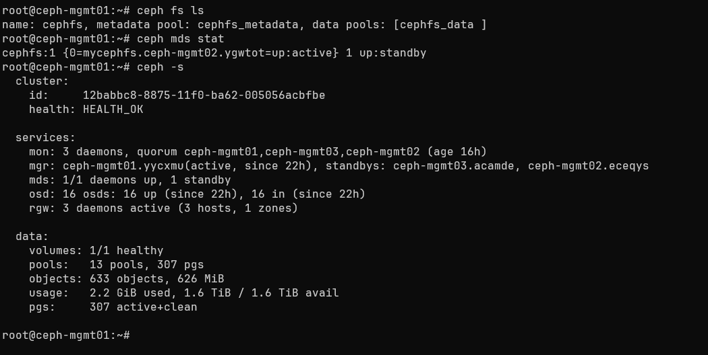

Nếu ceph yêu cầu thêm một máy để dự phòng (standby)

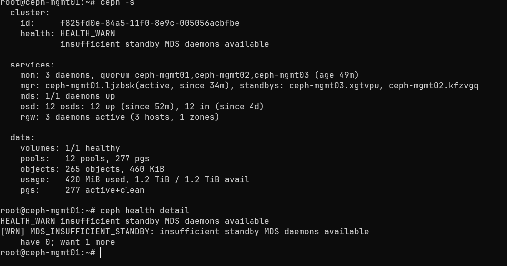


