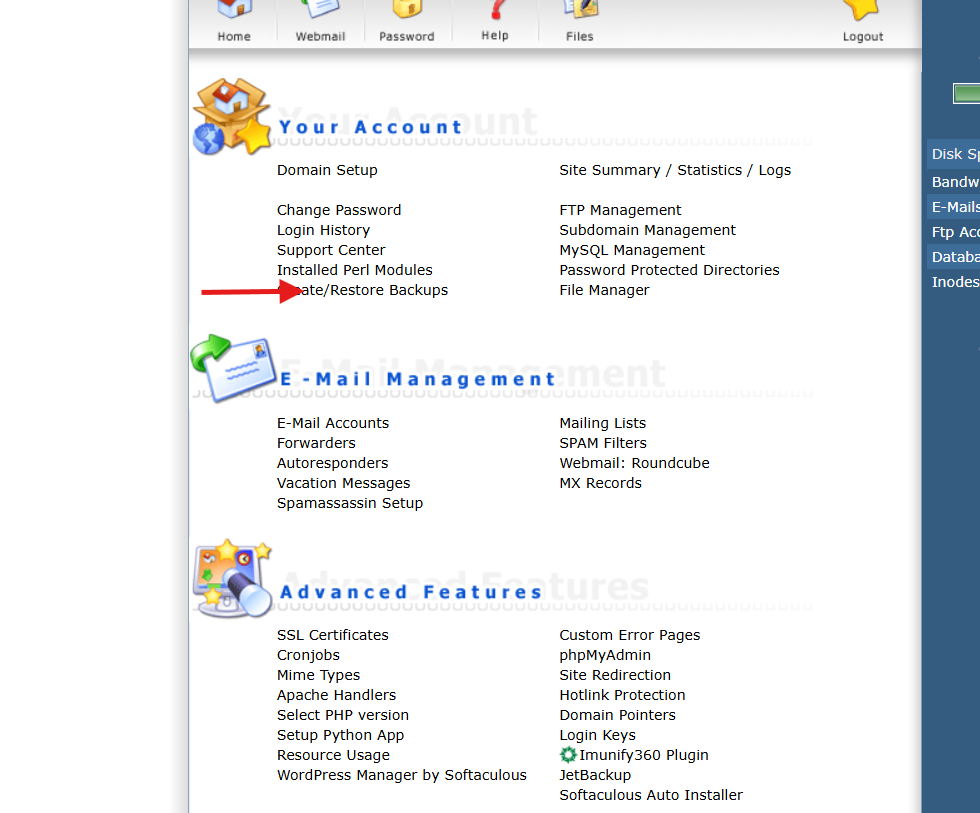
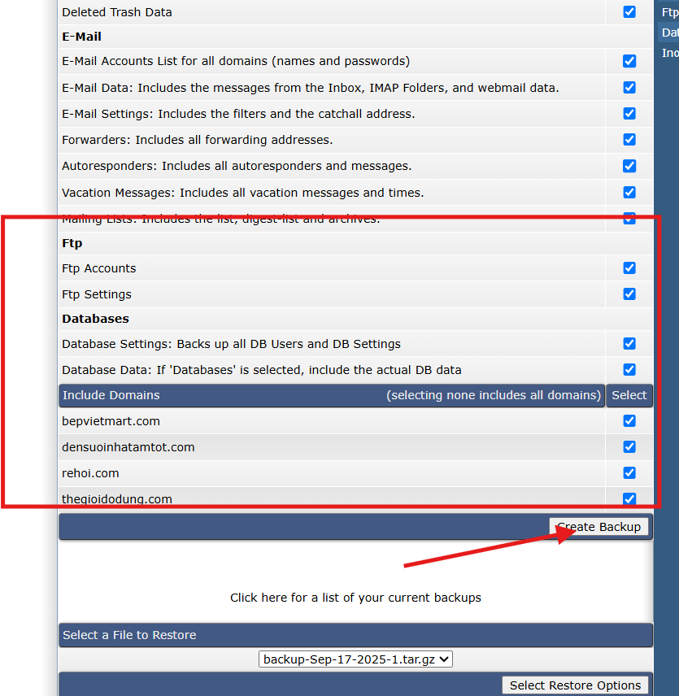
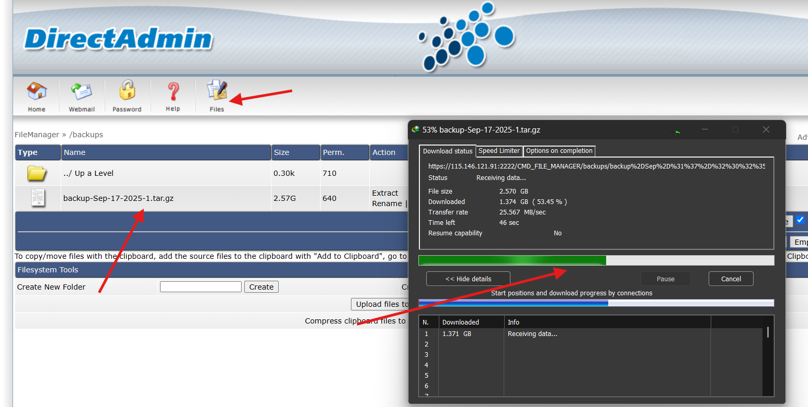
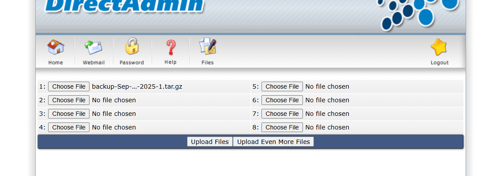
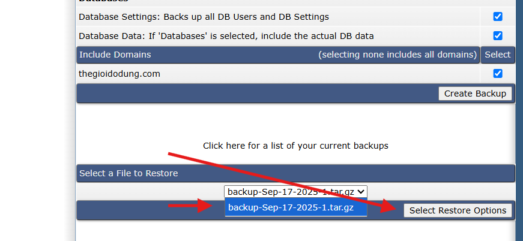

# Chuyển web từ DA sang DA

Đăng nhập vào DA: ip:2222

Chọn một domain. chọn create/restore backup

Chọn các tên miền cần chuyển, chọn create, nhớ chọn cả database các thứ,...

Về trang chủ để ý message báo backup thành công

Chọn File manager -> backups và tải xuống

Đăng nhập vào host mới -> File -> tạo một folder `backups` và tải file backup lên

