Tài liệu được thực hiện bởi phi.tt@hostingviet.vn
# 1. Cài CloneZilla

Một nhược điểm của phương pháp này là Down time backup tức là chúng ta phải tắt server đi mới có thể thực hiện được.

Có thể dùng Ventoy hoặc Rufus để tạo boot với file ISO.
Link CloneZilla: https://clonezilla.org/downloads.php
Link Ventoy: https://www.ventoy.net/en/download.html
Link Rufus: https://rufus.ie/downloads/

Lưu ý khi backup, ổ mới phải có dung lượng bằng hoặc lớn hơn ổ đĩa cũ.

## Khởi động Clonezilla

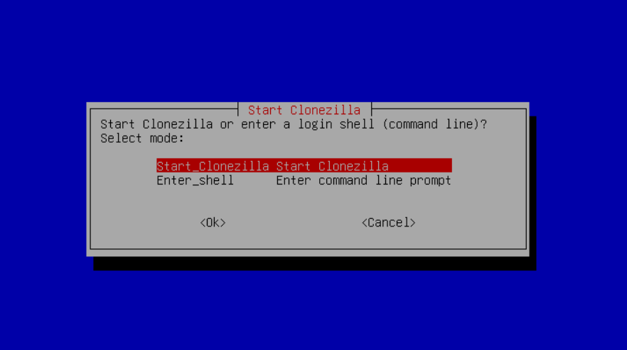
# 2. Backup/Restore đối với OS đơn server vật lý

## 2.1. Backup

Sau khi Boot vào CloneZilla, chọn Start Clonezilla -> Device-image -> Local_dev

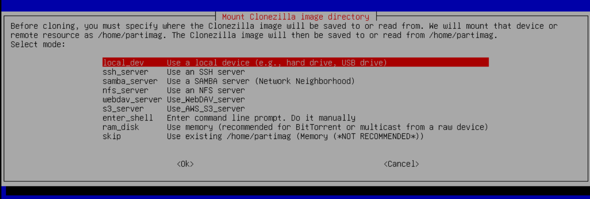

Sau đó nó sẽ hiện ra màn hình để detect ổ cứng, cắm ổ cứng mới và đợi nó scan. Nếu là server vật lý chúng ta chỉ cần cắm 1 ổ đơn sau đó vào IDRAC hoặc ILO convert to non-raid.

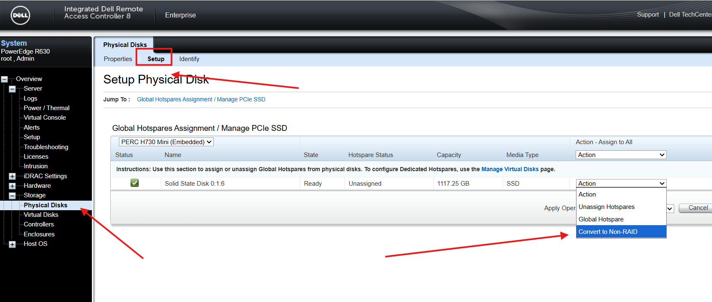

Lưu ý, nếu ổ giống nhau cần phải xác định rõ ràng ngay từ đầu. Bạn nên nhìn vào tên cho dễ. Ví dụ ban đầu có `sda` là ổ OS cần backup, `sdb` chính là USB chứa Clonezilla. Sau đó chúng ta cắm ổ đĩa để lưu backup và thấy có `sdc`. Lúc này ta cần chọn `sdc` để tạo phân vùng ext4 và lưu backup tại đây.

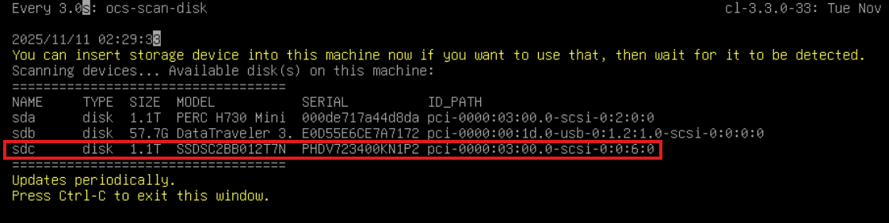

Sau khi Clonezilla đã nhận ổ, chúng ta nhấn `Ctrl C` để đến bước tiếp theo.

Ở bước này, ta không chọn ngay mà nhấn tab chọn `Cancel` -> No -> N để format ổ theo `ext4` và tạo phân vùng trên ổ.

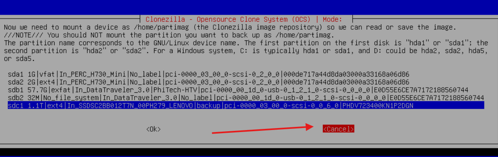

Tiếp theo chọn CMD để vào shell

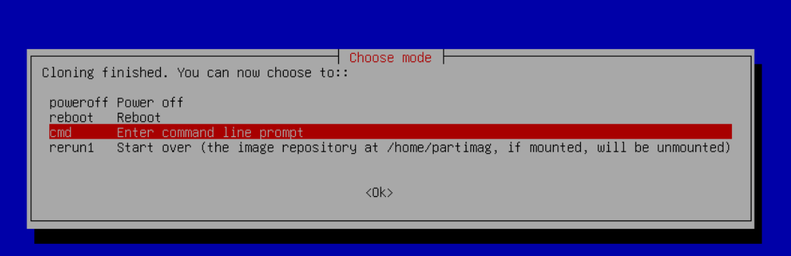

Format ổ đĩa

Ví dụ mình đã xác định được ổ để lưu file backup là `/dev/sdc`

```zsh
sudo wipefs -a /dev/sdc
```

Tạo lại phân vùng

```zsh
sudo parted /dev/sdc mklabel gpt
sudo parted -a opt /dev/sdc mkpart primary ext4 0% 100%
sudo mkfs.ext4 -L backup /dev/sdc1
```

Nó sẽ hỏi bạn có muốn ghi đè không thì chọn `Y` để xác nhận.

Sau đó kiểm tra lại

```zsh
lsblk -f
```

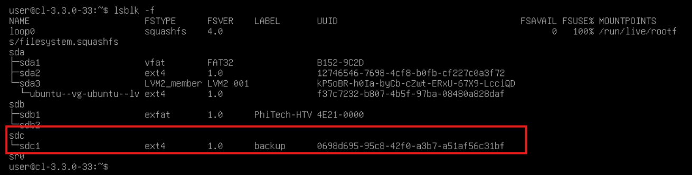

Gõ `exit` để quay lại từ đầu.

Đến bước trước đó mà chúng ta `Cancel`, chúng ta chọn phân vùng mình vừa tạo, như vừa rồi tôi đã tạo phân vùng ext4 trên toàn bộ ổ đĩa là `sdc1`

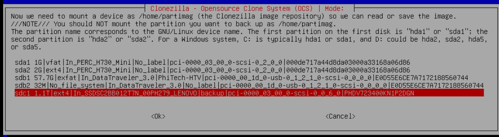

Chọn `fsck` để theo dõi lỗi và fix thủ công.

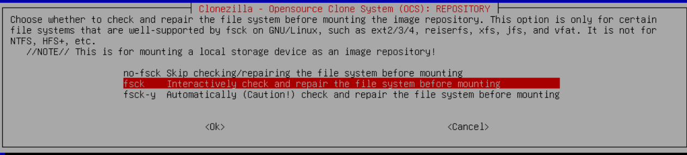

Ở bước này chúng ta không chọn, lưu trực tiếp ở thư mục gốc bằng cách nhấn phím `tab` chọn `done`. Nếu bạn muốn tạo folder riêng, tại bước cmd bạn có thể tạo folder từ bước đó hoặc exit và tạo folder mới. Hệ thống sẽ tự tạo cho bạn một folder nên không cần.

Clonezilla sẽ yêu cầu nhấn Enter để tiếp tục. Phần sync time với Clonezilla server thì không cần.

Tiếp đó chọn Mode Beginer -> Save Disk nếu muốn sao lưu toàn bộ ổ đĩa. Hoặc Save part để backup phân vùng.

Đặt tên cho thư mục

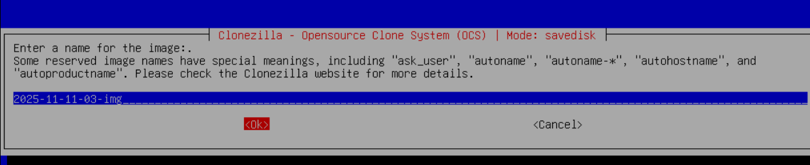

Chọn ổ đĩa cần sao lưu, ở đây với ổ đĩa `sda` mình đã xác định từ đầu nó là ổ chứa ubuntu (RAID1) nên mình sẽ chọn nó -> OK và chọn z1p.

Tiếp đó vẫn nên chạy với tùy chọn `fsck` -> `Check Image` để kiểm soát nếu có lỗi xảy ra.

Chọn enc nếu bạn muốn đặt pass cho bản backup hoặc không chọn dòng Noenc.

Bắt đầu chạy Backup

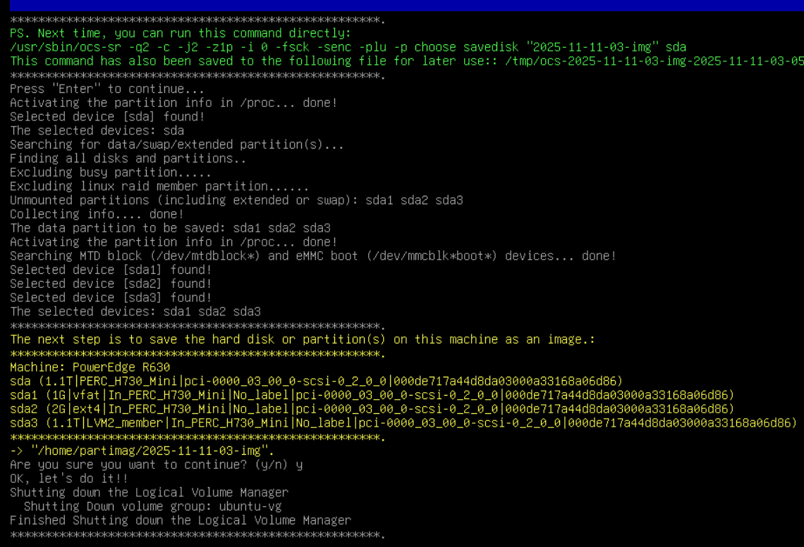

Trong quá trình này nó có thể sẽ hỏi bạn liên tục nên hãy chú ý nhập lệnh nhé.

## 2.2. Restore

### 2.2.1. RAID và các vấn đề liên quan.

Việc RAID ổ hay không, không ảnh hưởng (ý kiến cá nhân) đến việc chúng ta có thể khôi phục được dữ liệu hay không.

Giả sử backup xong, tắt server và tháo 2 ổ RAID1 ra, thay 2 ổ trắng tinh mới vào để test. Hoặc bạn đem ổ backup để restore trên server khác. Bạn có thể tạo RAID (Nếu SATA SSD/HDD) hoặc không (Non raid hoặc NVME không support RAID) không vấn đề gì.

Lưu ý ổ để restore cũng phải có dung lượng bằng hoặc lớn hơn ổ "Nguồn" trước đó. Ví dụ mình backup từ ổ 240GB sang lưu ở ổ 1.2T thì ổ tiếp theo để restore phải từ 240GB trở lên.

Trước hết là tạo RAID cho hai ổ mới, nếu bạn không quan tâm đến RAID cho máy chủ vật lý, hãy bỏ qua bước này.

Tại Virtual Disk, chọn Create

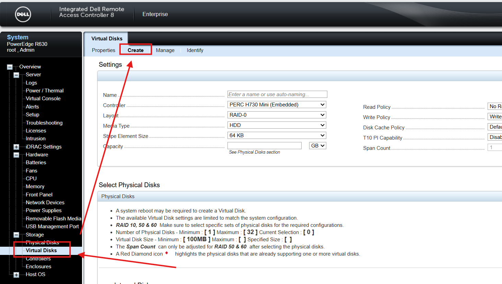

Phần name: bạn đặt tên cho RAID.
Layout: bạn chọn loại RAID, ở đây cài RAID này dành cho OS nên mình sẽ để RAID1
Media type: Chọn loại ổ của bạn (SSD/HDD)
Capacity: Chọn dung lượng của RAID, nếu các ổ đĩa không cùng dung lượng thì dung lượng tối đa của RAID-1 là dung lượng của ổ nhỏ nhất.

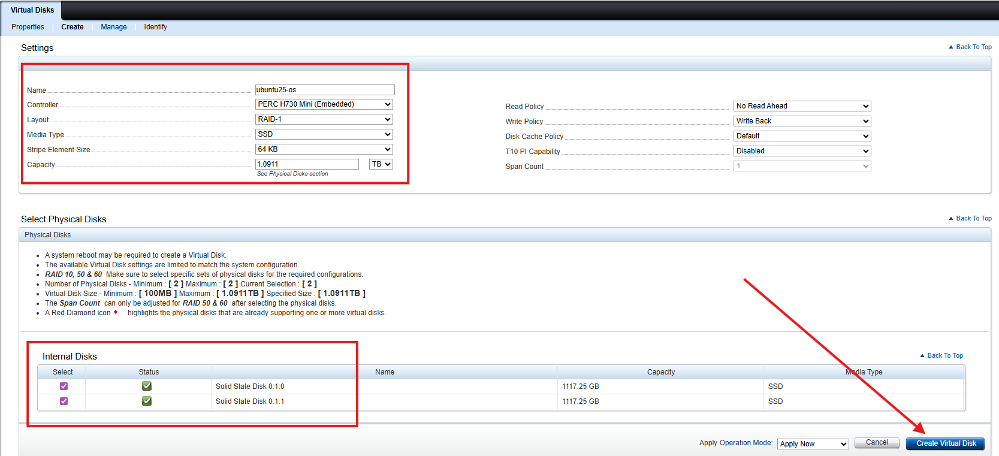

Sau đó chuyển sang `Job Queue` đợi tiến trình hoàn tất.

### 2.2.2. Restore

Tiếp tục cắm usb/drive... boot vào Clonezilla như bước backup.

Đến bước này, ta cần xác định lại vị trí ổ đĩa. Chúng ta nên tháo ổ cứng cần để restore và xem quét ra ổ nào là ổ chứa file backup, sau khi xác định được sda là ổ lưu file backup, sdc là USB thì việc còn lại là restore từ sda sang sdb.

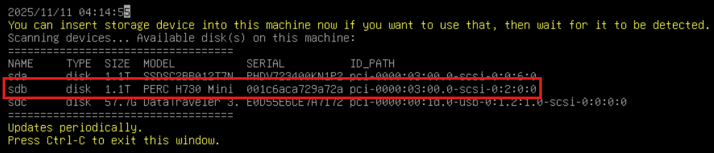

Bước tiếp theo, chúng ta chọn `ổ đĩa chứa file backup` tức ở đây đang là `sda1` của `sda`.

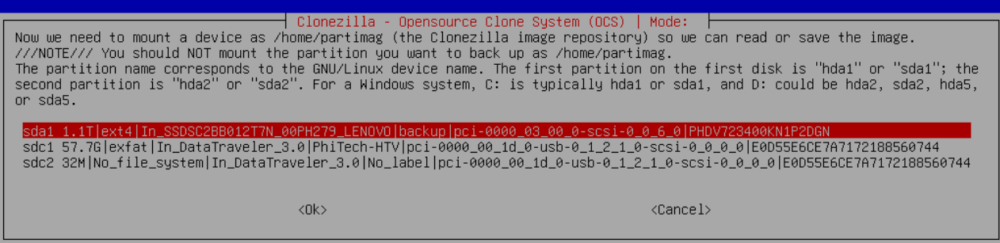

Vẫn nên chọn các tùy chọn `fsck` để tiện theo dõi quá trình.

Tại bước chọn images, chúng ta chọn bản backup và tab xuống done.

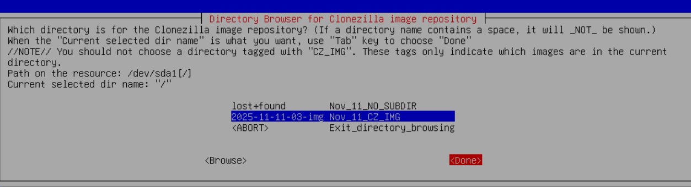

Chọn mode Beginer -> restoredisk

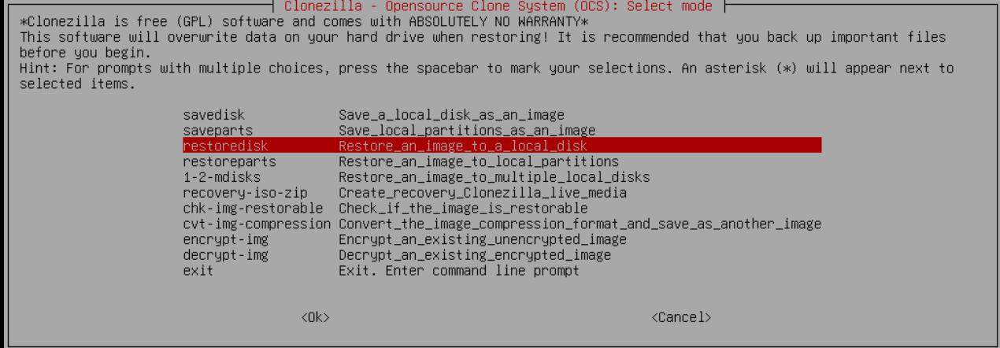

Tiếp theo chọn ổ đĩa đích để chuyển dữ liệu từ ổ backup vào.

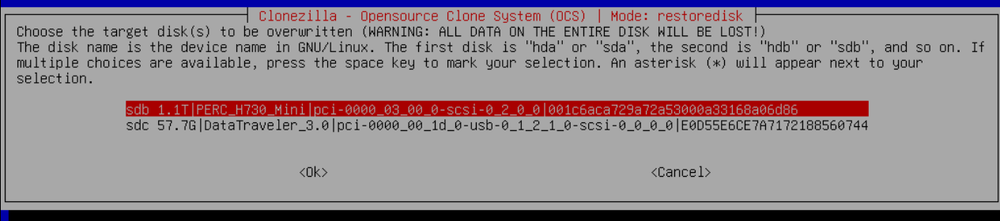

Tiếp theo bạn sẽ thấy 2 option.
k0 là tạo phân vùng giống hệt với OS cũ
k1 là tự động tạo phân vùng cho ổ mới không theo OS cũ.

Tiếp đến bạn nên chọn tùy chọn `Check the image` để kiểm tra tính toàn vẹn của file backup.

Tiến hành restore

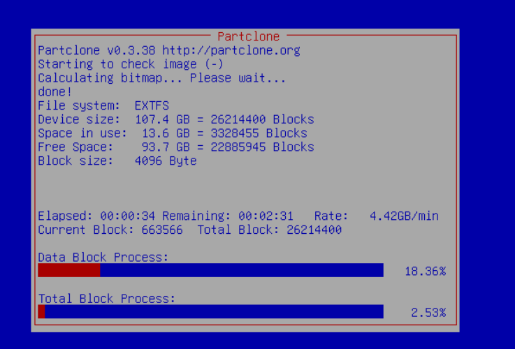

Nếu chọn tùy chọn `fsck` thì clonezilla sẽ hỏi và yêu cầu xác nhận nên cần chú ý nhập lệnh.
# 3. Backup/Restore Đối với Esxi

## 3.1. Tình huống

Giả sử tôi muốn backup esxi bao gồm các máy ảo của nó. Clonezilla hỗ trợ điều này, tuy hơi phức tạp một chút.  Hiện tại, tôi đang có 2 ổ RAID-1 cùng dung lượng 240GB, chứa Esxi OS và tạo 1 Data storage, tạo một máy ảo và tải một vài file lên để test.

2 Ổ cứng 240GB tạo RAID-1

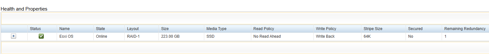

Đã cài Esxi, tải lên file và tạo máy ảo.

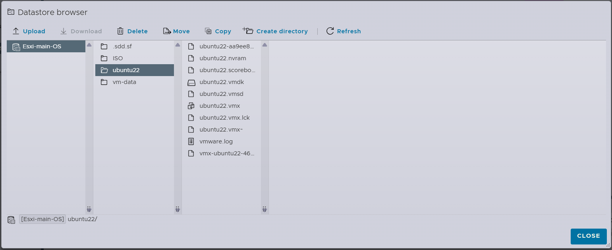

Yêu cầu sau khi backup:
- Giữ được cấu hình và toàn bộ dữ liệu, máy ảo của Esxi.
- Mở rộng được data storage khi chuyển sang ổ đĩa lớn hơn mà không làm mất dữ liệu của Esxi.

## 3.2. Backup

Backup như bình thường, giống như ở phần trước đã làm với OS đơn thì Esxi cũng tương tự.

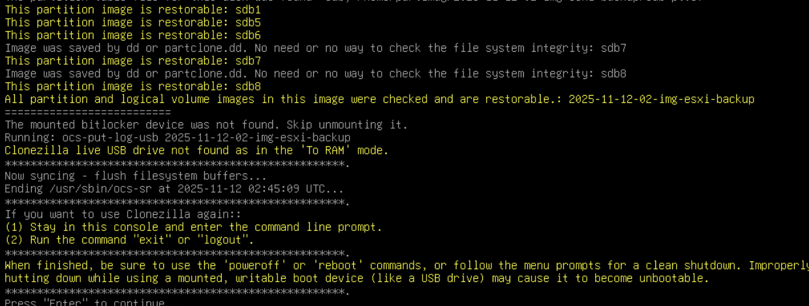

## 3.2. Restore

Giả sử ổ gốc tính cả data storage đang có dung lượng 240GB. Chúng ta đổi ổ cho RAID lên 1.2TB.

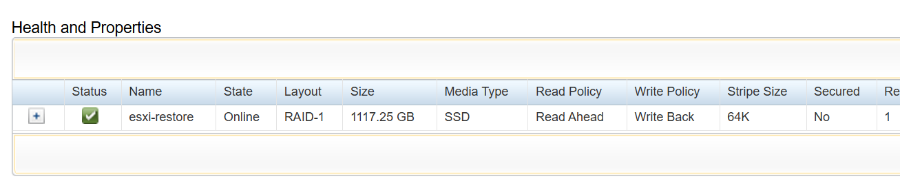

Chúng ta chọn ổ đĩa chứa backup

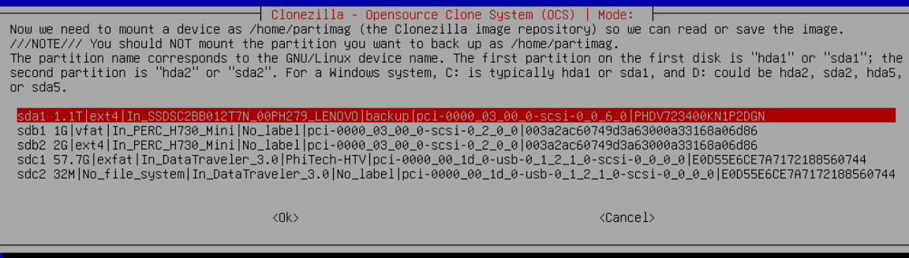

Vẫn chọn các tùy chọn như fsck...

Tiếp đến review folder image để restore.

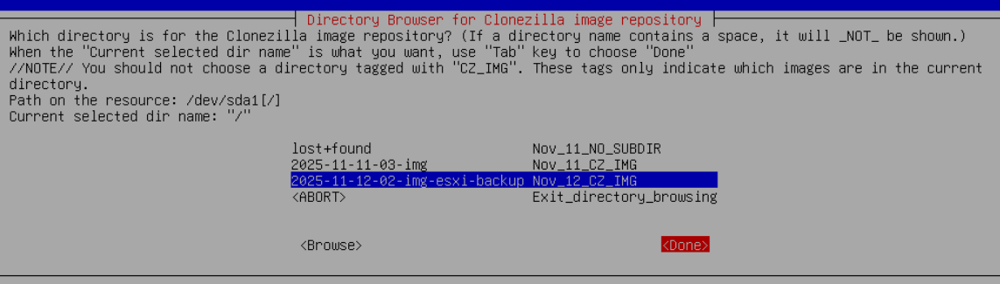

Lúc này chọn Restore Disk

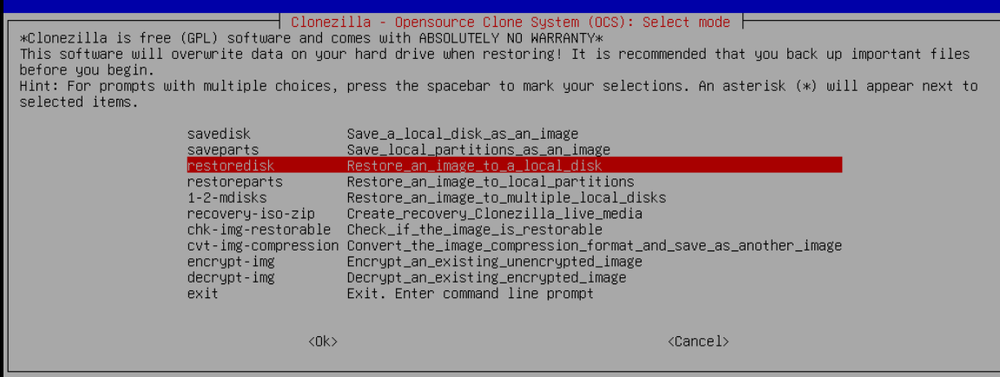

Bây giờ chúng ta mới chọn image để restore

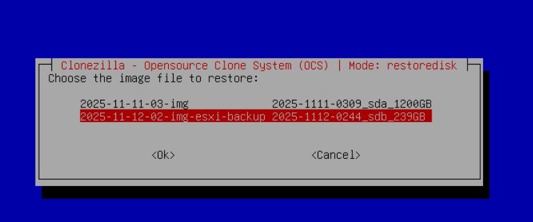

Chọn ổ đĩa để chứa Esxi mới. Ở đây mình chọn ổ 1.2T đã tạo RAID-1

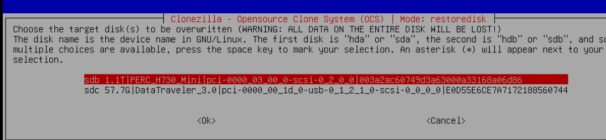

Chọn k0 và check image before restore.

Sau khi restore xong. Chúng ta reboot và xem liệu có vào lại được Esxi hay không.

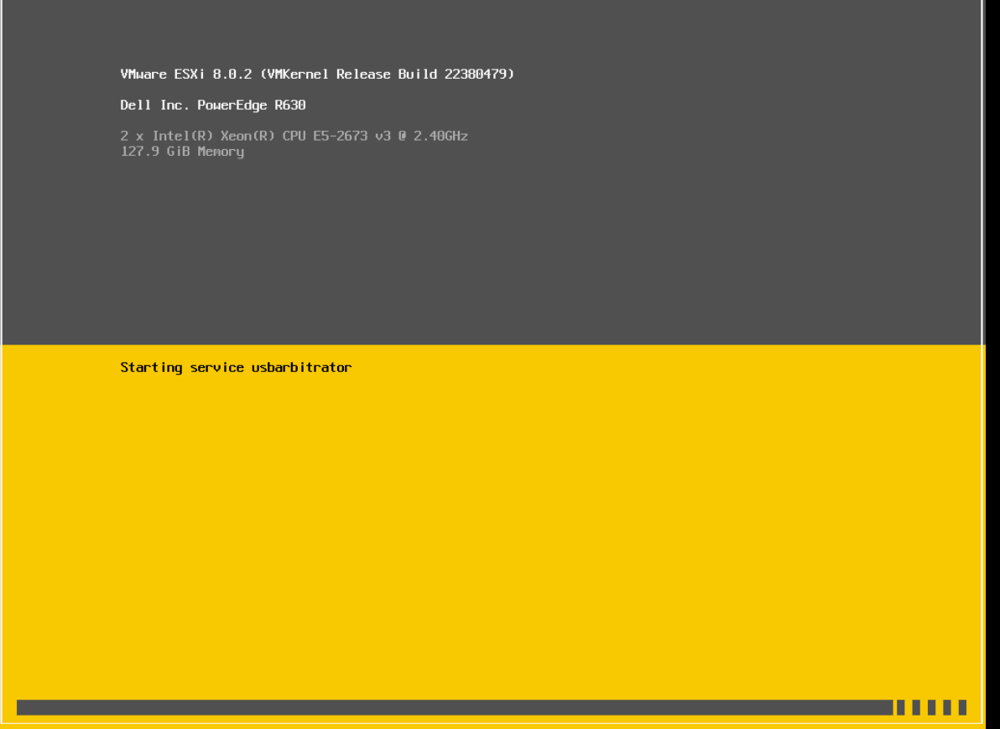

Như này là đã thành công bước đầu.

Tuy nhiên khi kiểm tra VM và Data storage thì không thấy đâu

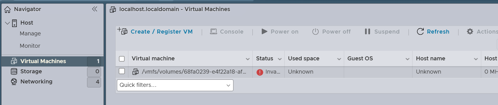

Đừng lo, nguyên nhân do khi restore lại, ổ cứng thay đổi ID nên chúng ta phải mount lại phân vùng.

Chúng ta vào Host -> Action -> Services và bật Shell với SSH lên.

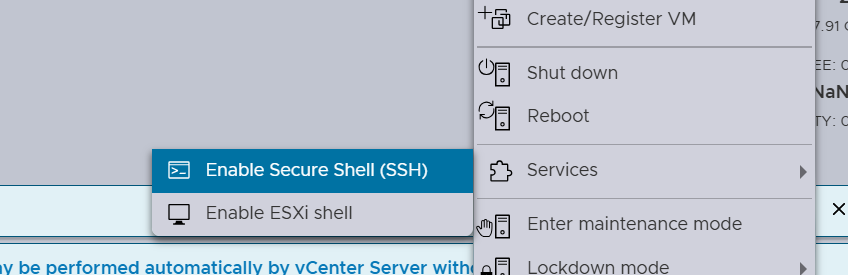

Sau đó ta ssh vào Esxi shell

```zsh
[root@localhost:~] ls /vmfs/devices/disks/
naa.55cd2e414e0a6e62
naa.55cd2e414e0a6e62:1
naa.61866da06831a30030a6d34907c62a3a
naa.61866da06831a30030a6d34907c62a3a:1
naa.61866da06831a30030a6d34907c62a3a:5
naa.61866da06831a30030a6d34907c62a3a:6
naa.61866da06831a30030a6d34907c62a3a:7
naa.61866da06831a30030a6d34907c62a3a:8
vml.020000000055cd2e414e0a6e62535344534332
vml.020000000055cd2e414e0a6e62535344534332:1
vml.020000000061866da06831a30030a6d34907c62a3a504552432048
vml.020000000061866da06831a30030a6d34907c62a3a504552432048:1
vml.020000000061866da06831a30030a6d34907c62a3a504552432048:5
vml.020000000061866da06831a30030a6d34907c62a3a504552432048:6
vml.020000000061866da06831a30030a6d34907c62a3a504552432048:7
vml.020000000061866da06831a30030a6d34907c62a3a504552432048:8
```

Ở đây chúng ta thấy ổ chính đang chứa Esxi là `naa.61866da06831a30030a6d34907c62a3a`

Phân vùng 8 (VMFS) chính là Data storage trước đó của chúng ta. Giữ nguyên 95GB như từ ổ đĩa cũ và có thể thấy sau khi chuyển sang ổ mới chúng ta dư khoảng 894GB đang trống (Free space)

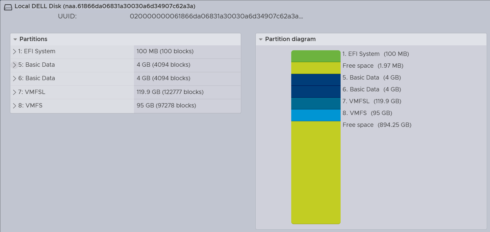

Kiểm tra phân vùng có thể thao tác, định dạng VMFS6 (dành cho data storage)

```zsh
[root@localhost:~] esxcfg-volume --list
Scanning for VMFS-6 host activity (4096 bytes/HB, 1024 HBs).
VMFS UUID/label: 68fa0239-e4f22a18-af86-001b21bcf020/Esxi-main-OS
Can mount: Yes
Can resignature: Yes
Extent name: naa.61866da06831a30030a6d34907c62a3a:8     range: 0 - 97023 (MB)
```

Tiến hành mount trước để kiểm tra toàn vẹn dữ liệu

```zsh
[root@localhost:~] esxcfg-volume -m 68fa0239-e4f22a18-af86-001b21bcf020
Mounting volume 68fa0239-e4f22a18-af86-001b21bcf020
```

Rescan lại volumes và phân vùng

```zsh
esxcli storage core adapter rescan --all
```

Sau đó kiểm tra lại bằng lệnh

```zsh
esxcli storage filesystem list
```

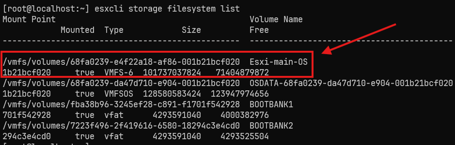

Trên Esxi GUI, chúng ta F5 lại là xem kết quả.

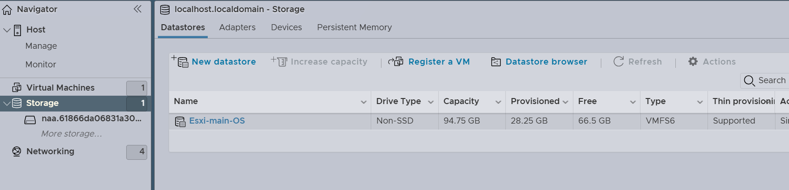

Lúc này kiểm tra lại xem file và máy ảo đã được khôi phục chưa?

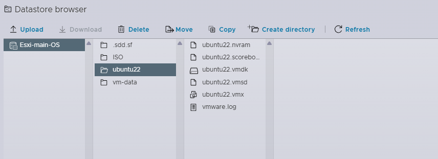

Bật lại máy ảo và xác nhận hoạt động bình thường.

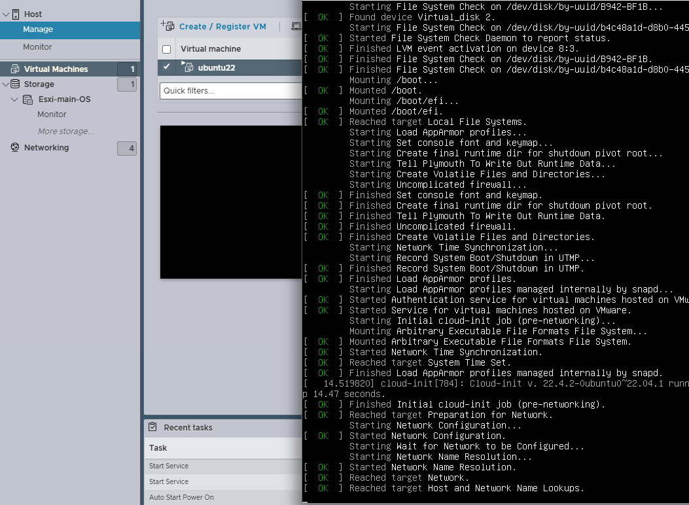

Tiếp theo, bước này quan trọng. Tắt hết các máy ảo. Chúng ta sẽ mở rộng data storage.

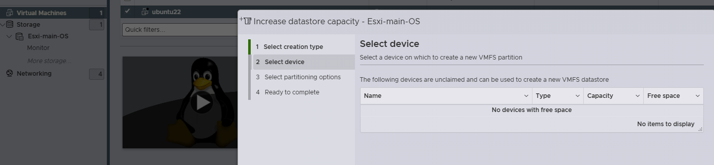

Nếu dùng GUI, ta sẽ không thấy phần free space. Bạn phải mở rộng phân vùng của data storage, sau đó resignature và growfs.

Trong shell, chúng ta xác định được ổ cứng của mình nhờ vào câu lệnh

```zsh
ls /vmfs/devices/disks/
naa.55cd2e414e0a6e62
naa.55cd2e414e0a6e62:1
naa.61866da06831a30030a6d34907c62a3a
naa.61866da06831a30030a6d34907c62a3a:1
naa.61866da06831a30030a6d34907c62a3a:5
naa.61866da06831a30030a6d34907c62a3a:6
naa.61866da06831a30030a6d34907c62a3a:7
naa.61866da06831a30030a6d34907c62a3a:8
vml.020000000055cd2e414e0a6e62535344534332
vml.020000000055cd2e414e0a6e62535344534332:1
vml.020000000061866da06831a30030a6d34907c62a3a504552432048
vml.020000000061866da06831a30030a6d34907c62a3a504552432048:1
vml.020000000061866da06831a30030a6d34907c62a3a504552432048:5
vml.020000000061866da06831a30030a6d34907c62a3a504552432048:6
vml.020000000061866da06831a30030a6d34907c62a3a504552432048:7
vml.020000000061866da06831a30030a6d34907c62a3a504552432048:8
```

Đó là `naa.61866da06831a30030a6d34907c62a3a`, cái chia làm 8 phân vùng.

Xác định vị trí bắt đầu và kết thúc của các phân vùng trên ổ đĩa.

Chúng ta biết rằng phân vùng 8 (cuối, dạng vmfs) luôn là Data storage hoặc trừ khi bạn đã tạo 2 cái trên một ổ đơn này. Lúc này bạn cần kết hợp với web management để kiểm tra cẩn thận.

```zsh
[root@localhost:~] partedUtil getptbl /vmfs/devices/disks/naa.61866da06831a30030a6d34907c62a3a
gpt
145847 255 63 2343043072
1 64 204863 C12A7328F81F11D2BA4B00A0C93EC93B systemPartition 128
5 208896 8595455 EBD0A0A2B9E5443387C068B6B72699C7 linuxNative 0
6 8597504 16984063 EBD0A0A2B9E5443387C068B6B72699C7 linuxNative 0
7 16986112 268435455 4EB2EA3978554790A79EFAE495E21F8D vmfsl 0
8 268437504 467664862 AA31E02A400F11DB9590000C2911D1B8 vmfs 0
```

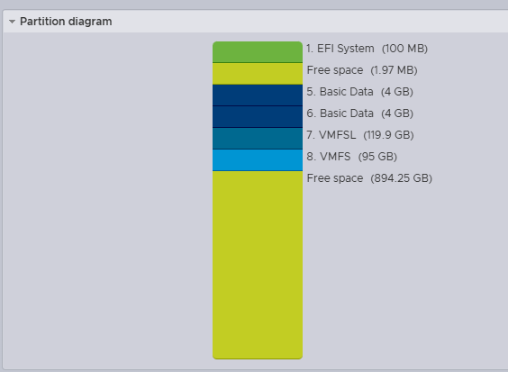

Như kết quả từ câu lệnh trên, ta thấy phân vùng 8 hiện tại chính là Data storage `Esxi-main-OS` cần mở rộng và có điểm bắt đầu `268437504`, kết thúc tại  `467664862`

Ý tưởng là ta sẽ tìm điểm cuối cùng của disk và set giới hạn (điểm kết thúc) của partition 8 tại vị trí đó.

```zsh
[root@localhost:~] partedUtil getUsableSectors /vmfs/devices/disks/naa.61866da06831a30030a6d34907c62a3a
34 2343043038
```

Chúng ta sẽ resize partition 8 là `/vmfs/devices/disks/naa.61866da06831a30030a6d34907c62a3a:8` có điểm bắt đầu giữ nguyên `268437504`, điểm kết thúc chúng ta nên giữ khoảng cách khoảng 30 chứ không lấy hết là khoảng `2343043008`

```zsh
partedUtil resize "/vmfs/devices/disks/naa.61866da06831a30030a6d34907c62a3a" 8 268437504 2343043008
```

Sau đó kiểm tra bằng lệnh

```zsh
partedUtil getptbl /vmfs/devices/disks/naa.61866da06831a30030a6d34907c62a3a
```

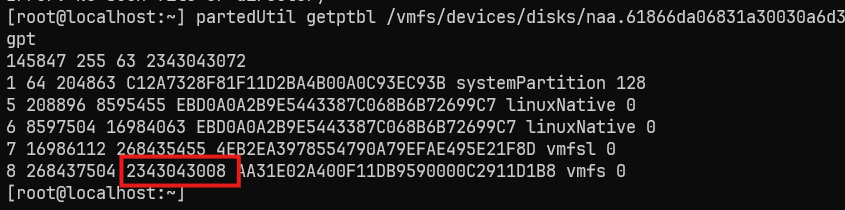

Lúc này cần unmount Data storage để tiến hành mở rộng dung lượng.

```zsh
esxcfg-volume -u Esxi-main-OS
Umounting volume /vmfs/volumes/Esxi-main-OS
warn [ConfigStore:6ab3384cc0] DeleteSubObject: Could not find key: snap_volume
```

Kiểm tra xem đã unmount chưa

```zsh
[root@localhost:~] esxcli storage filesystem list
Mount Point                                        Volume Name                                 UUID
            Mounted  Type            Size          Free
-------------------------------------------------  ------------------------------------------  -----------------------------------  -------  ------  ------------  ------------
/vmfs/volumes/68fa0239-da47d710-e904-001b21bcf020  OSDATA-68fa0239-da47d710-e904-001b21bcf020  68fa0239-da47d710-e904-001b21bcf020     true  VMFSOS  128580583424  123950071808
/vmfs/volumes/fba38b96-3245ef28-c891-f1701f542928  BOOTBANK1                                   fba38b96-3245ef28-c891-f1701f542928     true  vfat      4293591040    4000382976
/vmfs/volumes/7223f496-2f419616-6580-18294c3e4cd0  BOOTBANK2                                   7223f496-2f419616-6580-18294c3e4cd0     true  vfat      4293591040    4293525504
```

```zsh
[root@localhost:~] esxcfg-volume --list
Scanning for VMFS-6 host activity (4096 bytes/HB, 1024 HBs).
VMFS UUID/label: 68fa0239-e4f22a18-af86-001b21bcf020/Esxi-main-OS
Can mount: Yes
Can resignature: Yes
Extent name: naa.61866da06831a30030a6d34907c62a3a:8     range: 0 - 97023 (MB)
```

Đăng ký lại phân vùng và mount lại

```zsh
esxcfg-volume --resignature Esxi-main-OS
```

Mở rộng phân vùng:

```zsh
vmkfstools --growfs "/vmfs/devices/disks/naa.61866da06831a30030a6d34907c62a3a:8" "/vmfs/devices/disks
/naa.61866da06831a30030a6d34907c62a3a:8"
```

Kiểm tra lại

```zsh
[root@localhost:~] esxcli storage filesystem list
Mount Point                                        Volume Name                                 UUID                                 Mounted  Type             Size           Free
-------------------------------------------------  ------------------------------------------  -----------------------------------  -------  ------  -------------  -------------
/vmfs/volumes/6915980a-31727d10-2956-001b21bcf020  snap-151a78d1-Esxi-main-OS                  6915980a-31727d10-2956-001b21bcf020     true  VMFS-6  1061930663936  1031581728768
/vmfs/volumes/68fa0239-da47d710-e904-001b21bcf020  OSDATA-68fa0239-da47d710-e904-001b21bcf020  68fa0239-da47d710-e904-001b21bcf020     true  VMFSOS   128580583424   123950071808
/vmfs/volumes/fba38b96-3245ef28-c891-f1701f542928  BOOTBANK1                                   fba38b96-3245ef28-c891-f1701f542928     true  vfat       4293591040     4000382976
/vmfs/volumes/7223f496-2f419616-6580-18294c3e4cd0  BOOTBANK2                                   7223f496-2f419616-6580-18294c3e4cd0     true  vfat       4293591040     4293525504
```

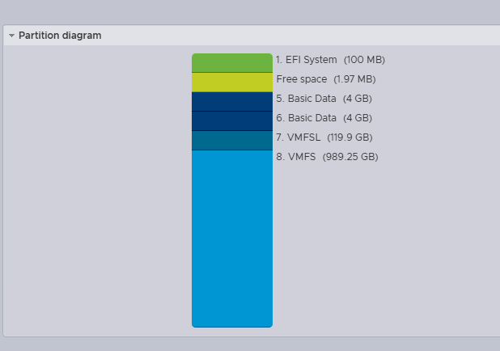

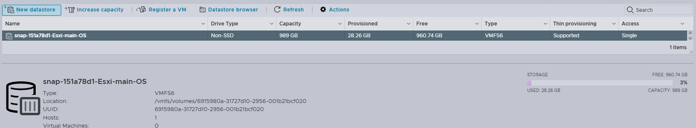

Có thể sẽ bị đổi tên, bạn có thể đổi lại nếu cần

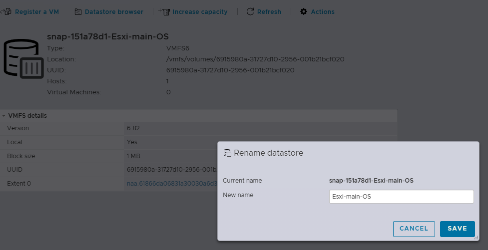

Thử chạy lại máy ảo.

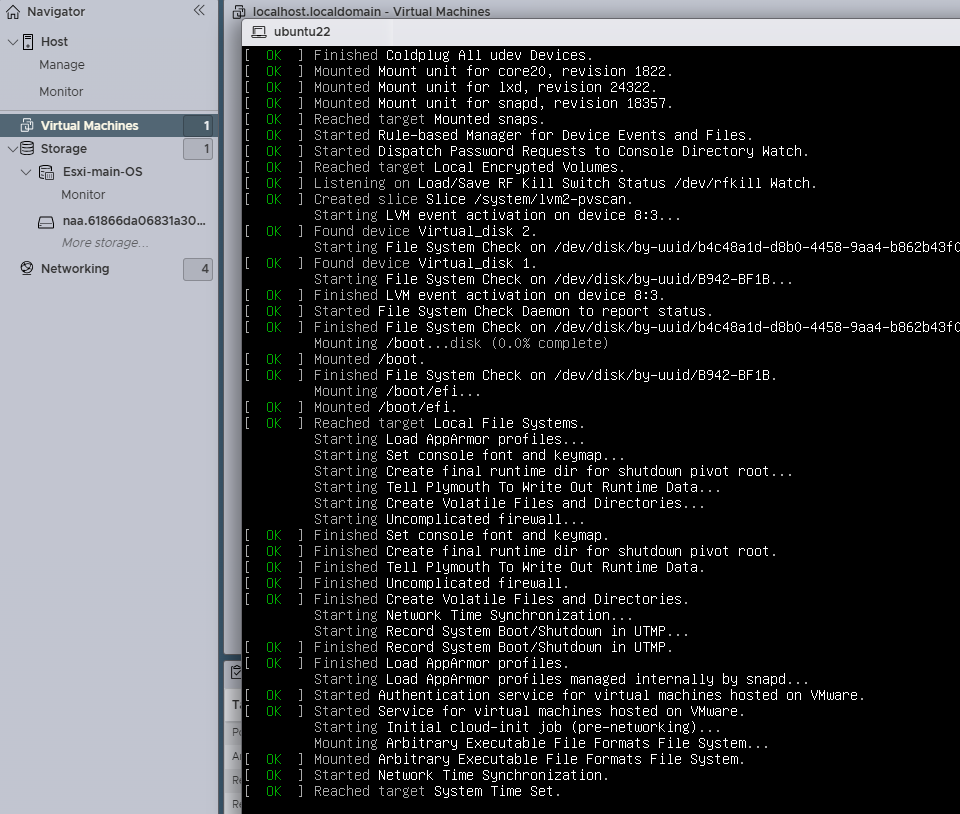
# 4. Backup/Restore từ máy chủ vật lý chuyển sang máy ảo

