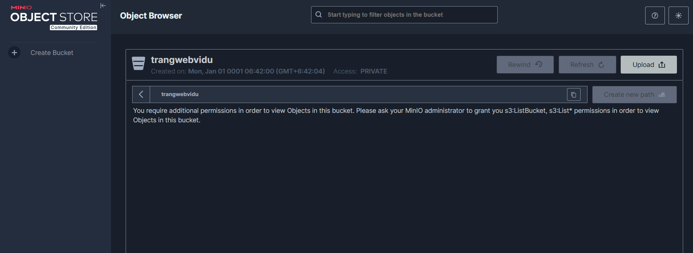
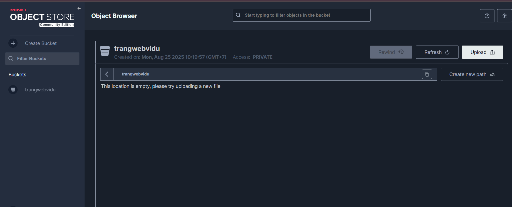
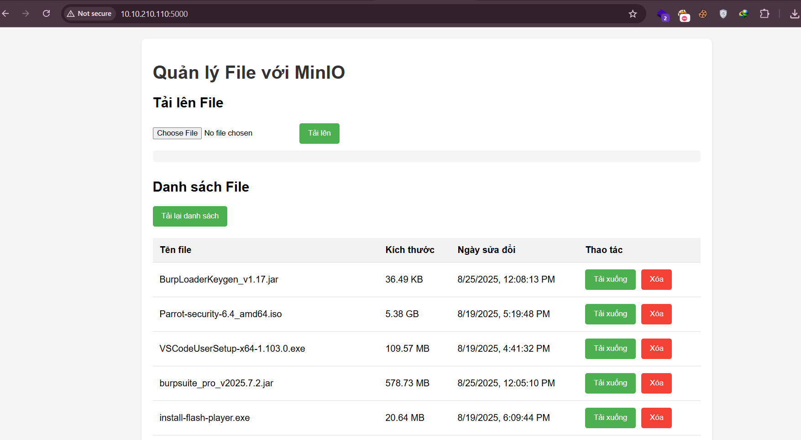
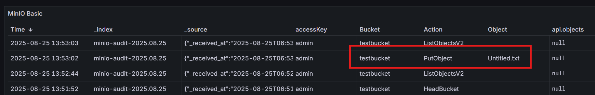
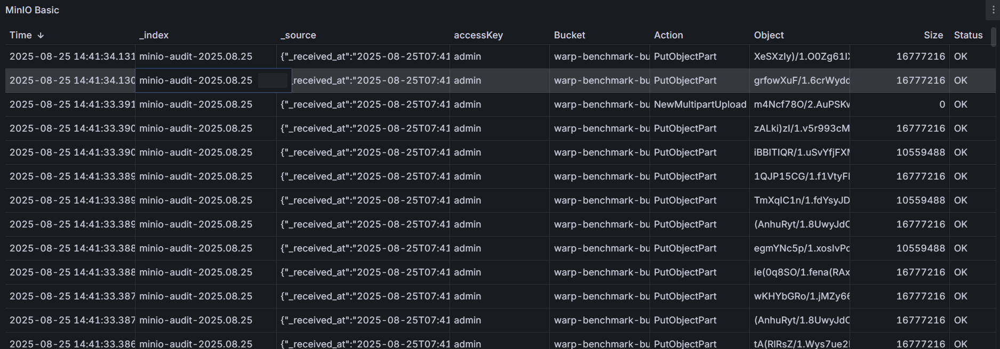

# 1. Tổng quan

Ta có một hệ thống minio, với dung lượng lớn và internet nhanh có thể đáp ứng nhu cầu về lưu trữ và đồng bộ. Giờ đây chúng ta muốn mở dịch vụ lưu trữ trực tuyến, khách hàng là các trang web, ứng dụng,...


# 2. Thiết kế

Tạo cho mỗi khách hàng một hoặc vài bucket có liên quan, tạo các tài khoản minio và cấu hình quyền riêng chỉ được phép truy cập thêm sửa xóa file trong các bucket nhất định đã được chỉ định cho khách hàng.

# 3. Triển khai

Tạo một bucket mới cho khách hàng **bằng tài khoản quản trị**, ví dụ: `trangwebvidu`, có thể tạo bằng `mc` hoặc trên minio console (port 9001)

Tiếp theo, tạo policy cho bucket, cho phép thêm, xóa file,... không cho phép xóa bucket.

```zsh
nano trangwebvidu-policy.json
```

```json
{
  "Version": "2012-10-17",
  "Statement": [
    {
      "Effect": "Allow",
      "Action": [
        "s3:ListBucket"
      ],
      "Resource": [
        "arn:aws:s3:::trangwebvidu"
      ]
    },
    {
      "Effect": "Allow",
      "Action": [
        "s3:GetObject",
        "s3:PutObject",
        "s3:DeleteObject"
      ],
      "Resource": [
        "arn:aws:s3:::trangwebvidu/*"
      ]
    }
  ]
}
```

Thêm policy vào minio

```zsh
../mc admin policy create myminio trangwebvidu-policy ./trangwebvidu-policy.json
```

Tạo user

```zsh
./mc admin user add myminio trangwebuser01 'FTuTRLf8SN'
```

Khi đăng nhập trên `minio console` không thấy có bucket nào.



Gán policy cho user có quyền trong bucket

```zsh
../mc admin policy attach myminio trangwebvidu-policy --user trangwebuser01
```

Như vậy là đã có quyền truy cập vào bucket



Thêm alias

```zsh
../mc alias set testtrangweb https://10.10.210.111:9000 trangwebuser01 FTuTRLf8SN --api S3v4
```
# Tạo một web upload đơn giản.

Cài đặt một máy chủ web ubuntu server 25.4

Cấu trúc trang web để test như sau:

```zsh
.
├── app.py
├── node01.crt
├── node02.crt
├── templates
│   └── index.html
```

Các file .crt là public key lấy từ các node khác để xác thực SSL cho api.

Mã nguồn app.py

```python
import os
import urllib3
from flask import Flask, send_from_directory, request, jsonify, render_template
from minio import Minio
from datetime import timedelta
from werkzeug.utils import secure_filename

# Cấu hình MinIO
MINIO_ENDPOINT = os.getenv("MINIO_ENDPOINT", "10.10.210.112:9000")
MINIO_ACCESS_KEY = os.getenv("MINIO_ACCESS_KEY", "admin")
MINIO_SECRET_KEY = os.getenv("MINIO_SECRET_KEY", "htv@2025")
MINIO_BUCKET = os.getenv("MINIO_BUCKET", "testbucket")
MINIO_CACERT = os.getenv("MINIO_CACERT", "./node02.crt")

# Tạo HTTP client với SSL tự ký
try:
    http_client = urllib3.PoolManager(
        cert_reqs='CERT_REQUIRED',
        ca_certs=MINIO_CACERT,
        retries=urllib3.Retry(total=3, backoff_factor=0.2),
        timeout=urllib3.util.Timeout(connect=5, read=15)
    )
except Exception as e:
    print(f"Lỗi khi tạo HTTP client: {e}")
    print("Sử dụng chế độ không xác thực SSL (chỉ dành cho development)")
    http_client = urllib3.PoolManager(
        cert_reqs='CERT_NONE',
        retries=urllib3.Retry(total=3, backoff_factor=0.2),
        timeout=urllib3.util.Timeout(connect=5, read=15)
    )

# Tạo MinIO client
client = Minio(
    MINIO_ENDPOINT,
    access_key=MINIO_ACCESS_KEY,
    secret_key=MINIO_SECRET_KEY,
    secure=True,
    http_client=http_client
)

# Tạo bucket nếu chưa tồn tại
try:
    if not client.bucket_exists(MINIO_BUCKET):
        client.make_bucket(MINIO_BUCKET)
        print(f"Đã tạo bucket: {MINIO_BUCKET}")
except Exception as e:
    print(f"Lỗi khi tạo bucket: {e}")

app = Flask(__name__)
app.config['MAX_CONTENT_LENGTH'] = 16 * 1024 * 1024  # Giới hạn 16MB

@app.route('/')
def index():
    return render_template('index.html')

@app.route('/presign', methods=['POST'])
def presign():
    try:
        data = request.get_json(force=True)
        name = data.get("name")
        if not name:
            return jsonify({"error": "Thiếu tên file"}), 400
        
        # Bảo mật tên file
        filename = secure_filename(name)
        
        # Tạo URL ký trước
        url = client.presigned_put_object(
            MINIO_BUCKET, filename, expires=timedelta(minutes=10)
        )
        return jsonify({"url": url, "filename": filename})
    except Exception as e:
        return jsonify({"error": str(e)}), 500

@app.route('/files', methods=['GET'])
def list_files():
    try:
        objects = client.list_objects(MINIO_BUCKET)
        files = []
        for obj in objects:
            files.append({
                "name": obj.object_name,
                "size": obj.size,
                "last_modified": obj.last_modified
            })
        return jsonify(files)
    except Exception as e:
        return jsonify({"error": str(e)}), 500

@app.route('/files/<filename>', methods=['DELETE'])
def delete_file(filename):
    try:
        client.remove_object(MINIO_BUCKET, filename)
        return jsonify({"message": f"Đã xóa file {filename}"})
    except Exception as e:
        return jsonify({"error": str(e)}), 500

@app.route('/download/<filename>', methods=['GET'])
def download_file(filename):
    try:
        # Tạo URL tải xuống
        url = client.presigned_get_object(
            MINIO_BUCKET, filename, expires=timedelta(minutes=5)
        )
        return jsonify({"url": url})
    except Exception as e:
        return jsonify({"error": str(e)}), 500

if __name__ == "__main__":
    app.run(host="0.0.0.0", port=5000, debug=True)

```

Sau đó chúng ta dùng biến môi trường, ví dụ

```zsh
export MINIO_ENDPOINT="10.10.210.112:9000"
```

Mã nguồn index.html

```html
<!DOCTYPE html>
<html lang="vi">
<head>
    <meta charset="UTF-8">
    <meta name="viewport" content="width=device-width, initial-scale=1.0">
    <title>Quản lý File với MinIO</title>
    <style>
        body {
            font-family: Arial, sans-serif;
            max-width: 1000px;
            margin: 0 auto;
            padding: 20px;
            background-color: #f5f5f5;
        }
        .container {
            background-color: white;
            padding: 20px;
            border-radius: 8px;
            box-shadow: 0 2px 4px rgba(0,0,0,0.1);
        }
        h1 {
            color: #333;
        }
        .upload-section, .files-section {
            margin-bottom: 30px;
        }
        input[type="file"] {
            margin: 10px 0;
        }
        button {
            background-color: #4CAF50;
            color: white;
            padding: 10px 15px;
            border: none;
            border-radius: 4px;
            cursor: pointer;
            margin-right: 10px;
        }
        button:hover {
            background-color: #45a049;
        }
        button.delete {
            background-color: #f44336;
        }
        button.delete:hover {
            background-color: #d32f2f;
        }
        table {
            width: 100%;
            border-collapse: collapse;
            margin-top: 20px;
        }
        th, td {
            padding: 12px;
            text-align: left;
            border-bottom: 1px solid #ddd;
        }
        th {
            background-color: #f2f2f2;
        }
        .progress {
            height: 20px;
            background-color: #f5f5f5;
            border-radius: 4px;
            margin: 10px 0;
        }
        .progress-bar {
            height: 100%;
            background-color: #4CAF50;
            border-radius: 4px;
            width: 0%;
            transition: width 0.3s;
        }
    </style>
</head>
<body>
    <div class="container">
        <h1>Quản lý File với MinIO</h1>

        <div class="upload-section">
            <h2>Tải lên File</h2>
            <input type="file" id="fileInput">
            <button onclick="uploadFile()">Tải lên</button>
            <div class="progress">
                <div class="progress-bar" id="progressBar"></div>
            </div>
            <div id="uploadStatus"></div>
        </div>

        <div class="files-section">
            <h2>Danh sách File</h2>
            <button onclick="loadFiles()">Tải lại danh sách</button>
            <table id="filesTable">
                <thead>
                    <tr>
                        <th>Tên file</th>
                        <th>Kích thước</th>
                        <th>Ngày sửa đổi</th>
                        <th>Thao tác</th>
                    </tr>
                </thead>
                <tbody id="filesBody">
                </tbody>
            </table>
        </div>
    </div>

    <script>
        // Hàm tải lên file
        async function uploadFile() {
            const fileInput = document.getElementById('fileInput');
            const progressBar = document.getElementById('progressBar');
            const statusDiv = document.getElementById('uploadStatus');

            if (!fileInput.files.length) {
                statusDiv.textContent = 'Vui lòng chọn file để tải lên';
                return;
            }

            const file = fileInput.files[0];
            statusDiv.textContent = 'Đang chuẩn bị tải lên...';

            try {
                // Lấy URL ký trước từ server
                const response = await fetch('/presign', {
                    method: 'POST',
                    headers: {
                        'Content-Type': 'application/json'
                    },
                    body: JSON.stringify({ name: file.name })
                });

                const data = await response.json();

                if (!response.ok) {
                    throw new Error(data.error || 'Lỗi khi lấy URL tải lên');
                }

                // Sử dụng URL ký trước để tải file lên MinIO
                const uploadResponse = await fetch(data.url, {
                    method: 'PUT',
                    body: file,
                    headers: {
                        'Content-Type': 'application/octet-stream'
                    }
                });

                if (uploadResponse.ok) {
                    statusDiv.textContent = 'Tải lên thành công!';
                    progressBar.style.width = '100%';
                    fileInput.value = '';
                    loadFiles(); // Tải lại danh sách file
                } else {
                    throw new Error('Tải lên thất bại');
                }
            } catch (error) {
                console.error('Lỗi:', error);
                statusDiv.textContent = 'Lỗi: ' + error.message;
            }
        }

        // Hàm tải danh sách file
        async function loadFiles() {
            try {
                const response = await fetch('/files');
                const files = await response.json();

                if (!response.ok) {
                    throw new Error(files.error || 'Lỗi khi tải danh sách file');
                }

                const filesBody = document.getElementById('filesBody');
                filesBody.innerHTML = '';

                files.forEach(file => {
                    const row = document.createElement('tr');

                    const nameCell = document.createElement('td');
                    nameCell.textContent = file.name;

                    const sizeCell = document.createElement('td');
                    sizeCell.textContent = formatFileSize(file.size);

                    const dateCell = document.createElement('td');
                    dateCell.textContent = new Date(file.last_modified).toLocaleString();

                    const actionCell = document.createElement('td');

                    const downloadBtn = document.createElement('button');
                    downloadBtn.textContent = 'Tải xuống';
                    downloadBtn.onclick = () => downloadFile(file.name);

                    const deleteBtn = document.createElement('button');
                    deleteBtn.textContent = 'Xóa';
                    deleteBtn.className = 'delete';
                    deleteBtn.onclick = () => deleteFile(file.name);

                    actionCell.appendChild(downloadBtn);
                    actionCell.appendChild(deleteBtn);

                    row.appendChild(nameCell);
                    row.appendChild(sizeCell);
                    row.appendChild(dateCell);
                    row.appendChild(actionCell);

                    filesBody.appendChild(row);
                });
            } catch (error) {
                console.error('Lỗi:', error);
                alert('Lỗi khi tải danh sách file: ' + error.message);
            }
        }

        // Hàm tải xuống file
        async function downloadFile(filename) {
            try {
                const response = await fetch(`/download/${encodeURIComponent(filename)}`);
                const data = await response.json();

                if (!response.ok) {
                    throw new Error(data.error || 'Lỗi khi lấy URL tải xuống');
                }

                // Chuyển hướng đến URL tải xuống
                window.location.href = data.url;
            } catch (error) {
                console.error('Lỗi:', error);
                alert('Lỗi khi tải xuống file: ' + error.message);
            }
        }

        // Hàm xóa file
        async function deleteFile(filename) {
            if (!confirm(`Bạn có chắc chắn muốn xóa file "${filename}"?`)) {
                return;
            }

            try {
                const response = await fetch(`/files/${encodeURIComponent(filename)}`, {
                    method: 'DELETE'
                });

                const data = await response.json();

                if (!response.ok) {
                    throw new Error(data.error || 'Lỗi khi xóa file');
                }

                alert('Đã xóa file thành công');
                loadFiles(); // Tải lại danh sách file
            } catch (error) {
                console.error('Lỗi:', error);
                alert('Lỗi khi xóa file: ' + error.message);
            }
        }

        // Hàm định dạng kích thước file
        function formatFileSize(bytes) {
            if (bytes === 0) return '0 Bytes';
            const k = 1024;
            const sizes = ['Bytes', 'KB', 'MB', 'GB'];
            const i = Math.floor(Math.log(bytes) / Math.log(k));
            return parseFloat((bytes / Math.pow(k, i)).toFixed(2)) + ' ' + sizes[i];
        }

        // Tải danh sách file khi trang được load
        document.addEventListener('DOMContentLoaded', loadFiles);
    </script>
</body>
</html>
```


Trông nó sẽ như thế này




Thử tải lên một file



# Benmark

Sử dụng công cụ [Warp][https://github.com/minio/warp] để benmark.

Ở đây mình dùng 4 client để benmark. (Không phải máy node minio)

Tải về và cài đặt lần lượt trên 4 client

```zsh
wget https://github.com/minio/warp/releases/download/v1.3.0/warp_Linux_x86_64.deb
sudo dpkg -i warp_Linux_x86_64.deb
```

Nếu là Windows, chỉ cần tải file .exe.

Chạy trên các máy client, mặc định sẽ lắng nghe trên cổng 7761

```zsh
warp client
```

Chạy lệnh sau trên máy chỉ đạo benmark

```powershell
warp.exe mixed --warp-client 10.10.210.110:7761,10.10.210.13:7761,10.10.210.12:7761,10.10.210.14:7761 --host 10.10.210.111:9000,10.10.210.112:9000,10.10.210.113:9000,10.10.210.114:9000 --duration 120s --obj.size 8M --access-key admin --secret-key "htv@2025" --concurrent 16 --tls --insecure
```

Trong đó, các ip có port 7761 là các warp client, các host có port 9000 là các node trong minio.




