# 1. Tích hợp MinIO - webhook - ElasticSearch và Grafana để theo dõi log

## 1.1 Tạo webhook đơn giản kiểm tra xem log có hoạt động không

Xây dựng một ứng dụng lấy log, ví dụ ở đây là python3.

```python
from flask import Flask, request, abort
import hmac
import hashlib
import json
from datetime import datetime

app = Flask(__name__)

# Secret Key của bạn - PHẢI GIỐNG với config trong MinIO
WEBHOOK_SECRET_KEY = "your-super-secret-key-here"

def verify_signature(received_signature, payload):
    """
    Hàm xác thực chữ ký HMAC.
    Sử dụng so sánh 'constant-time' để tránh tấn công timing attack.
    """
    computed_signature = hmac.new(
        key=WEBHOOK_SECRET_KEY.encode('utf-8'),
        msg=payload,
        digestmod=hashlib.sha256
    ).hexdigest()
    return hmac.compare_digest(computed_signature, received_signature)

@app.route('/webhook', methods=['POST'])
def handle_webhook():
    # 1. Get the signature from the header
    received_token = request.headers.get('Authorization', '')
    
    # 2. So sánh trực tiếp với secret key (Simple Auth)
    if not received_token:
        app.logger.warning("Missing Authorization header")
        abort(403, description="Missing Authorization header")
    
    # 3. So sánh token nhận được với secret key của chúng ta
    if not hmac.compare_digest(received_token, WEBHOOK_SECRET_KEY):
        app.logger.error("Invalid token. Potential forged request!")
        abort(403, description="Invalid token")

    # 4. Nếu xác thực thành công, parse JSON và xử lý log
    try:
        log_data = request.get_json()
        print(f"\n--- [{datetime.now().isoformat()}] Received Valid Log ---")
        print(json.dumps(log_data, indent=2))
        # TODO: Ở đây sẽ đẩy dữ liệu vào Redis Queue hoặc Elasticsearch

    except Exception as e:
        app.logger.error(f"Error processing JSON: {e}")
        abort(400, description="Invalid JSON")

    return {'status': 'success', 'message': 'Log received successfully'}

if __name__ == '__main__':
    # Chạy server trên tất cả IP public (0.0.0.0), port 5000, dùng HTTP cho tiện test nội bộ
    app.run(host='0.0.0.0', port=5000, debug=True)
```

Cài đặt các thư viện cần thiết và chạy dứng dụng.

```zsh
python3 app.py
```

Tại node bất kì của mino, chạy lệnh sau (dùng minio-client)

```zsh
./mc admin config set myminio audit_webhook endpoint=http://10.10.210.208:5000/webhook auth_token='your-super-secret-key-here'
```

Kiểm tra bằng lệnh

```zsh
./mc admin config get myminio audit_webhook
```

Thử lên http://node-ip:9001/ login vào và kiểm tra xem log hoạt động không.

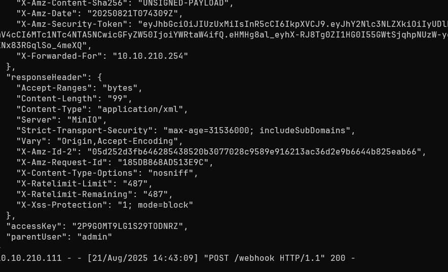

## 1.2 Tích hợp công cụ truy vấn dữ liệu

Giờ đây những dòng log dài lê thê phải được xử lý cho dễ quan sát và phục vụ cho phân tích. Do đó cần kết hợp một bộ công cụ để xử lý dữ liệu log trực quan, từ dữ liệu log, tạo được biểu đồ hoặc bảng chứa giá trị cần theo dõi,...

Ở đây tôi tích hợp `Grafana` + `ElasticSearch` + `Kibana`. Dù nó khá phức tạp, nhưng những lợi ích sau này có lẽ xứng đáng cần phải đánh đổi.

### 1.2.1 Cài đặt Elastic Search và Kibana

Cài đặt java nếu chưa có:

```zsh
wget https://download.oracle.com/java/24/latest/jdk-24_linux-x64_bin.deb
```

**Thêm Elasticsearch repository và cài đặt**

```zsh
# Import GPG key
wget -qO - https://artifacts.elastic.co/GPG-KEY-elasticsearch | sudo gpg --dearmor -o /usr/share/keyrings/elastic-keyring.gpg

# Thêm repository
echo "deb [signed-by=/usr/share/keyrings/elastic-keyring.gpg] https://artifacts.elastic.co/packages/8.x/apt stable main" | sudo tee /etc/apt/sources.list.d/elastic.list

# Cài đặt Elasticsearch & Kibana
sudo apt update
sudo apt install elasticsearch kibana -y
```

**Cấu hình cơ bản và khởi động:**

```zsh
# Tự động khởi động cùng hệ thống
sudo systemctl daemon-reload
sudo systemctl enable elasticsearch.service
sudo systemctl enable kibana.service

# Khởi động dịch vụ
sudo systemctl start elasticsearch.service
sudo systemctl start kibana.service

# Kiểm tra trạng thái
sudo systemctl status elasticsearch.service
sudo systemctl status kibana.service
```

**Kiểm tra Elasticsearch:**

```zsh
ss -tunlp
```

Chú ý 2 port 9200 và 5601

Lần đầu tiên, bạn sẽ cần mật khẩu mặc định được tạo ra. Nó được lưu trong file `/etc/elasticsearch/elasticsearch.yml` hoặc trong log của Elasticsearch. Bạn có thể reset nó bằng lệnh

```zsh
sudo /usr/share/elasticsearch/bin/elasticsearch-reset-password -u elastic
```

**Truy cập thử Kibana (Tùy chọn nhưng rất hữu ích):**  

Kibana chạy trên port `5601`. Truy cập `http://<ip>:5601`. Bạn sẽ cần dùng username `elastic` và password vừa lấy được ở trên để đăng nhập.

Tuy nhiên nếu bạn không vào được từ trình duyệt, là do nó chỉ cấu hình chạy trên local, chúng ta cần sửa config để nó cho phép truy cập trong dải mạng LAN.

```zsh
sudo nano /etc/kibana/kibana.yml
```

Tìm dòng `server.host: "localhost"` sửa thành `server.host: "0.0.0.0"`

Tiếp theo sửa file

```zsh
sudo nano /etc/elasticsearch/elasticsearch.yml
```

Tìm và sửa dòng này thành `network.host: 0.0.0.0`
Tìm và sửa dòng này thành `http.port: 9200`

Sau đó khởi động lại dịch vụ:

```zsh
sudo systemctl restart elasticsearch
sudo systemctl restart kibana
```

Truy cập thử vào `https://<ip>:9200`

Cần lưu ý thêm tường lửa nếu có.

Sau đó, khi lần đầu tiên đăng nhập, nó bắt chúng ta phải nhập token. Chúng ta tạo token bằng lệnh sau và copy token để xác thực.

```zsh
 sudo /usr/share/elasticsearch/bin/elasticsearch-create-enrollment-token -s kibana
```

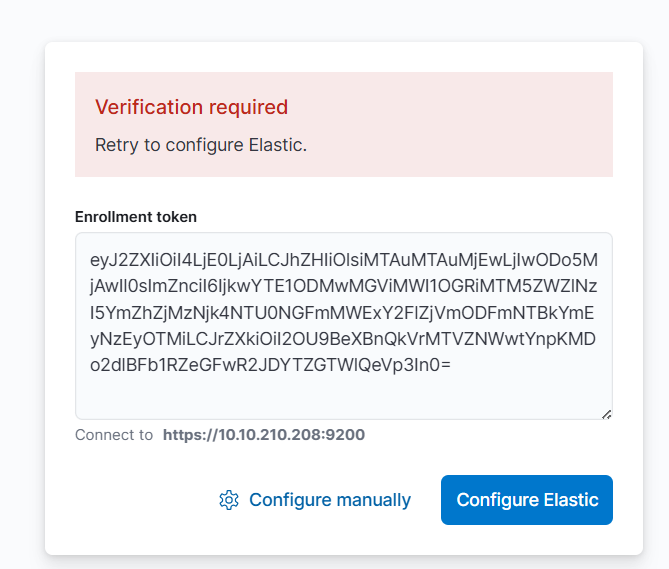

Sau đó còn một lần xác minh nữa. Trong **Elasticsearch/Kibana 8.x**, lần đầu liên kết Kibana với Elasticsearch thì ngoài **Enrollment Token** nó còn yêu cầu **Verification Code** (6 ký tự) để chắc chắn bạn đang truy cập đúng Kibana server, tránh MITM.

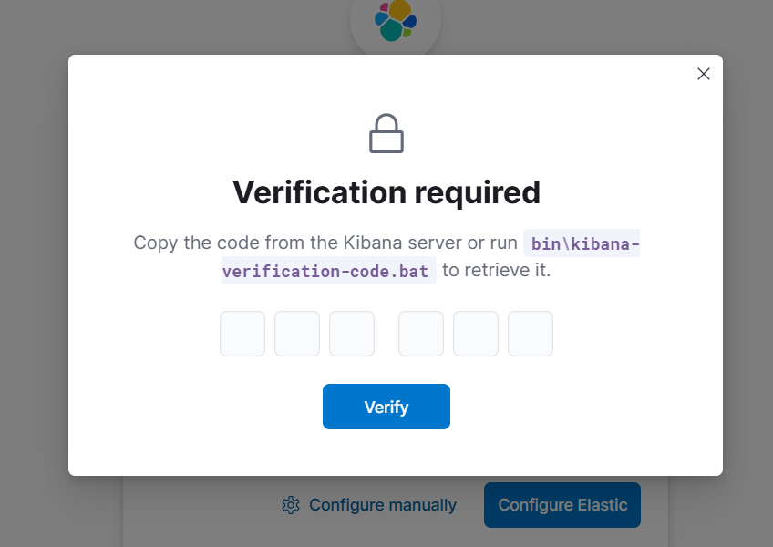

Lấy code

```zsh
sudo /usr/share/kibana/bin/kibana-verification-code
```

Sau đó đợi cho quá trình setup kết thúc

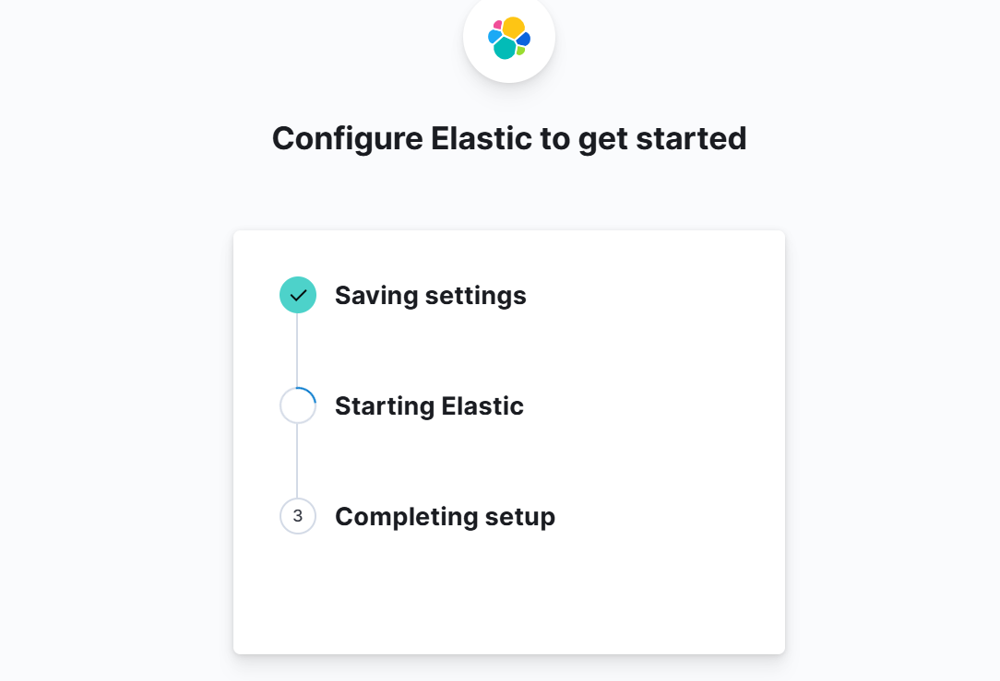

Chúng ta đăng nhập với thông tin mà reset mật khẩu của elastic ở trên

Giao diện trông sẽ như thế này.

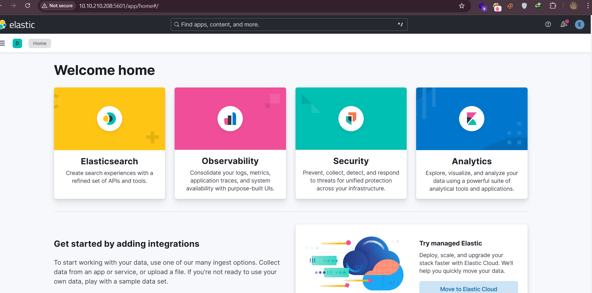

Trong quá trình chạy thử cơ bản, nếu gặp phải lỗi như này:

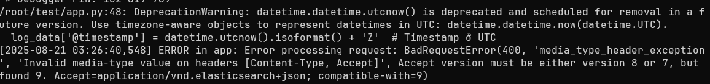
Có thể do phiên bản không tương thích giữa thư viện của python trong `app.py` và phiên bản elastic mà chúng ta đã cài.

Confirm:

```zsh
pip3 show elasticSearch
curl -X GET "http://<ip>:9200/" --user elastic:<password>
```


Rõ ràng rằng hai phiên bản này khác nhau...

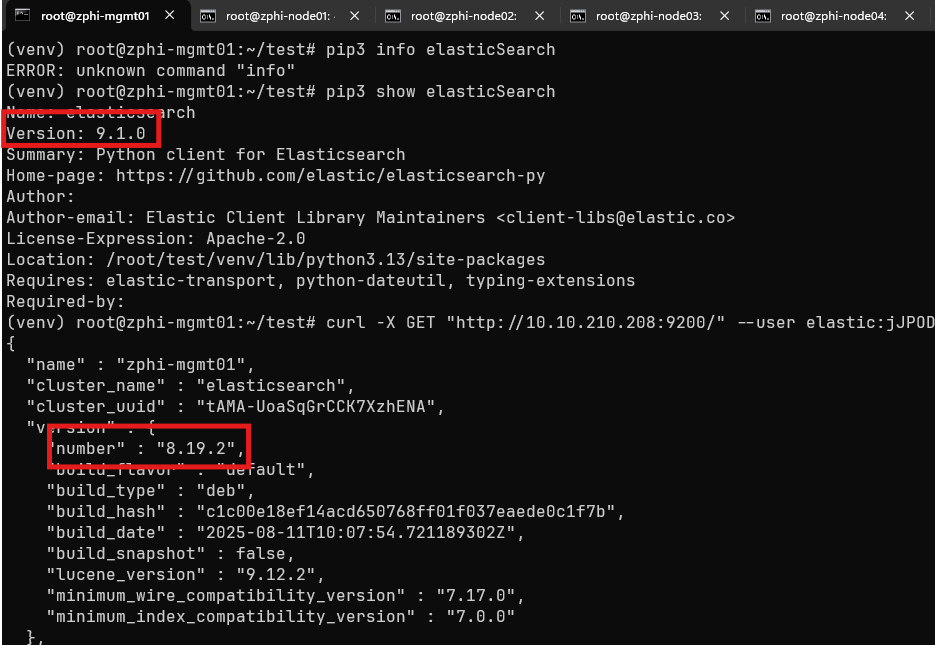

Như vậy ta sẽ hạ cấp thư viện về bản `8.9.12`

```zsh
pip3 install elasticsearch==8.9.0
```

Có vẻ ổn áp

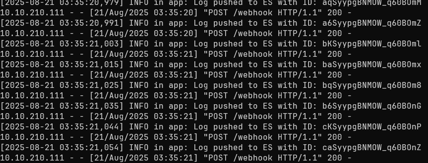

Tại Elastic, chúng ta có thể có vài thông số sơ bộ khi cài đặt monitoring trên Elastic, nó sẽ báo lỗi không thấy key, lúc này ta cần tạo key và chuyển vào file config của kibana

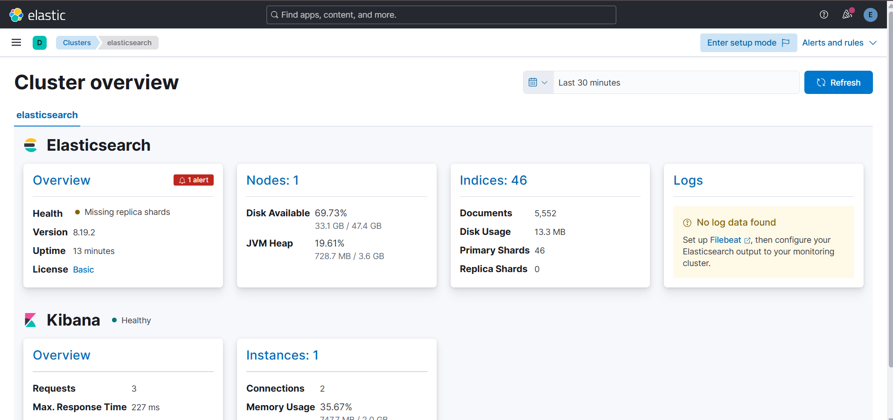

```zsh
sudo /usr/share/kibana/bin/kibana-encryption-keys generate
```

Sau đó copy vào cuối file hoặc sửa:

```zsh
sudo nano /etc/kibana/kibana.yml
```

```zsh
xpack.encryptedSavedObjects.encryptionKey: 537851519863d3ad2aea30d13c015f74
xpack.reporting.encryptionKey: c85cd64e532a4a733f82bff37b4a1947
xpack.security.encryptionKey: b9cf079c7f03d906e1e20d0efc5eac9f
```

Lưu lại file và khởi động lại elastic và kibana

#### Bài toán Redis giải quyết bất đồng bộ và webhook.py hoàn chỉnh?

🧩 Bức tranh tổng quan (đơn giản hóa)

- **MinIO**: phát sinh log → gửi log qua HTTP tới webhook (Python app bạn đã viết).
    
- **Webhook App (Flask)**: chỉ việc **nhận log và bỏ vào hàng đợi Redis**.
    
- **Redis**: giống như “hộp hàng chờ” (queue). Nó giữ tất cả log tạm thời.
    
- **Worker** (Python script khác): sẽ lấy log trong Redis → gửi vào Elasticsearch.
    
- **Elasticsearch (ES)**: nơi lưu trữ log (cơ sở dữ liệu dạng tìm kiếm).
    
- **Kibana / Grafana**: công cụ hiển thị log, làm dashboard.
    

👉 Lợi ích có Redis ở giữa:

- Flask không phải chờ ES, nên nhanh trả lời cho MinIO → không bị mất log.
    
- Worker có thể xử lý log theo lô (bulk), tối ưu tốc độ.
    
- Nếu ES tạm thời hỏng, log vẫn nằm trong Redis → không mất dữ liệu.


Cài đặt redis

```zsh
sudo apt update
sudo apt install redis-server -y
systemctl status redis-server
```

Kiểm tra

```zsh
redis-cli ping
```

Nếu nó trả về `PONG` thì nó đang chạy...

### 1.2.2 Ghép nối Webhook, Redis và Elastic

#### Tin cậy CA của Elastic (quan trọng)

Lấy file `.pem` của elastic về `/tmp`

```zsh
openssl s_client -showcerts -connect 127.0.0.1:9200 </dev/null 2>/dev/null | \
  sed -n '/-----BEGIN CERTIFICATE-----/,/-----END CERTIFICATE-----/p' > /tmp/elastic-cert.pem
```

Test CA xem dùng được không:

```zsh
curl --cacert /tmp/elastic-cert.pem -u elastic:<yourpassword> https://127.0.0.1:9200/_cluster/health
```

Nếu trả về JSON => file CA dùng được.

Tiếp theo cài CA vào trust store.

```zsh
sudo cp /tmp/elastic-cert.pem /usr/local/share/ca-certificates/elastic-ca.crt
sudo update-ca-certificates
```

Lúc này, CA của Elastic Search sẽ ở trong `/etc/ssl/certs/elastic-cert.pem`

Chúng ta cần cải tiến lại script python3 cho webhook

Mã nguồn `webhook_app.py`

```python
#!/usr/bin/env python3
"""
Webhook Flask app: nhận POST từ MinIO -> push vào Redis queue.
Production: chạy bằng Gunicorn.
"""

import os
import hmac
import hashlib
import json
import logging
from datetime import datetime
from flask import Flask, request, abort, jsonify
import redis

# Config via ENV
WEBHOOK_SECRET_KEY = os.getenv("WEBHOOK_SECRET_KEY", "7cu14KOFaK")
REDIS_URL = os.getenv("REDIS_URL", "redis://127.0.0.1:6379/0")
QUEUE_NAME = os.getenv("QUEUE_NAME", "minio:events")

# Logging
logging.basicConfig(level=logging.INFO, format="%(asctime)s %(levelname)s: %(message)s")
log = logging.getLogger("minio-webhook")

# Redis client
r = redis.from_url(REDIS_URL, decode_responses=True)

app = Flask(__name__)

def verify_token(received_token):
    if not received_token:
        return False
    try:
        return hmac.compare_digest(received_token, WEBHOOK_SECRET_KEY)
    except Exception:
        return False

@app.route("/webhook", methods=["POST"])
def handle_webhook():
    # 1. Auth header
    token = request.headers.get("Authorization", "")
    if not verify_token(token):
        log.warning("Unauthorized request from %s", request.remote_addr)
        abort(403, description="Forbidden")

    # 2. Parse JSON
    try:
        payload = request.get_json(force=True)
    except Exception as e:
        log.error("Invalid JSON: %s", e)
        abort(400, description="Invalid JSON")

    # 3. Enrich: add server receipt time
    if isinstance(payload, dict):
        payload["_received_at"] = datetime.utcnow().isoformat() + "Z"

    try:
        r.rpush(QUEUE_NAME, json.dumps(payload, ensure_ascii=False))
    except Exception as e:
        log.exception("Failed to push to Redis: %s", e)
        # trả lỗi 502 để MinIO biết nên retry — nhưng chúng ta thường trả 202 để ack nhanh.
        return jsonify({"status": "error", "detail": "redis push failed"}), 502

    log.info("Queued event requestID=%s from %s", payload.get("requestID", "<no-id>"), request.remote_addr)
    return jsonify({"status": "queued"}), 202

# For quick dev/test only (won't be used in systemd/gunicorn)
if __name__ == "__main__":
    app.run(host="0.0.0.0", port=5000)

```

Chúng ta cần một worker xử lý việc đẩy log lên redis và đẩy log lên ES

Mã nguồn `worker_minio_to_es.py`

```python
#!/usr/bin/env python3
"""
worker_minio_to_es.py
Worker: BLPOP từ Redis queue -> bulk index vào Elasticsearch (_bulk) với Basic Auth.
Ghi index theo ngày: minio-audit-YYYY.MM.DD
Supports ES certificate verification via ES_CA_CERT or ES_VERIFY env vars.
"""

import os
import time
import json
import logging
from datetime import datetime
from requests.auth import HTTPBasicAuth
import requests
import redis

# ----- Config via ENV (tùy chỉnh) -----
REDIS_URL = os.getenv("REDIS_URL", "redis://127.0.0.1:6379/0")
QUEUE_NAME = os.getenv("QUEUE_NAME", "minio:events")
DLQ_NAME = os.getenv("DLQ_NAME", "minio:dlq")
BULK_SIZE = int(os.getenv("BULK_SIZE", "200"))
BLPOP_TIMEOUT = int(os.getenv("BLPOP_TIMEOUT", "5"))

# Elasticsearch settings
ES_HOST = os.getenv("ES_HOST", "https://127.0.0.1:9200")
ES_BULK_ENDPOINT = os.getenv("ES_BULK_ENDPOINT", ES_HOST.rstrip("/") + "/_bulk")
ES_USER = os.getenv("ES_USER", "elastic")
ES_PASS = os.getenv("ES_PASS", "9b1bmL-k_Jibmd33uhyV")
USE_BASIC_AUTH = bool(ES_USER and ES_PASS)

# Certificate / verify options
ES_CA_CERT = os.getenv("ES_CA_CERT", "/etc/ssl/certs/elastic-ca.pem")   # path to CA cert pem, if available
ES_VERIFY = os.getenv("ES_VERIFY", "true").lower()  # "true" or "false"

# Optional: đường dẫn tới requestId trong payload để làm dedupe (dot notation)
REQUEST_ID_PATH = os.getenv("REQUEST_ID_PATH", "requestID")

MAX_BACKOFF = int(os.getenv("MAX_BACKOFF", "300"))

# ----- Logging -----
logging.basicConfig(level=logging.INFO, format="%(asctime)s %(levelname)s: %(message)s")
log = logging.getLogger("minio-worker")

# ----- Clients -----
r = redis.from_url(REDIS_URL, decode_responses=True)
es_auth = HTTPBasicAuth(ES_USER, ES_PASS) if USE_BASIC_AUTH else None
es_headers = {"Content-Type": "application/x-ndjson; charset=utf-8"}

# ----- Helpers -----
def current_index_name():
    # UTC date, format YYYY.MM.DD
    return "minio-audit-" + datetime.utcnow().strftime("%Y.%m.%d")

def extract_request_id(doc):
    if not isinstance(doc, dict):
        return None
    path = REQUEST_ID_PATH.split(".")
    cur = doc
    try:
        for p in path:
            if isinstance(cur, dict) and p in cur:
                cur = cur[p]
            else:
                return None
        return str(cur)
    except Exception:
        return None

def prepare_bulk_payload(docs):
    lines = []
    idx_name = current_index_name()
    for d in docs:
        rid = extract_request_id(d)
        if rid:
            action = {"index": {"_index": idx_name, "_id": rid}}
        else:
            action = {"index": {"_index": idx_name}}
        lines.append(json.dumps(action, ensure_ascii=False))
        lines.append(json.dumps(d, ensure_ascii=False))
    return "\n".join(lines) + "\n"

def bulk_post(payload):
    attempts = 0
    if ES_CA_CERT:
        verify_param = ES_CA_CERT
    elif ES_VERIFY in ("false", "0", "no"):
        verify_param = False
    else:
        verify_param = True

    while attempts < 5:
        attempts += 1
        try:
            resp = requests.post(
                ES_BULK_ENDPOINT,
                data=payload.encode("utf-8"),
                headers=es_headers,
                auth=es_auth,
                timeout=30,
                verify=verify_param
            )
            resp.raise_for_status()
            return resp.json()
        except Exception as e:
            log.error("ES bulk attempt %d failed: %s", attempts, e)
            time.sleep(min(2 ** attempts, 30))
    raise RuntimeError("ES bulk failed after retries")

# ----- Main loop -----
def main_loop():
    backoff = 1
    while True:
        try:
            item = r.blpop(QUEUE_NAME, timeout=BLPOP_TIMEOUT)
            if not item:
                continue

            docs = [json.loads(item[1])]

            for _ in range(BULK_SIZE - 1):
                v = r.lpop(QUEUE_NAME)
                if not v:
                    break
                docs.append(json.loads(v))

            payload = prepare_bulk_payload(docs)

            try:
                res = bulk_post(payload)
            except Exception as e:
                log.error("Bulk post failed: %s -- pushing docs to DLQ", e)
                for d in docs:
                    try:
                        r.rpush(DLQ_NAME, json.dumps(d, ensure_ascii=False))
                    except Exception as ee:
                        log.error("Failed push to DLQ: %s", ee)
                time.sleep(backoff)
                backoff = min(backoff * 2, MAX_BACKOFF)
                continue

            # Log summary
            log.info("Bulk posted %d docs to ES index=%s; errors=%s", len(docs), current_index_name(), res.get("errors"))

            # Nếu ES báo errors, tìm và push failed items vào DLQ
            if res.get("errors"):
                items = res.get("items", [])
                failed = []
                for idx, item_res in enumerate(items):
                    op = list(item_res.values())[0]
                    if op.get("error"):
                        failed.append(docs[idx])
                if failed:
                    log.warning("ES reported %d failed items; pushing to DLQ", len(failed))
                    for f in failed:
                        r.rpush(DLQ_NAME, json.dumps(f, ensure_ascii=False))

            backoff = 1

        except Exception as e:
            log.exception("Worker exception: %s", e)
            time.sleep(5)

if __name__ == "__main__":
    log.info("Starting worker. QUEUE=%s -> ES=%s (index_pattern=minio-audit-YYYY.MM.DD)", QUEUE_NAME, ES_BULK_ENDPOINT)
    main_loop()

```

Đưa chúng vào một folder riêng cho dễ quản lý, ví dụ: `/opt/minio-worker`

Tạo file requirements.txt để cài nhanh các thư viện cần thiết.

```zsh
Flask>=2.3
gunicorn>=21.2
redis>=4.5.0
requests>=2.31.0
```

Tạo môi trường python3 để cài package, trong thư mục `/opt/minio-worker`

```zsh
python3 -m venv venv
```

Khởi chạy môi trường python3

```zsh
source venv/bin/activate
```

Cài các thư viện cần thiết

```zsh
pip3 install -r requirements.txt
```

Chúng ta có thể tạo service để tự động chạy. Nên chạy thử từng file trước xem có lỗi không.

Tạo service webhook

```zsh
sudo nano /etc/systemd/system/minio-webhook.service
```

```zsh
[Unit]
Description=MinIO Webhook (gunicorn)
After=network.target

[Service]
User=root
Group=root
WorkingDirectory=/opt/minio-worker
Environment="REDIS_URL=redis://127.0.0.1:6379/0"
Environment="QUEUE_NAME=minio:events"
Environment="WEBHOOK_SECRET_KEY=7cu14KOFaK"
ExecStart=/opt/minio-worker/venv/bin/gunicorn -b 0.0.0.0:5000 --workers 2 --timeout 30 webhook_app:app
Restart=always
RestartSec=5

[Install]
WantedBy=multi-user.target
```

Tạo service worker

```zsh
sudo nano /etc/systemd/system/minio-worker.service
```

```zsh
[Unit]
Description=MinIO -> Elasticsearch worker
After=network.target

[Service]
User=root
Group=root
WorkingDirectory=/opt/minio-worker

Environment="REDIS_URL=redis://127.0.0.1:6379/0"
Environment="ES_HOST=https://127.0.0.1:9200"
Environment="ES_USER=elastic"
Environment="ES_PASS=9b1bmL-k_Jibmd33uhyV"
Environment="ES_INDEX=minio-audit"
Environment="ES_CA_CERT=/tmp/elastic-cert.pem"
Environment="QUEUE_NAME=minio:events"
ExecStart=/opt/minio-worker/venv/bin/python /opt/minio-worker/worker_minio_to_es.py
Restart=always
RestartSec=5

[Install]
WantedBy=multi-user.target
```

Khởi động và kiểm tra trạng thái dịch vụ

```zsh
sudo systemctl daemon-reload
sudo systemctl start minio-webhook.service
sudo systemctl start minio-worker.service

sudo systemctl status minio-webhook.service
sudo systemctl status minio-worker.service
```

Tạo một vài hoạt động, tải lên, xóa, file trong bucket,...

Sau đó chúng ta check xem log đã hoạt động trên ElasticSearch chưa. Ví dụ câu lệnh test khi vừa tải lên một file `Untitled.txt` xem nó có log không?

```zsh
curl -u elastic:<yourpassword> --cacert /etc/ssl/certs/elastic-ca.pem -X GET "https://10.10.210.208:9200/minio-audit-2025.08.22/_search?q=api.object:Untitled.txt&pretty"
```

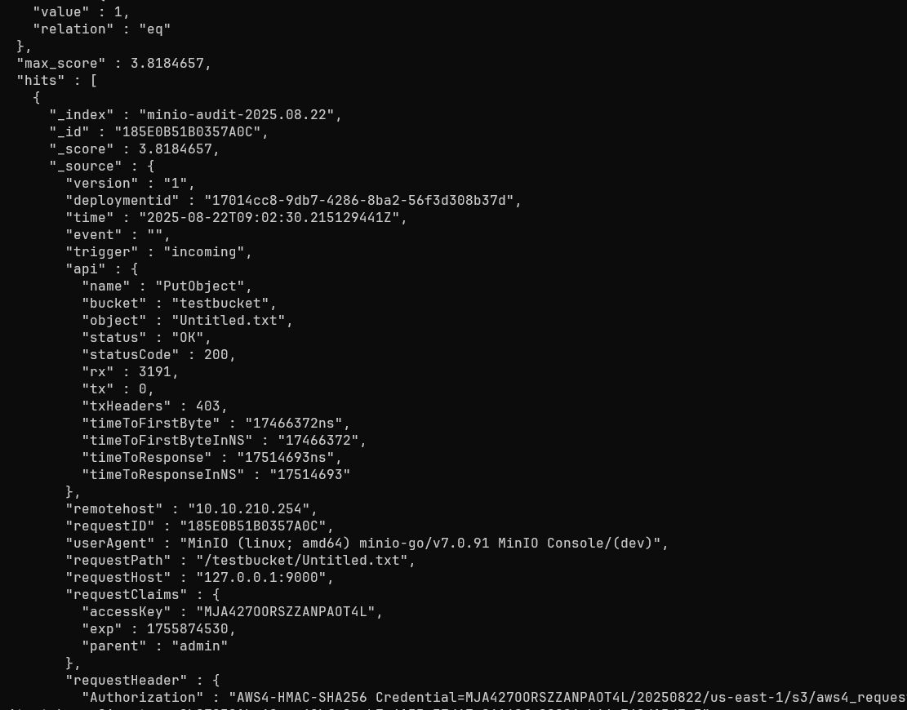
## 1.3 Tích hợp Grafana

### Cài đặt grafana

```zsh
wget -qO- https://packages.grafana.com/gpg.key | \
sudo gpg --dearmor -o /usr/share/keyrings/grafana.gpg
```

```zsh
echo "deb [signed-by=/usr/share/keyrings/grafana.gpg] https://packages.grafana.com/oss/deb stable main" \
| sudo tee /etc/apt/sources.list.d/grafana.list
```

```zsh
sudo apt update
sudo apt install grafana -y
```

Enable service

```zsh
sudo systemctl daemon-reload
sudo systemctl enable grafana-server
sudo systemctl start grafana-server
```

Sau đó truy cập vào `http://<ip>:3000`

Lần đầu đăng nhập với `admin:admin`

### Kết nối đến Elastic Search

Tại connection -> Add new connection -> Elasticsearch -> Add new data source (góc trên bên phải)

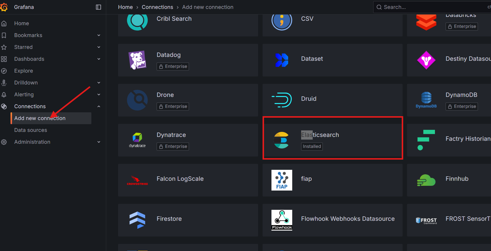

Cấu hình cơ bản như sau, có thể tùy chỉnh nếu bạn cấu hình khác.

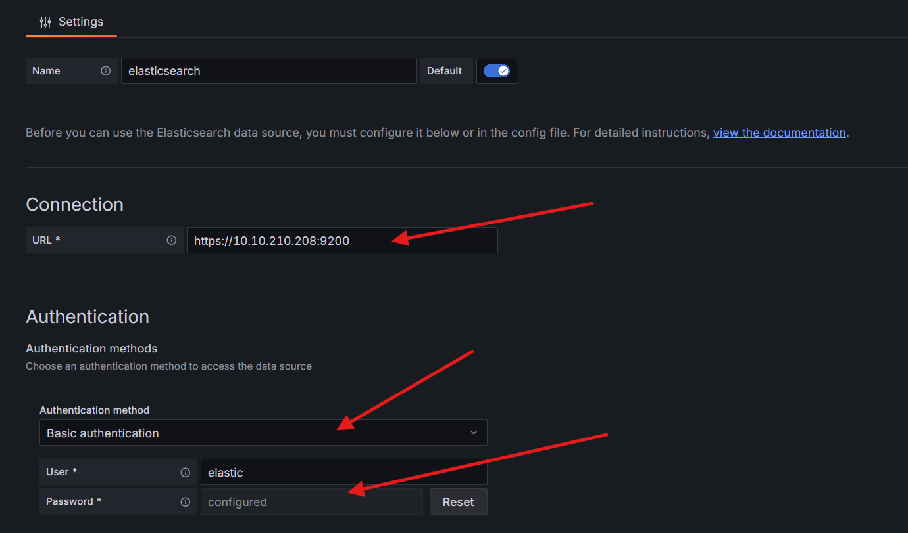

Tại TLS settings, chúng ta chọn add self-signed bằng cách dán nội dung CA của Elastic Search mà chúng ta đã tin cậy ở trên, trong `/etc/ssl/certs/elastic-cert.pem`

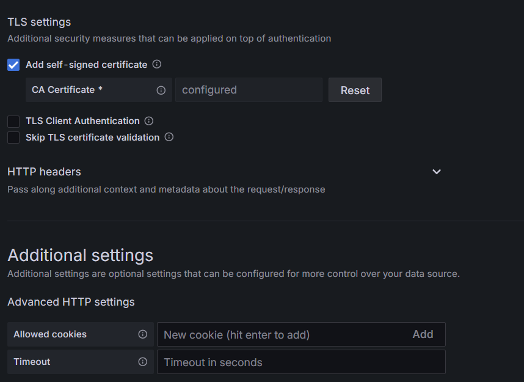

Tại phần details. chúng ta cấu hình như sau:

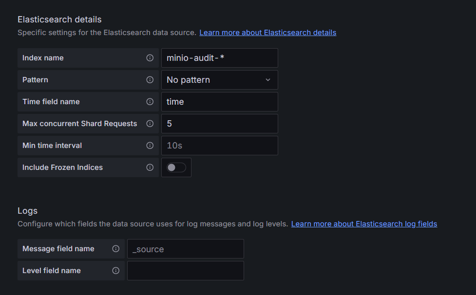

Lưu lại cấu hình.
### Tạo dashboard

Dashboard -> New -> New Dashboard -> Add Visualization

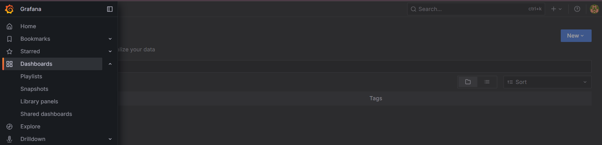

Chọn Data Source là Elastic Search ta vừa thêm vào.

Query type là Logs, Bật table view

Lúc này nếu kết nối thành công, bạn sẽ thấy log hiện ra

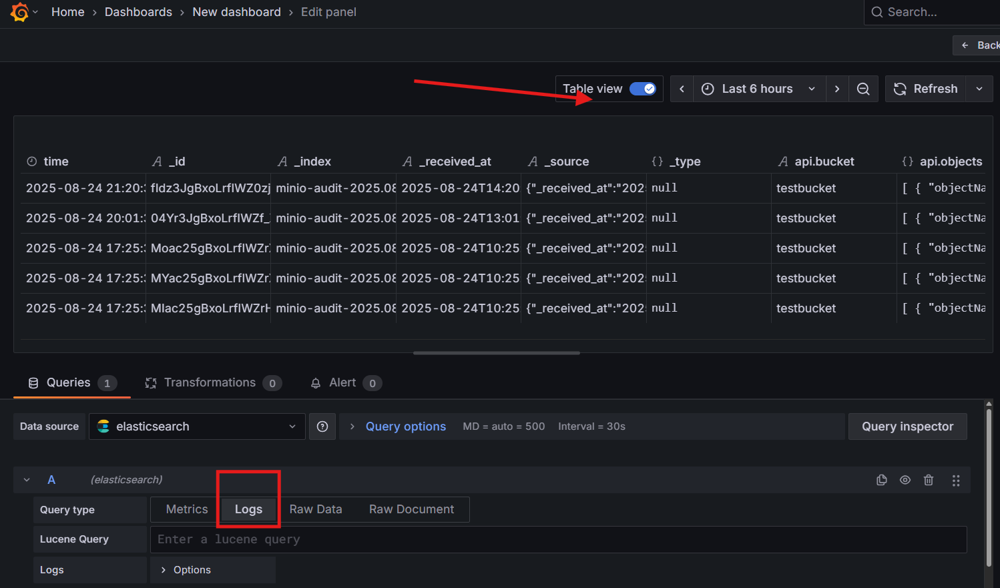

Có quá nhiều dữ liệu không cần thiết, chúng ta cần lọc chúng.

Tại Transformations, tạo một cái mới, chọn `Organize fields by name`

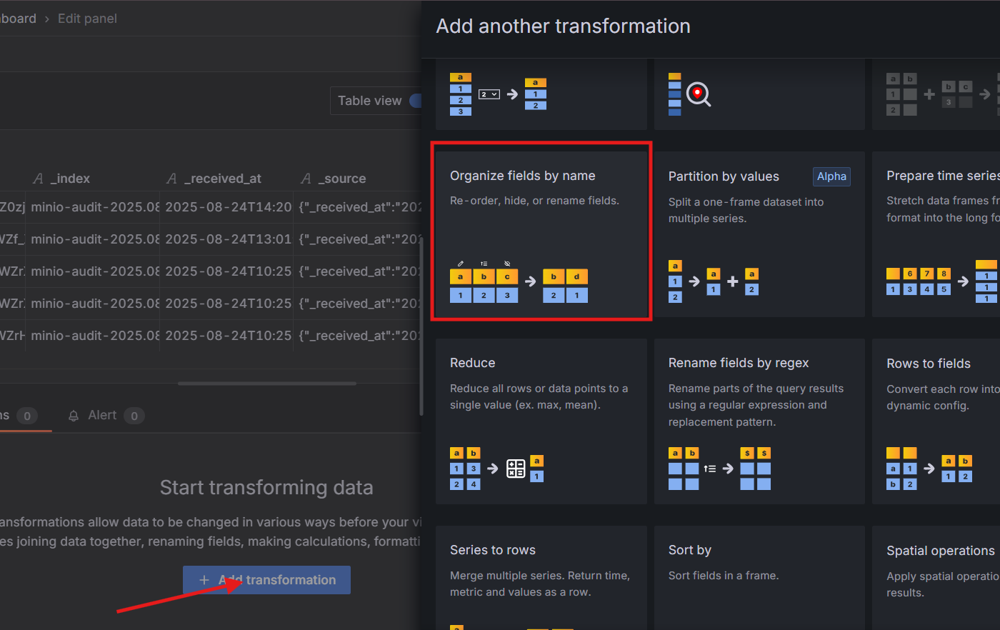

Biểu tượng con mắt (disable) là ẩn các cột mà không cần xem, các ô nhập bên cạnh là đổi tên cột.

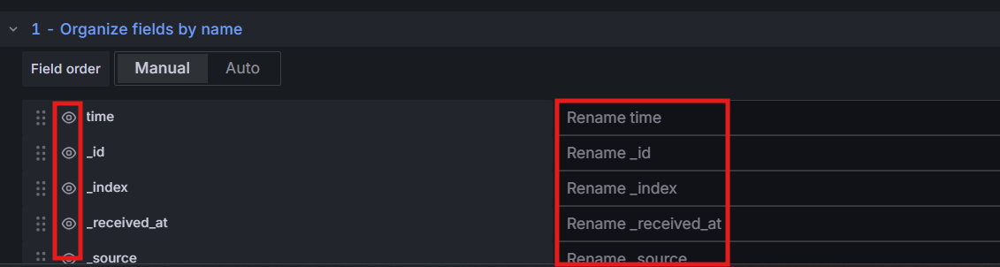

Ví dụ sau khi tùy chỉnh

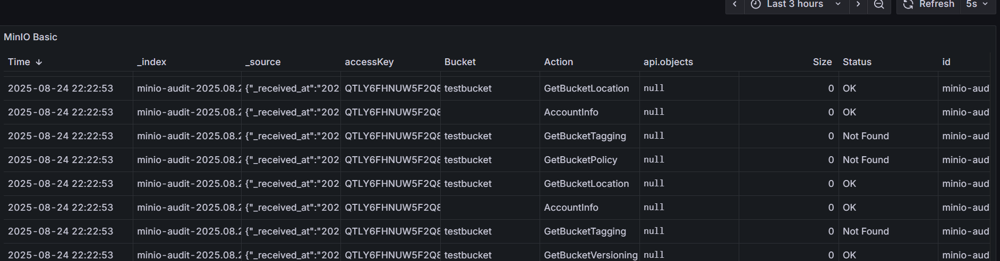