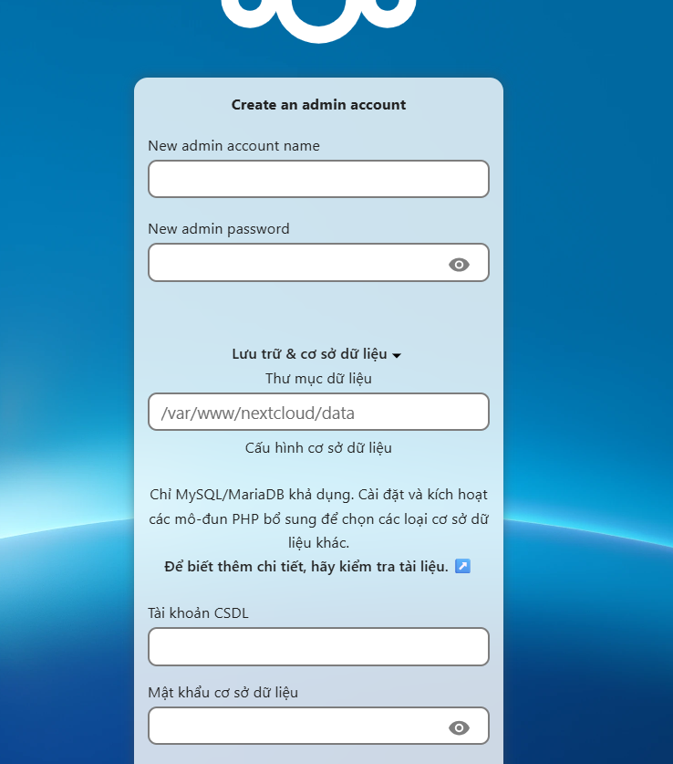
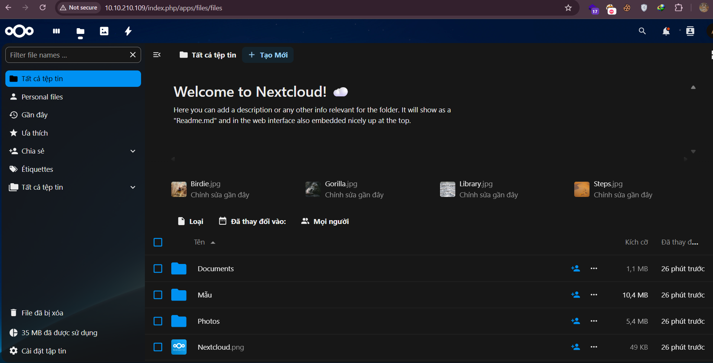
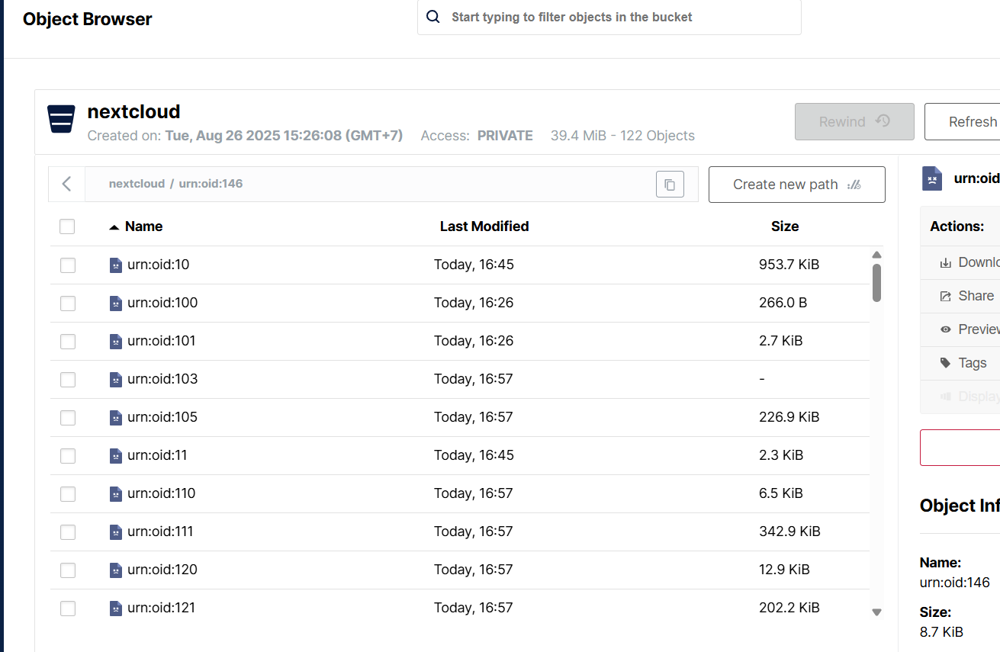

## 1. Nextcloud là gì?

**Nextcloud** là một bộ phần mềm mã nguồn mở hoạt động theo mô hình client-server, hỗ trợ tạo dịch vụ lưu trữ, đồng bộ và chia sẻ tập tin. Bạn có thể chạy **on-premise** hoặc trên đám mây — với khả năng mở rộng tới hàng triệu người dùng

- Hỗ trợ nhiều nền tảng: Linux máy chủ; desktop (Windows/macOS/Linux/FreeBSD); mobile (Android/iOS)
    
- Tính năng: đồng bộ tập tin, chia sẻ công khai, phân quyền linh hoạt, bảo mật (TOTP, WebAuthn, MFA), quản lý người dùng/gruppen, lịch, địa chỉ liên hệ, hội nghị video, chỉnh sửa tài liệu (through Collabora hoặc OnlyOffice)…
    
- Giấy phép: AGPL-3.0.
    

---

## 2. Lợi ích

- **Kiểm soát dữ liệu**: Dữ liệu được lưu tại chỗ bạn quản lý, không phụ thuộc vào đám mây công cộng
    
- **Bảo mật cao**: Hỗ trợ vũ khí bảo mật như đa yếu tố, mã hóa, kiểm soát truy cập
    
- **Tính năng cộng tác mạnh mẽ**: Chỉnh sửa tài liệu trực tuyến, hội nghị video, chia sẻ nhóm…[
    
- **Khả năng mở rộng và plugin phong phú**: Hơn 250 ứng dụng mở rộng theo nhu cầu doanh nghiệp hoặc cá nhân
    
- **Tương thích đa nền tảng**: Sẵn sàng cho người dùng Windows, Linux, macOS, iOS, Android…
    

---

## 3. Hạn chế

- **Hiệu năng phụ thuộc cấu hình**: Khi sử dụng object storage như MinIO làm **primary storage**, hiệu năng có thể bị chậm hơn so với lưu trữ cục bộ
    
- **Phức tạp trong tích hợp S3**: Nếu tích hợp sau khi cài đặt Nextcloud, các file cũ có thể không truy cập được
    
- **Rủi ro khi upload lớn hoặc qua S3**: Một số trường hợp người dùng báo ảnh có thể bị lỗi khi upload tệp lớn qua giao tiếp S3
    
- **Phải backup DB thật kỹ**: Bởi metadata (như tên file, cấu trúc thư mục) được lưu trong cơ sở dữ liệu, không nằm ở MinIO


# 2. Triển khai NextCloud trên ubuntu

Cài đặt các ứng dụng và thư viện cần thiết.

```zsh
sudo apt update && sudo apt upgrade -y
sudo apt install apache2 mariadb-server php php-common libapache2-mod-php \
  php-bz2 php-gd php-mysql php-curl php-mbstring php-imagick php-zip \
  php-common php-curl php-xml php-json php-bcmath php-xml php-intl php-gmp \
  unzip wget -y
```

```zsh
sudo systemctl enable mariadb
sudo systemctl start mariadb
sudo mariadb-secure-installation
```

Tạo database và user cho Nextcloud:

```zsh
mysql -u root -p
```

```sql
CREATE DATABASE nextcloud_db;
CREATE USER 'nextcloud_user'@'localhost' IDENTIFIED BY 'your_password';
GRANT ALL PRIVILEGES ON nextcloud_db.* TO 'nextcloud_user'@'localhost';
FLUSH PRIVILEGES;
```

### Tải và cài đặt Nextcloud

```zsh
cd /var/www
sudo wget https://download.nextcloud.com/server/releases/latest.zip
sudo unzip latest.zip
sudo chown -R www-data:www-data /var/www/nextcloud/
```

### Cấu hình Apache

```zsh
sudo a2enmod rewrite headers env dir mime
cat << EOF | sudo tee /etc/apache2/sites-available/nextcloud.conf
<VirtualHost *:80>
    DocumentRoot /var/www/nextcloud
    ServerName phi.com

    <Directory /var/www/nextcloud/>
        Options +FollowSymlinks
        AllowOverride All
        Require all granted

        <IfModule mod_dav.c>
            Dav off
        </IfModule>
        SetEnv HOME /var/www/nextcloud
        SetEnv HTTP_HOME /var/www/nextcloud
    </Directory>
</VirtualHost>
EOF

sudo a2ensite nextcloud.conf
sudo a2dissite 000-default.conf
sudo systemctl restart apache2
```

Tiếp theo thiết lập người dùng admin (nếu không có gui)

```zsh
cd /var/www/nextcloud
sudo -u www-data php occ maintenance:install \
--database "mysql" --database-name "nextcloud_db" \
--database-user "nextcloud_user" --database-pass "your_password" \
--admin-user "admin" --admin-pass "admin_password"
```

Nếu có gui, truy cập vào http://<ip-nextcloud/ và cấu hình



Sửa file config

```zsh
sudo nano /var/www/nextcloud/config/config.php
```

```zsh
<?php
$CONFIG = array (
  'instanceid' => 'ocgh7wnthfxu',
  'passwordsalt' => 'ytW8mghmV2Fq2Tb2I6r8YUd3IvhsrI',
  'secret' => '6XHWYh0hjaDodvFkt+T23Jfe4iZn5UKGBLfml0FbPdhUKXXx',
  'trusted_domains' =>
  array (
    0 => '10.10.210.109',
    1 => 'phi.com',
  ),
  'datadirectory' => '/var/www/nextcloud/data',
  'dbtype' => 'mysql',
  'version' => '31.0.8.1',
  'overwrite.cli.url' => 'http://10.10.210.109',
  'dbname' => 'nextcloud_db',
  'dbhost' => 'localhost',
  'dbport' => '',
  'dbtableprefix' => 'oc_',
  'objectstore' =>
  array (
    'class' => '\\OC\\Files\\ObjectStore\\S3',
    'arguments' =>
    array (
      'bucket' => 'nextcloud',
      'autocreate' => false,
      'key' => 'admin',
      'secret' => 'htv@2025',
      'hostname' => '10.10.210.113',
      'port' => 9000,
      'use_ssl' => true,
      'use_path_style' => true,
      'region' => 'auto',
      'verify_bucket_exists' => false,
    ),
  ),
  'mysql.utf8mb4' => true,
  'dbuser' => 'nextcloud_user',
  'dbpassword' => 'rk3YiTtWK0',
  'installed' => true,
);
```

Thêm vào `/etc/hosts`

```zsh
10.10.210.109    phi.com
```

Nếu bị lỗi SSL do self cert, fix như sau:

Đầu tiên lấy file CA root từ node sang, ví dụ:

```zsh
-rw-r--r-- 1 root root     1805 Aug 19 08:54 minioCA.crt
-rw-r--r-- 1 root root     3272 Aug 19 08:54 minioCA.key
-rw-r--r-- 1 root root       41 Aug 19 09:14 minioCA.srl
-rw-r--r-- 1 root root     1501 Aug 19 09:14 node03.crt
-rw-r--r-- 1 root root      980 Aug 19 09:13 node03.csr
-rw------- 1 root root     1704 Aug 19 09:13 node03.key
```

Lấy file `minioCA.crt` sang server nextcloud. Sau đó thêm nó vào trust store

```zsh
sudo cp minioCA.crt /usr/local/share/ca-certificates/
sudo update-ca-certificates
```

Giao diện của nextcloud



Dữ liệu lưu trên bucket:

