# 1. Tổng quan

## 1.1 MinIO là gì?

(Nguyên văn trên Viblo.asia)

Đây là định nghĩa ở trang chủ của minio:

> Minio is a high performance distributed object storage server, designed for large-scale private cloud infrastructure.

Ngắn gọn mà nói thì câu trả lời là: **Nó giống như dịch vụ AWS S3, nhưng được host local**.

Minio là một object storage server được implement những public API giống như AWS S3. Điều đó có nghĩa là những ứng dụng có thể config để giao tiếp với Minio thì cũng có thể giao tiếp với AWS S3. Là một server lưu trữ object nên có thể được sử dụng để lưu trữ những unstructured data như ảnh, video, log files, backups và container/VM images. Dung lượng của 1 object có thể dao động từ một vài KB tới tối đa là 5TB. File cũng được gom lại trong 1 buckets, nó là được chỉ cùng với access key khi dùng app.

### 1.2 Xử lý khối lượng lớn dữ liệu

Giả sử bạn phải lưu trữ một khối dữ liệu, bạn không muốn những dữ liệu này (ảnh, mailboxes,...) lưu trữ trên cùng một app. Sẽ là một vấn đề lớn nếu lưu trữ ở cùng một server vì lượng dữ liệu này khá lớn, ví dụ như mailboxes chúng ta cần dung lượng có thể mở rộng và sao lưu được để tránh việc mất dữ liệu.

Minio là công cụ tốt để handle những điều trên. Nó tách những dữ liệu lưu trữ khỏi app của bạn và có thể truy cập thông qua HTTP.

## 1.3 So sánh với Amazon S3

###  a. **Định nghĩa & Kiến trúc**

|**Tiêu chí**|**MinIO**|**Amazon S3**|
|---|---|---|
|**Bản chất**|Object Storage mã nguồn mở, tự triển khai (self-hosted) 15|Dịch vụ Object Storage đám mây quản lý bởi AWS 11|
|**Triển khai**|Linh hoạt: On-premise, Private Cloud, Edge, Container (Docker/Kubernetes) 13|Chỉ trên AWS Cloud 11|
|**Tương thích S3**|Hỗ trợ 100% S3 API (SDK, CLI, công cụ AWS) 14|Gốc S3, tích hợp sâu với hệ sinh thái AWS (Lambda, CloudFront, IAM) 11|

---

### b. **So sánh kỹ thuật**

#### **Hiệu năng & Khả năng mở rộng**

- **MinIO**:
    
    - Hiệu suất cao nhờ tối ưu bằng Go, hỗ trợ Erasure Coding để mở rộng ngang 16.
        
    - Xử lý dữ liệu AI/ML tốc độ cao (21.8 TiB/s @ 1 exabyte) 6.
        
- **Amazon S3**:
    
    - Tối ưu cho quy mô siêu lớn, độ trễ thấp trong mạng AWS 811.
        

#### **Bảo mật**

|**Tính năng**|**MinIO**|**Amazon S3**|
|---|---|---|
|Mã hóa dữ liệu|SSE/TLS, Object Locking 1|AES-256, TLS, KMS tích hợp 11|
|Quản lý truy cập|IAM cơ bản, OpenID/LDAP 38|IAM nâng cao, Bucket Policies 11|

#### **Chi phí**

- **MinIO**:
    
    - **Miễn phí bản thân quản lý**, chỉ tốn chi phí phần cứng 35.
        
    - Tiết kiệm 60%+ so với S3 khi lưu trữ lớn 8.
        
- **Amazon S3**:
    
    - Tính phí theo dung lượng, request, và băng thông (egress) 811.
        
    - Phí xuất dữ liệu cao (~$0.09/GB) 2.
        

---

### c. **Use Case điển hình**

|**Ứng dụng**|**MinIO**|**Amazon S3**|
|---|---|---|
|**AI/ML & Big Data**|Ưu tiên do tốc độ cao, chạy trên GPU 6|Tích hợp Redshift/Athena 11|
|**Hybrid/Multi-Cloud**|Triển khai xuyên môi trường 48|Giới hạn trong AWS|
|**Lưu trữ dữ liệu lạnh**|Không hỗ trợ lớp Glacier|Glacier cho chi phí cực thấp 11|
|**Air-Gapped/Edge**|Lý tưởng (không cần internet) 8|Không hỗ trợ|

---

### d. **Hạn chế**

- **MinIO**:
    
    - Tự quản lý hạ tầng, thiếu CDN tích hợp 35.
        
    - Chức năng IAM và replication đa cloud hạn chế 3.
        
- **Amazon S3**:
    
    - Vendor lock-in, khó di chuyển dữ liệu do phí egress 28.
        
    - Chi phí không dự đoán được với workload lớn 8.
        
### e. **Khi nào chọn cái gì?**

1. **Chọn MinIO nếu**:
    
    - Cần kiểm soát dữ liệu on-premise/edge, tối ưu chi phí lớn, hoặc chạy workload AI tốc độ cao 368.
        
    - Ưu tiên mã nguồn mở, tránh lock-in 5.
        
2. **Chọn Amazon S3 nếu**:
    
    - Dùng AWS ecosystem, cần dịch vụ managed, hoặc dữ liệu cần lớp lưu trữ rẻ (Glacier) 811.
        

> 💡 **Xu hướng kết hợp**: Dùng S3 cho public cloud, MinIO cho private/edge → Tận dụng S3 API xuyên suốt.
# 2. Triển khai môi trường và xác định quy mô

Mỗi node là một máy chủ, các node này gắn với ổ đĩa bên ngoài.
## Cơ chế hoạt động của MinIO Cluster 4 nodes

MinIO sử dụng kiến trúc **Distributed Erasure Code** để đảm bảo tính sẵn sàng cao và chịu lỗi. Dưới đây là giải thích chi tiết:
### 1. Kiến trúc phân tán

- **4 node ngang hàng** (peer-to-peer): Không có node chính/phụ, tất cả nodes bình đẳng
    
- **Mỗi node có 2 ổ đĩa** → Tổng cộng 8 ổ đĩa trong cluster
    
- Dữ liệu được **phân mảnh và phân tán** đều trên tất cả nodes
    
### 2. Cơ chế Erasure Coding

MinIO chia dữ liệu thành các fragment và tính toán parity fragments:

- **Data Shards**: 4 fragment dữ liệu gốc
    
- **Parity Shards**: 4 fragment parity (dùng để khôi phục dữ liệu)
    
- **Công thức**: `EC:N` (N = số parity shards) → EC:4 trong trường hợp này
    
Ví dụ: File 1GB được xử lý:
1. Chia thành 4 data shards (mỗi shard 256MB)
2. Tính toán thêm 4 parity shards (mỗi shard 256MB)
3. Tổng dung lượng lưu trữ: 2GB (gấp đôi dữ liệu gốc)

### 3. Phân phối dữ liệu

MinIO tự động phân phối các shards lên các ổ đĩa khác nhau theo nguyên tắc:

- Mỗi shard của cùng object nằm trên node khác nhau
    
- Đảm bảo không có 2 shards cùng object trên cùng node
    
Ví dụ phân bố file "report.pdf":
- Node1: Data Shard 1 + Parity Shard 3
- Node2: Data Shard 2 + Parity Shard 4
- Node3: Data Shard 3 + Parity Shard 1
- Node4: Data Shard 4 + Parity Shard 2

### 4. Khả năng chịu lỗi

Với EC:4, cluster có thể:

- Mất đồng thời **4 ổ đĩa bất kỳ** mà vẫn đọc được dữ liệu
    
- Mất **2 node đồng thời** (4 ổ đĩa) vẫn hoạt động bình thường
    
- Chỉ cần **>50% shards** (5/8) để đọc dữ liệu

Tình huống lỗi:
- Node1 và Node2 hỏng → mất 4 shards
- Hệ thống vẫn đọc được file từ:
  Data Shard 3 + Data Shard 4 + Parity Shard 1 + Parity Shard 2 (từ Node3 và Node4)

### 5. Quy trình ghi dữ liệu

1. Client gửi PUT request tới bất kỳ node nào (qua LB)
    
2. Node nhận request trở thành "leader" tạm thời
    
3. Leader tính toán Erasure Code → chia thành 8 shards
    
4. Leader gửi shards tới tất cả nodes (mỗi node nhận 2 shards)
    
5. Khi >50% nodes (3/4) xác nhận ghi thành công → trả kết quả cho client
    
### 6. Quy trình đọc dữ liệu

1. Client gửi GET request tới bất kỳ node
    
2. Node xác định vị trí các shards cần thiết
    
3. Thu thập đủ 4 shards bất kỳ (data hoặc parity)
    
4. Tái tạo dữ liệu gốc từ các shards
    
5. Trả kết quả cho client
    
### 7. Đồng bộ metadata

- Sử dụng cơ chế **Lamport Clocks** để đồng bộ trạng thái
    
- Dữ liệu metadata (bucket, object info) được nhân bản trên tất cả nodes
    
- Thay đổi metadata yêu cầu đồng thuận >50% nodes
    
### 8. Ưu điểm kiến trúc 4 nodes

- **Hiệu suất**: Đọc/ghi song song trên nhiều node
    
- **Độ tin cậy**: Chịu được lỗi 2 nodes/4 drives
    
- **Tính toán hiệu quả**: EC:4 cân bằng giữa dự phòng và hiệu năng
    
- **Mở rộng dễ dàng**: Có thể thêm server pool mới
    
### 9. Giới hạn

- **Không thể thêm node đơn lẻ**: Phải thêm theo nhóm (tối thiểu 4 nodes mới)
    
- **Dung lượng hiệu dụng**: Chỉ 50% tổng dung lượng vật lý (do EC:4)
    
- **Hiệu năng mạng**: Yêu cầu băng thông mạng cao giữa các node
    
> ⚠️ **Lưu ý quan trọng**: MinIO yêu cầu tất cả nodes phải đồng bộ thời gian (dùng NTP) để đảm bảo tính nhất quán của dữ liệu.
## 2.1 Lựa chọn môi trường triển khai

- Ở đây mình sử dụng Ubuntu Server 2024, triển khai từ Template có sẵn.
- Triển khai 4 máy VM Ubuntu (4 nodes) trên VMESXi 8U2
- Phạm vi triển khai: Mạng local, vlan 10.10.210.0/24
- Cách thức triển khai: Thủ công

## 2.2 Triển khai cơ bản

Cài đặt VLAN, Set IP tĩnh, hostname... Ví dụ
+ IP: 10.10.210.111, 10.10.210.112, 10.10.210.113, 10.10.210.114

```zsh
sudo nano /etc/netplan/50-cloud-init.yaml
netplan apply
```

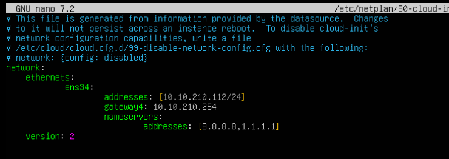

Sau khi cấu hình xong thử ping đến gateway xem được không.

+ Hostname ví dụ: zphi-node01, zphi-node02, zphi-node03, zphi-node04

```zsh
sudo hostnamectl set-hostname zphi-node01
nano /etc/hosts
systemctl restart systemd-hostnamed
```

- Đồng bộ time theo máy chủ local hoặc gateway

```zsh
sudo apt update
sudo apt install chrony -y
sudo nano /etc/chrony/chrony.conf
```

Thêm/đổi dòng:

`server 10.10.240.161 iburst`

```zsh
sudo systemctl restart chrony
sudo systemctl enable chrony
```

Đồng bộ ngay:

```zsh
chronyc sources -v
chronyc tracking
```

Làm tương tự các bước với các node khác.
## 2.3 Cấu hình Storage, ổ đĩa cho các nodes

Tắt máy ảo vào trang quản lý vSphere -> Chọn máy ảo -> Edit Setting -> Add New Device -> Hard Disk

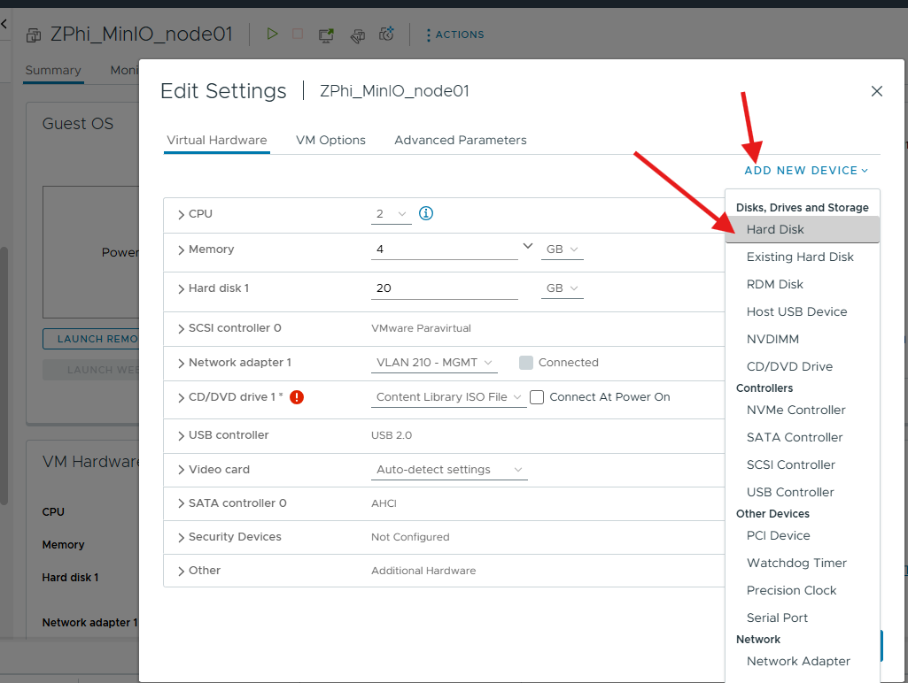

Chỉnh các cấu hình

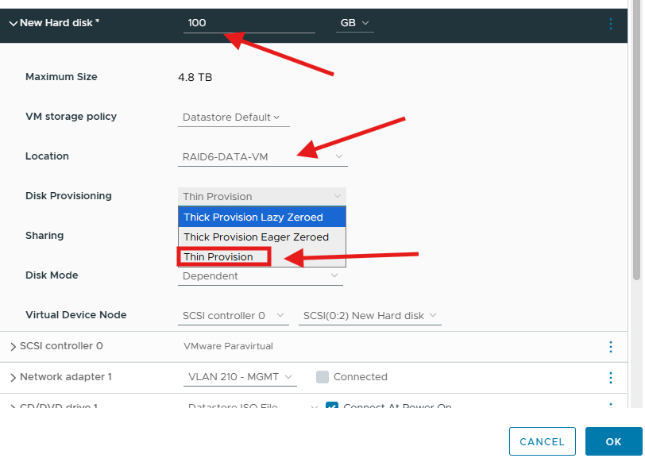

Tạo mỗi node 2 ổ như này

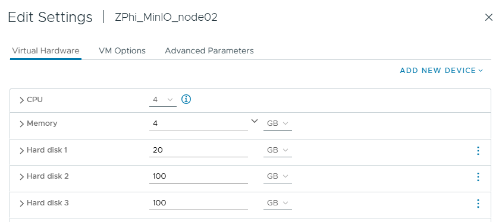

Sau khi connect xong, vào máy ảo và kiểm tra

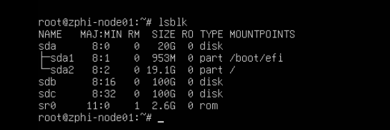
#### Xử Lý Ổ Đĩa Đúng Cách

Bạn BẮT BUỘC phải mount ổ đĩa trước khi sử dụng với MinIO.
Không thể dùng trực tiếp /dev/sdb hoặc /dev/sdc vì MinIO cần filesystem để quản lý dữ liệu.

Tại sao phải mount?

	Yêu cầu của MinIO: MinIO chỉ làm việc với mounted filesystems (XFS/ext4)
	
	Bảo mật: Truy cập trực tiếp block device yêu cầu quyền root cao
	
	Quản lý: Filesystem cung cấp features (quota, snapshot, repair)
	
	Hiệu năng: XFS tối ưu cho object storage

#### Hướng Dẫn Chi Tiết Các Bước:

Format và Mount Ổ Đĩa (Thực hiện trên tất cả 4 nodes)

Lặp lại cho sdb và sdc trên mỗi node

```zsh
sudo mkfs.xfs /dev/sdb -f -L MINIO-DATA1
sudo mkfs.xfs /dev/sdc -f -L MINIO-DATA2
```

 Tạo mount point
 
```zsh
sudo mkdir -p /mnt/minio/{disk1,disk2}
```

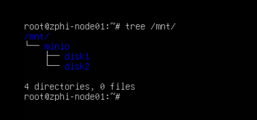

Mount ổ đĩa

```zsh
sudo mount /dev/sdb /mnt/minio/disk1
sudo mount /dev/sdc /mnt/minio/disk2
```

Kiểm tra mount

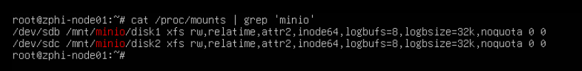

Cấu hình auto-mount khi reboot

```zsh
echo "/dev/sdb /mnt/minio/disk1 xfs defaults,noatime,nodiratime 0 0" | sudo tee -a /etc/fstab
echo "/dev/sdc /mnt/minio/disk2 xfs defaults,noatime,nodiratime 0 0" | sudo tee -a /etc/fstab
```

Kiểm tra

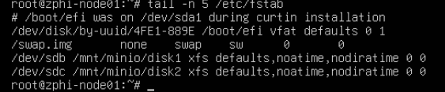

Dưới đây là script tự động, lưu ý phải check kĩ xem các thông số có thể thay đổi, ví dụ sdb, sdc, /mnt/minio,disk1,disk2...

```bash
#!/usr/bin/bash
# ============================================================================
#  MINIO DISK SETUP SCRIPT - Clean version
# ============================================================================
printf "$(tput bold)$(tput setaf 2)"
cat <<'LOGO'
 __  __ _       ___ ___  _____                          _   
|  \/  (_)_ __ |_ _/ _ \|  ___|__  _ __ _ __ ___   __ _| |_ 
| |\/| | | '_ \ | | | | | |_ / _ \| '__| '_ ` _ \ / _` | __|
| |  | | | | | || | |_| |  _| (_) | |  | | | | | | (_| | |_ 
|_|  |_|_|_| |_|___\___/|_|  \___/|_|  |_| |_| |_|\__,_|\__|
---------------------------------------v1.0 by Phitt--------
LOGO
printf "$(tput sgr0)"
echo

set -euo pipefail
IFS=$'\n\t'

# ----------------------------- Configuration ---------------------------------
DEFAULT_DEVICES=("/dev/sdb" "/dev/sdc")
DEFAULT_LABELS=("MINIO-DATA1" "MINIO-DATA2")
DEFAULT_MOUNTS=("/mnt/minio/disk1" "/mnt/minio/disk2")
MOUNT_OPTS="defaults,noatime,nodiratime"
FSTAB_BACKUP="/etc/fstab.bak.$(date +%Y%m%d%H%M%S)"

# ----------------------------- Colors & logging -----------------------------
if command -v tput >/dev/null 2>&1; then
  BOLD=$(tput bold)
  NORMAL=$(tput sgr0)
  RED=$(tput setaf 1)
  GREEN=$(tput setaf 2)
  YELLOW=$(tput setaf 3)
  BLUE=$(tput setaf 4)
else
  BOLD='' ; NORMAL='' ; RED='\e[31m' ; GREEN='\e[32m' ; YELLOW='\e[33m' ; BLUE='\e[34m'
fi

log()  { printf "%s %b\n" "[$(date '+%F %T')]" "$*"; }
info() { log "${BLUE}${BOLD}[INFO]${NORMAL} $*"; }
succ() { log "${GREEN}${BOLD}[OK]${NORMAL} $*"; }
warn() { log "${YELLOW}${BOLD}[WARN]${NORMAL} $*"; }
err()  { log "${RED}${BOLD}[ERROR]${NORMAL} $*" >&2; }

# ----------------------------- Safety / trap --------------------------------
DEBUG=false
DRY_RUN=false
ASSUME_YES=false
SKIP_FSTAB=false

function on_exit() {
  local rc=${1:-$?}
  if [[ "$rc" -ne 0 ]]; then
    err "Script failed with exit code $rc"
  else
    succ "Script finished successfully"
  fi
}
trap 'on_exit $?' EXIT

# ----------------------------- Helpers --------------------------------------
function usage() {
  cat <<EOF
Usage: $0 [options] [device1 device2]

Options:
  -n, --dry-run        Show what would be done, don't execute destructive steps
  -y, --yes            Assume yes to all prompts (dangerous)
  -s, --skip-fstab     Do not append to /etc/fstab
  -d, --debug          Enable shell debug (set -x)
  -h, --help           Show this help

If you don't pass devices, script defaults to: ${DEFAULT_DEVICES[*]}
EOF
  exit 1
}

function confirm() {
  if $ASSUME_YES; then
    return 0
  fi

  printf "\n${YELLOW}Are you absolutely sure you want to proceed? This WILL FORMAT the devices: %s${NORMAL}\n" "$*"
  read -r -p "Type 'yes' to continue: " answer
  if [[ "$answer" != "yes" ]]; then
    err "User declined. Aborting."
    exit 2
  fi
}

function check_root() {
  if [[ $EUID -ne 0 ]]; then
    err "This script must be run as root. Use sudo or run as root."
    exit 3
  fi
}

function check_block_device() {
  local dev=$1
  if [[ ! -b "$dev" ]]; then
    err "Block device $dev does not exist or is not a block special file."
    return 1
  fi
  return 0
}

function is_mounted() {
  local dev=$1
  if grep -qE "^${dev//\//\\\/}[[:space:]]" /proc/mounts; then
    return 0
  fi
  return 1
}

# ----------------------------- Workflows ------------------------------------
function format_device() {
  local dev=$1
  local label=$2

  if $DRY_RUN; then
    info "DRY-RUN: Would format $dev as XFS with label $label"
    return 0
  fi

  info "Formatting $dev -> label=$label"
  # mkfs.xfs returns non-zero on failure; -f to force. Keep output for logs.
  if ! mkfs.xfs -f -L "$label" "$dev"; then
    err "mkfs.xfs failed for $dev"
    return 1
  fi
  succ "Formatted $dev"
}

function create_and_mount() {
  local dev=$1
  local mountpoint=$2

  info "Creating mount point $mountpoint"
  if ! $DRY_RUN; then
    mkdir -p "$mountpoint"
  fi

  if $DRY_RUN; then
    info "DRY-RUN: Would mount $dev -> $mountpoint"
    return 0
  fi

  if ! mount "$dev" "$mountpoint"; then
    err "Failed to mount $dev to $mountpoint"
    return 1
  fi
  succ "Mounted $dev to $mountpoint"
}

function ensure_fstab_entry() {
  local dev=$1
  local mp=$2
  local opts=${3:-$MOUNT_OPTS}
  local fs_type=${4:-xfs}

  # Use full device path match to reduce false positives
  if grep -qE "^${dev//\//\\\/}[[:space:]]+${mp//\//\\\/}" /etc/fstab; then
    warn "An /etc/fstab entry already exists for $dev -> $mp. Skipping append."
    return 0
  fi

  if $DRY_RUN; then
    info "DRY-RUN: Would append fstab: $dev $mp $fs_type $opts 0 0"
    return 0
  fi

  # Backup fstab first time we write
  if [[ ! -f "$FSTAB_BACKUP" ]]; then
    cp /etc/fstab "$FSTAB_BACKUP"
    succ "Backed up /etc/fstab to $FSTAB_BACKUP"
  fi

  printf "%s %s %s %s 0 0\n" "$dev" "$mp" "$fs_type" "$opts" >> /etc/fstab
  succ "Appended /etc/fstab entry for $dev -> $mp"
}

# ----------------------------- Argument parsing -----------------------------
if [[ ${#@} -eq 0 ]]; then
  # nothing
  :
fi

ARGS=()
while [[ $# -gt 0 ]]; do
  case $1 in
    -n|--dry-run) DRY_RUN=true; shift ;;
    -y|--yes) ASSUME_YES=true; shift ;;
    -s|--skip-fstab) SKIP_FSTAB=true; shift ;;
    -d|--debug) DEBUG=true; shift ;;
    -h|--help) usage ;;
    --) shift; break ;;
    -*) err "Unknown option: $1"; usage ;;
    *) ARGS+=("$1"); shift ;;
  esac
done

# If debug requested, enable tracing
if $DEBUG; then
  set -x
fi

# Devices come either from args or defaults
if [[ ${#ARGS[@]} -eq 2 ]]; then
  DEVICES=("${ARGS[0]}" "${ARGS[1]}")
else
  DEVICES=("${DEFAULT_DEVICES[@]}")
fi

LABELS=("${DEFAULT_LABELS[@]}")
MOUNTS=("${DEFAULT_MOUNTS[@]}")

# ----------------------------- Main ----------------------------------------
check_root

info "Target devices: ${DEVICES[*]}"
info "Mount points: ${MOUNTS[*]}"

# Confirm destructive operation
confirm "${DEVICES[*]}"

# Validate devices
for dev in "${DEVICES[@]}"; do
  if ! check_block_device "$dev"; then
    err "Aborting due to missing device $dev"
    exit 4
  fi
  if is_mounted "$dev"; then
    warn "$dev appears to be mounted. Please unmount it first or re-run with care. Aborting."
    exit 5
  fi
done

# Format -> mount -> fstab
for i in 0 1; do
  dev=${DEVICES[$i]}
  label=${LABELS[$i]}
  mp=${MOUNTS[$i]}

  format_device "$dev" "$label"
  create_and_mount "$dev" "$mp"

  if ! $SKIP_FSTAB && ! $DRY_RUN; then
    ensure_fstab_entry "$dev" "$mp" "$MOUNT_OPTS" "xfs"
  elif $SKIP_FSTAB; then
    info "Skipping fstab update as requested"
  fi
done

info "Checking /proc/mounts for minio mounts"
if $DRY_RUN; then
  info "DRY-RUN: Would show /proc/mounts and tail of /etc/fstab"
else
  grep --color=auto -E "minio|/mnt/minio" /proc/mounts || warn "No minio mounts found in /proc/mounts"
  echo
  tail -n 5 /etc/fstab || warn "Cannot tail /etc/fstab"
fi
exit 0
```

Làm tương tự với các node khác.

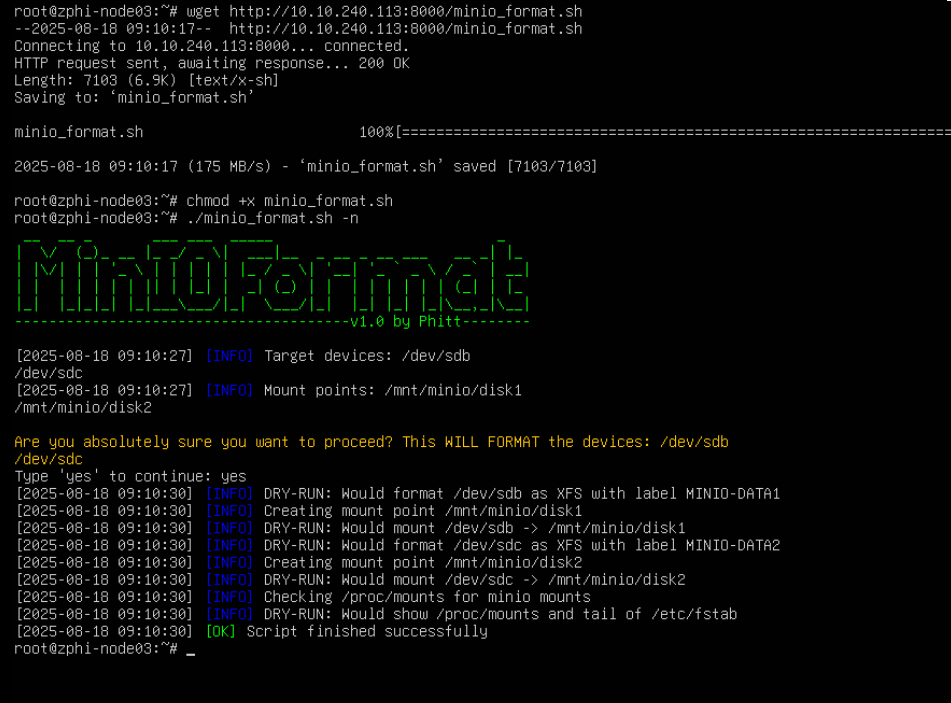
# 3. Triển khai MinIO 4 nodes

Trên 4 nodes, làm tương tự nhau.
#### Cài đặt MinIO binary

```zsh
wget https://dl.min.io/server/minio/release/linux-amd64/minio
chmod +x minio
sudo mv minio /usr/local/bin/
```
#### Tạo System User và Cấp Quyền

```zsh
sudo useradd -r minio-user -s /sbin/nologin
sudo chown -R minio-user:minio-user /mnt/minio
```

#### Cấu hình file `/etc/hosts` (nếu không cấu hình thì file /etc/default/minio thay bằng ip của node)

```bash
127.0.0.1 localhost
127.0.1.1 zphi-node02

# The following lines are desirable for IPv6 capable hosts
::1     ip6-localhost ip6-loopback
fe00::0 ip6-localnet
ff00::0 ip6-mcastprefix
ff02::1 ip6-allnodes
ff02::2 ip6-allrouters

10.10.210.111 zphi-node01
#10.10.210.112 zphi-node02 # Chúng ta đang trên này rồi, không cần chỉnh
10.10.210.113 zphi-node03
10.10.210.114 zphi-node04
```

#### Tạo File cấu hình: `/etc/default/minio`

```zsh
sudo nano /etc/default/minio
```

Ở bước này rất quan trọng, minIO sẽ ưu tiên mỗi dòng có {...} nếu bạn để chia pool.

```
{1...2} hay {1...3} {1...4}... (nếu có 4 ổ trên mỗi node, tùy cấu hình)
```

Như vậy nó sẽ chia ưu tiên mỗi dòng 1 pool. Như ví dụ dưới đây là chia 4 pool, mỗi pool là một node.

```bash
MINIO_ROOT_USER=admin
MINIO_ROOT_PASSWORD=htv@2025
MINIO_VOLUMES="http://10.10.210.111/mnt/minio/disk{1...2} \
               http://10.10.210.112/mnt/minio/disk{1...2} \
               http://10.10.210.113/mnt/minio/disk{1...2} \
               http://10.10.210.114/mnt/minio/disk{1...2}"
MINIO_OPTS="--console-address :9001"
```

Nếu như này nó sẽ ưu tiên gộp tất vào một pool (điều này không nên) vì khả năng mở rộng bị hạn chế, khi muốn mở rộng, ta phải thêm 1 pool gồm 8 ổ nữa...

```zsh
MINIO_VOLUMES="http://10.10.210.111/mnt/minio/disk1 http://10.10.210.111/mnt/minio/disk2 \ http://10.10.210.112/mnt/minio/disk1 http://10.10.210.112/mnt/minio/disk2 \ http://10.10.210.113/mnt/minio/disk1 http://10.10.210.113/mnt/minio/disk2 \ http://10.10.210.114/mnt/minio/disk1 http://10.10.210.114/mnt/minio/disk2"
```

Ưu tiên cách xếp: ví dụ ta chia nhiều pool, như ví dụ thứ nhất, ta thấy có 4 pool khi chạy xong:

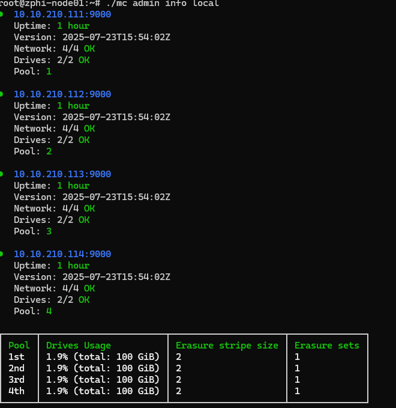

Nhưng mỗi pool lại là một node, điều này khiến cho việc đảm bảo dữ liệu chỉ ở ổ cứng và EC chỉ là 1, nghĩa là mỗi pool hay mỗi node hay mỗi máy mà chết 1 ổ cứng thì chấp nhận được. Điều này ổn nếu chúng ta quan tâm đến dữ liệu trong ổ cứng. Nếu như trong môi trường bình thường, chúng ta có một máy trạm không hoạt động? Và hiển nhiên là cả hệ thống bị ảnh hưởng. Do đó cách xếp này không an toàn.

Cách giải quyết tốt hơn là chia làm sao để dàn trải đều trên các node để không may một node có vấn đề (EC=2) tức là mất hẳn một node vẫn có thể hoạt động được. Ở đây, 8 ổ đĩa mình chia làm 2 pool, nếu mỗi pool chết 2 ổ thì gọi là chấp nhận được.
Do mình sắp xếp thành 2 pool như sau:

```zsh
MINIO_ROOT_USER=admin
MINIO_ROOT_PASSWORD=htv@2025
MINIO_VOLUMES=" \
  http://10.10.210.{111...114}/mnt/minio/disk1 \
  http://10.10.210.{111...114}/mnt/minio/disk2 \
"
MINIO_OPTS="--console-address :9001 --certs-dir /etc/minio/certs"
```

#### Tạo file service cho MinIO

```zsh
[Unit]
Description=MinIO
Documentation=https://min.io/docs
After=network.target

[Service]
User=minio-user
Group=minio-user
EnvironmentFile=/etc/default/minio
ExecStart=/usr/local/bin/minio server $MINIO_OPTS $MINIO_VOLUMES

Restart=always
LimitNOFILE=65536
TimeoutStopSec=infinity
SendSIGKILL=no

[Install]
WantedBy=multi-user.target
```

#### Khởi Động Dịch Vụ

```zsh
sudo systemctl daemon-reload
sudo systemctl enable minio
sudo systemctl start minio
```
#### Tường lửa (nếu có)

```zsh
sudo ufw allow 9000/tcp
sudo ufw allow 9001/tcp
sudo ufw allow from 10.10.210.0/24 to any port 9000
```

# 4. Kiểm tra

**Xác minh mount points**:

```bash
df -h | grep minio
```

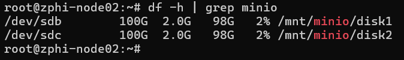

**Kiểm tra dịch vụ**:

```zsh
sudo systemctl status minio
```

```zsh
journalctl -u minio -f
```

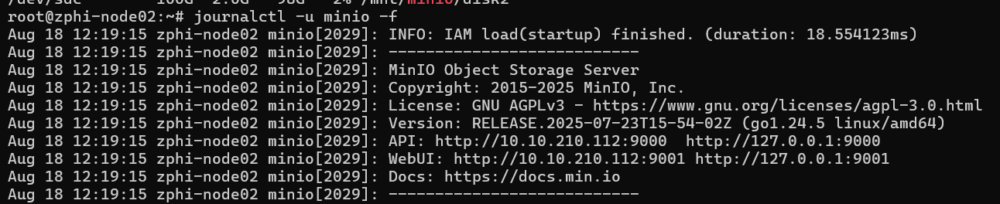

Nhớ để ý xem có thông báo lỗi không.

**Truy cập Web Console**:

http://node-ip:9001 hoặc http://zphi-node01:9001 nếu đã cấu hình trong /etc/hosts.

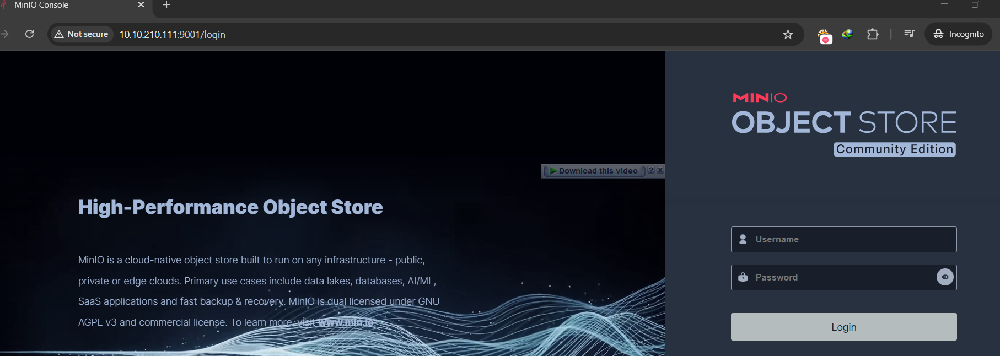

Đăng nhập vào tạo bucket và thử tải file lên

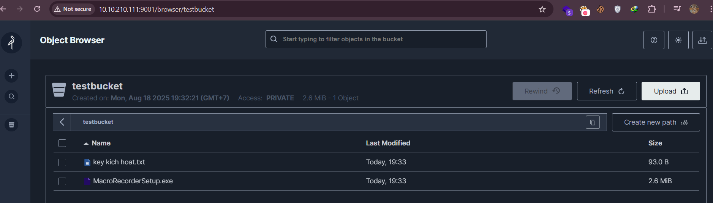

## Kiểm tra với MC (minio-client)

Tải binary chính thức từ github:

```zsh
wget https://dl.min.io/client/mc/release/linux-amd64/mc
chmod +x mc
./mc --help
```

Kiểm tra danh sách alias

```zsh
./mc alias list
```

Như chúng ta thấy, alias mà ta vừa triển khai có tên là `local` và nó chưa có thông tin xác thực

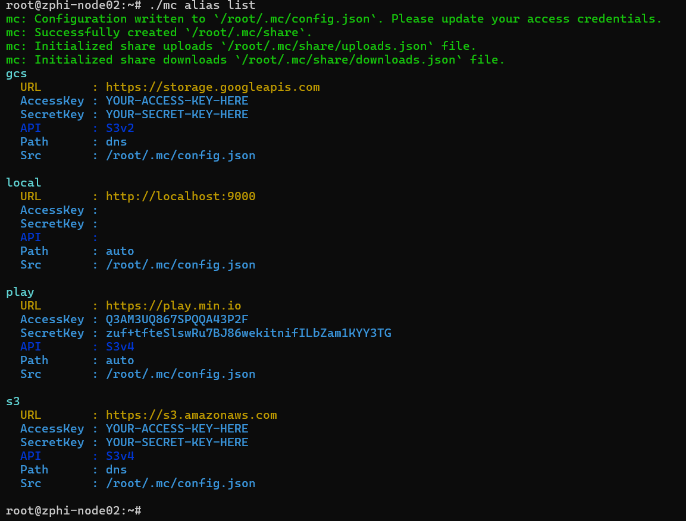

Thêm thông tin xác thực cho alias, bạn có thể sửa alias hiện có (local) hoặc thêm alias mới, ở đây mình thêm alias mới có tên là myminio

```zsh
./mc alias set myminio http://10.10.210.112:9000 admin htv@2025 --api S3v4 --insecure
```

Tiếp theo kiểm tra trạng thái của ALIAS

```zsh
./mc admin info myminio
```


Nếu như bạn gộp tất cả vào 1 pool, nó sẽ trông như này.


Nếu triển khai 4 pool, nó sẽ như này


# 5. Cài SSL cho MinIO

Ở đây do không có tên miền và triển khai cục bộ nên mình sẽ dùng selfcert.

Trước hết phải tắt dịch vụ của minio nếu chúng ta đã khởi động nó,

```zsh
sudo systemctl stop minio
```

Đầu tiên dùng openssl tạo một CA gốc cho các node.

```zsh
openssl genrsa -out minioCA.key 4096

openssl req -x509 -new -nodes -key minioCA.key -sha256 -days 3650 -out minioCA.crt -subj "/CN=Minio-CA"
```

Sau khi tạo xong sẽ có 3 file như này:

```zsh
-rw-r--r-- 1 root root 1805 Aug 19 01:54 minioCA.crt
-rw------- 1 root root 3272 Aug 19 01:54 minioCA.key
-rw-r--r-- 1 root root   41 Aug 19 01:56 minioCA.srl
```

Tiếp theo tạo Cho từng node CSR (Certificate Signing Request)

Ví dụ node1:

```zsh
openssl genrsa -out node01.key 2048
```

```zsh
openssl req -new -key node01.key -out node01.csr \
  -subj "/CN=zphi-node01" \
  -addext "subjectAltName=DNS:zphi-node01,IP:10.10.210.111,DNS:localhost,IP:127.0.0.1"
```

Dùng Root CA ký cert cho từng node, Ví dụ node1:

```zsh
openssl x509 -req -in node01.csr -CA minioCA.crt -CAkey minioCA.key -CAcreateserial -out node01.crt -days 365 -sha256 -extfile <(printf "subjectAltName=DNS:zphi-node01,IP:10.10.210.111,DNS:localhost,IP:127.0.0.1")
```

Lặp lại cho node2, node3, node4 (chỉ đổi CN + IP trong SAN).

Tiếp theo chúng ta sửa trong file `/etc/default/minio`

Sửa http thành https.

Sửa dòng này như sau:

```
MINIO_OPTS="--console-address :9001 --certs-dir /etc/minio/certs"
```

File sẽ có nội dung ví dụ như này:

```bash
MINIO_ROOT_USER=admin
MINIO_ROOT_PASSWORD=htv@2025
MINIO_VOLUMES="https://10.10.210.111/mnt/minio/disk1 https://10.10.210.111/mnt/minio/disk2 \
               https://10.10.210.112/mnt/minio/disk1 https://10.10.210.112/mnt/minio/disk2 \
               https://10.10.210.113/mnt/minio/disk1 https://10.10.210.113/mnt/minio/disk2 \
               https://10.10.210.114/mnt/minio/disk1 https://10.10.210.114/mnt/minio/disk2"
MINIO_OPTS="--console-address :9001 --certs-dir /etc/minio/certs"
```

Tạo thư mục lưu chứng chỉ và copy chứng chỉ đã kí vào đó.

```zsh
sudo mkdir -p /etc/minio/certs
sudo cp node01.crt /etc/minio/certs/public.crt
sudo cp node01.key /etc/minio/certs/private.key
```

Thay đổi chủ sở hữu cho minio toàn quyền, cấu hình quyền chuẩn cho private key

```zsh
sudo chown -R minio-user:minio-user /etc/minio/certs
sudo chmod 600 /etc/minio/certs/private.key
```

Có thể update CA cho SSL nếu cần:

```zsh
sudo cp minioCA.crt /usr/local/share/ca-certificates/minioCA.crt
sudo update-ca-certificates
```

Tiếp theo ở node khác, chuyển root CA vừa tạo ở node1 sang node2 (scp, python3, ftp,...)

Ở node01 (trong thư mục nơi chứa CA gốc)

```zsh
python3 -m http.server 12345
```

Ở node02 (ví dụ cần chuyển CA sang đây)

```zsh
wget http://10.10.210.111:12345/minioCA.crt
wget http://10.10.210.111:12345/minioCA.key
wget http://10.10.210.111:12345/minioCA.srl
```

Thực hiện tạo và ký chứng chỉ

```zsh
openssl genrsa -out node02.key 2048
```

```zsh
openssl req -new -key node02key -out node02.csr \
  -subj "/CN=zphi-node02" \
  -addext "subjectAltName=DNS:zphi-node01,IP:10.10.210.112,DNS:localhost,IP:127.0.0.1"
```

Dùng Root CA ký cert cho từng node, Ví dụ node1:

```zsh
openssl x509 -req -in node02.csr -CA minioCA.crt -CAkey minioCA.key -CAcreateserial -out node02.crt -days 365 -sha256 -extfile <(printf "subjectAltName=DNS:zphi-node02,IP:10.10.210.112,DNS:localhost,IP:127.0.0.1")
```

Tiếp tục như các bước đã làm với node01 ở trên.

Sau khi hoàn tất, khởi động lại minio trên các node

```zsh
sudo systemctl daemon-reload
sudo systemctl start minio
```

Kiểm tra

```zsh
sudo systemctl status minio
```

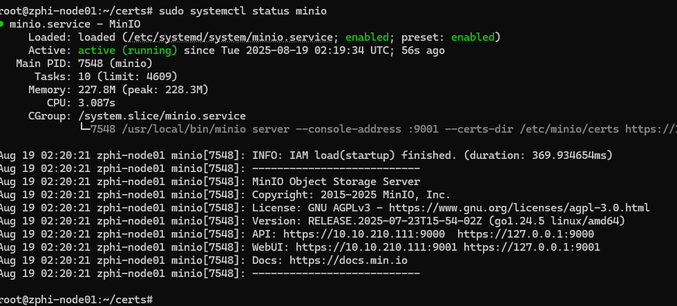

Trên trình duyệt vì là self cert nên không có tin cậy của trình duyệt, chúng ta có thể bỏ qua nó, dữ liệu đã được mã hóa thông qua https. Để cảnh báo bớt khó chịu, có thể import CA vào trình duyệt tại setting->certificate->import

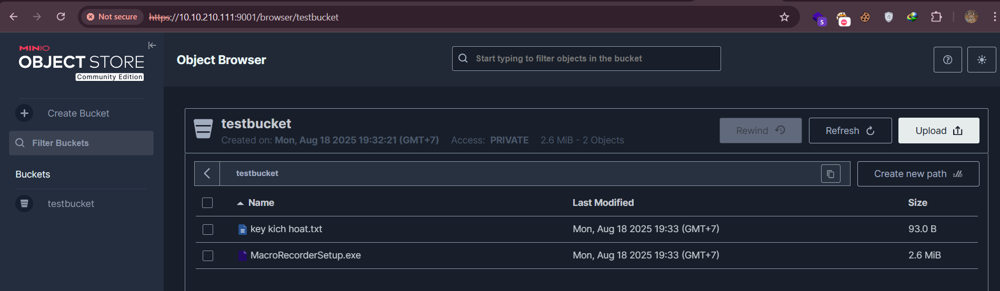

Bạn có thể bắt request với burpsuite hoặc phần network của dev tool trong trình duyệt.
## Sửa https trong API

Nếu Alias local của bạn còn http như này. Dùng minio client.

Tải mc hoặc copy từ máy cài sẵn sang... Ở đây mình đã tải sẵn trên node01

```zsh
wget http://10.10.210.111/mc
```

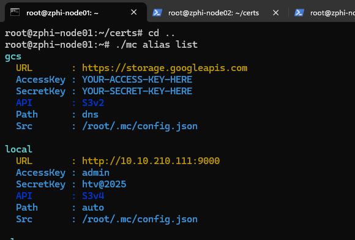

```zsh
./mc alias rm local
./mc alias set local https://10.10.210.111:9000 admin htv@2025
```

Làm tương tự với các node khác hoặc nếu muốn thêm mới alias

Kiểm tra lại

```zsh
./mc alias list
```

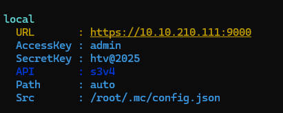

Restart lại minio và check lại

```zsh
sudo systemctl restart minio
./mc admin info local
```

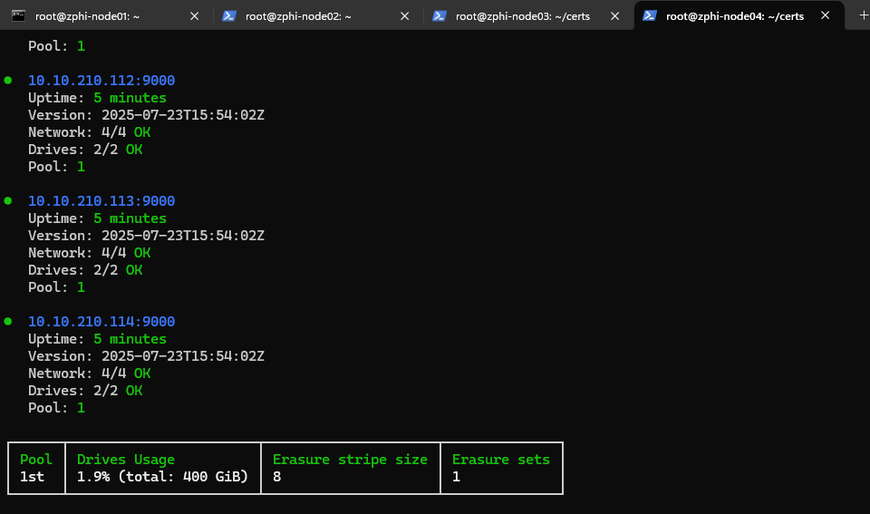


# 6. Khả năng mở rộng

Có rất nhiều trường hợp có thể xảy ra từ bước cấu hình cho đến thời điểm này cũng không ngoại lệ, cần phải cẩn trọng từng bước nếu cấu hình thực tế trong hệ thống lớn có thể gây thiệt hại.

## 6.1. Trường hợp giữ nguyên node, gắn thêm ổ đĩa vào node.

Nguyên tắc như đề cập, không động vào pool cũ, do đó, ta phải tạo một pool mới. Ví dụ mình thêm không đều ổ như pool trước (mỗi node 2 ổ), giờ đây mỗi node chỉ thêm một ổ, 4 node tổng là 4 ổ.

Mình sẽ lấy mô hình cài cũ ở trên đã cài SSL, tối ưu nhất (2 pools x 4 disks, EC2)
Xác định số pool thêm mới: 1 pool. Tổng sẽ có 3 pool.

Tắt máy, điều này quan trọng

```zsh
shutdown -h now
```

Gắn thêm ổ vào VM, dung lượng có thể không đồng nhất giữa các pool, nên tôi thêm ổ 80GB để test.


Trên từng node, thực hiện:

Kiểm tra trong VM xem đã có chưa.

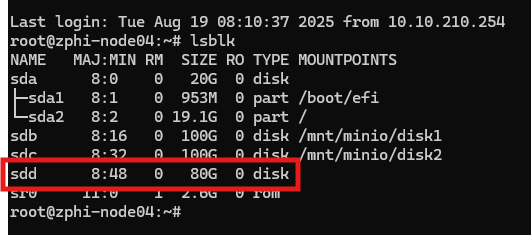

Tắt minio

```zsh
sudo systemctl stop minio
```

Tiến hành format

```zsh
sudo mkfs.xfs /dev/sdd -f -L MINIO-DATA3
```

Tạo mount point
 
```zsh
sudo mkdir -p /mnt/minio/disk3
```

Mount ổ đĩa

```zsh
sudo mount /dev/sdd /mnt/minio/disk3
```

Cấu hình auto-mount khi reboot

```zsh
echo "/dev/sdd /mnt/minio/disk3 xfs defaults,noatime,nodiratime 0 0" | sudo tee -a /etc/fstab
```

Đổi chủ sở hữu sang cho minio-user

```zsh
chown -R minio-user:minio-user /mnt/minio/disk*
```

Sửa file 

```zsh
nano /etc/default/minio
```

```zsh
MINIO_ROOT_USER=admin
MINIO_ROOT_PASSWORD=htv@2025
MINIO_VOLUMES=" \
  https://10.10.210.{111...114}/mnt/minio/disk1 \
  https://10.10.210.{111...114}/mnt/minio/disk2 \
  https://10.10.210.{111...114}/mnt/minio/disk3 \
"
MINIO_OPTS="--console-address :9001 --certs-dir /etc/minio/certs"
```

Trên mỗi node chạy

```zsh
sudo systemctl daemon-reload
```

Sau đó chạy cùng lúc start

```zsh
sudo systemctl start minio
```

Kiểm tra

```zsh
sudo systemctl status minio
```

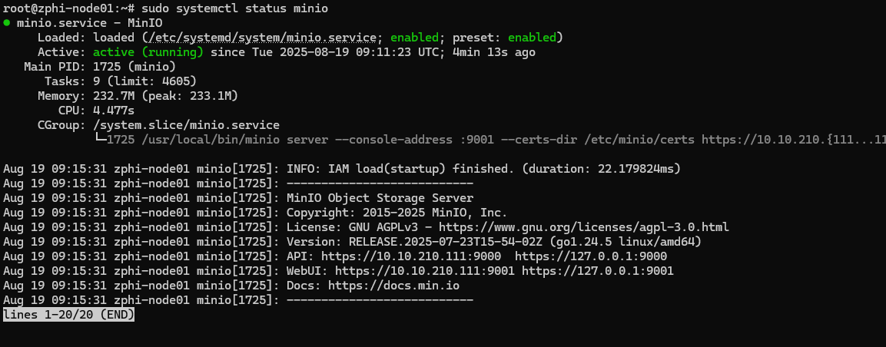

```zsh
./mc admin info myminio
```

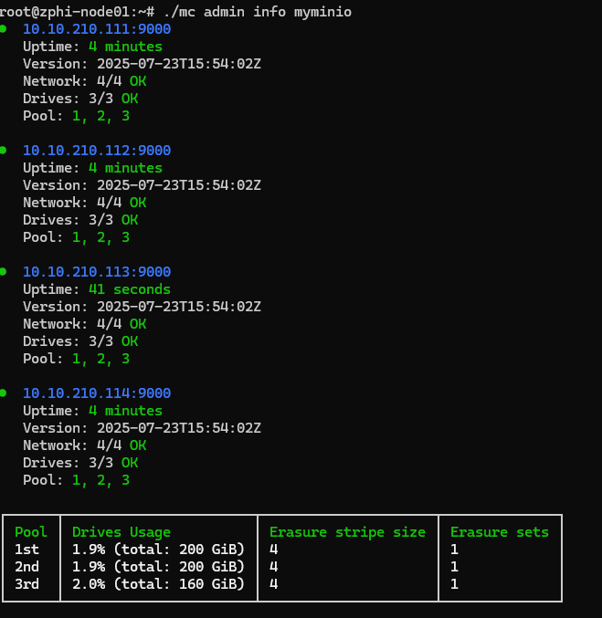