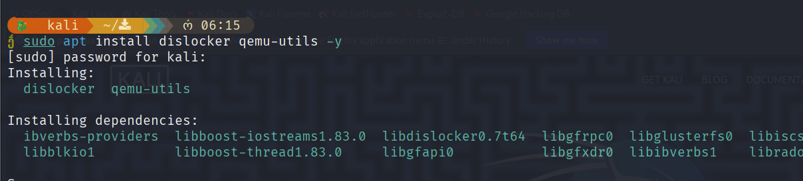
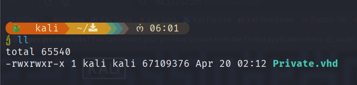
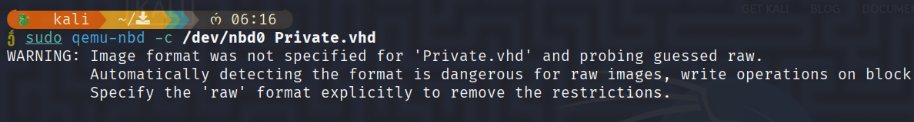
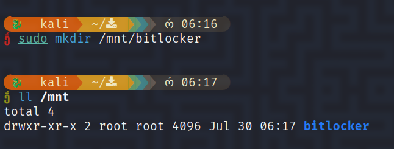
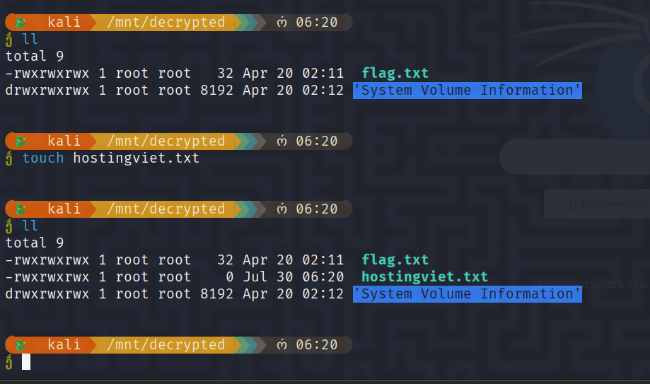
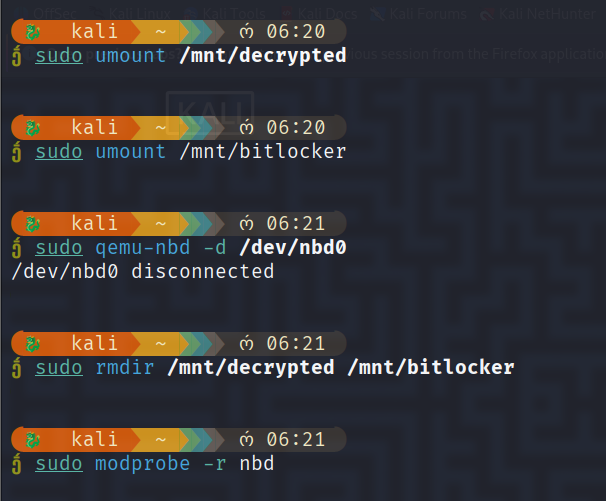

### Hướng dẫn Mount File VHD/VHDX Mã Hóa BitLocker trên Linux

#### **Giới thiệu**

File VHD/VHDX là định dạng đĩa ảo của Microsoft, thường được mã hóa bằng BitLocker để bảo mật. Trên Linux, chúng ta sử dụng công cụ `dislocker` kết hợp `qemu-nbd` để giải mã và truy cập nội dung. Hướng dẫn này giải thích chi tiết từng bước và lý do kỹ thuật đằng sau.

---

### **Các bước thực hiện**

#### **1. Cài đặt công cụ cần thiết**


```zsh
sudo apt install dislocker qemu-utils -y
```



- Giải thích
    
    - `dislocker`: Giải mã BitLocker.
        
    - `qemu-utils`: Cung cấp `qemu-nbd` để gắn file VHD/VHDX như thiết bị khối (block device).
        

---

#### **2. Kích hoạt kernel module NBD**

```zsh
sudo modprobe nbd max_part=16
```

- Giải thích
    
    - Module `nbd` (Network Block Device) cho phép Linux nhận diện file VHD/VHDX như thiết bị vật lý.
        
    - `max_part=16`: Hỗ trợ tối đa **16 phân vùng** trên thiết bị (ví dụ: `/dev/nbd0p1`, `/dev/nbd0p2`).
        

---

#### **3. Gắn file VHD/VHDX vào thiết bị NBD**

Ví dụ, có một file như sau cần mount:




```zsh
sudo qemu-nbd -c /dev/nbd0 Private.vhd
```




Sẽ có một dòng thông báo cảnh báo nhỏ, chúng ta bỏ qua nó.

- **Giải thích**
    
    - `qemu-nbd`: Chuyển đổi file VHD/VHDX thành thiết bị khối (ở đây là `/dev/nbd0`).
        
    - Linux sẽ tự động phát hiện phân vùng (ví dụ: `/dev/nbd0p1` cho phân vùng đầu tiên).
        

---

#### **4. Tạo thư mục mount**

```zsh
sudo mkdir /mnt/bitlocker
```



---

#### **5. Giải mã phân vùng BitLocker**

Giả sử mật khẩu của bitlocker là `francisco`

```zsh
sudo dislocker -V /dev/nbd0p1 -ufrancisco -- /mnt/bitlocker
```

- GIải thích
    
    - `-V /dev/nbd0p1`: Phân vùng BitLocker cần giải mã (thường là phân vùng đầu tiên).
        
    - `-u [password]`: Sử dụng mật khẩu BitLocker (thay `francisco` bằng mật khẩu thực).  
        _Nếu dùng recovery key, thay bằng `-r [key]`_.
        
    - Output: File giải mã `/mnt/bitlocker/dislocker-file`.
        

---

#### **6. Mount file giải mã**


```zsh
sudo mkdir /mnt/decrypted
sudo mount -o loop /mnt/bitlocker/dislocker-file /mnt/decrypted
```

- **Giải thích**
    
    - `-o loop`: Gắn file ảnh (`dislocker-file`) như một thiết bị loopback.
        
    - Dữ liệu giải mã sẽ xuất hiện tại `/mnt/decrypted`.
        

---

#### **7. Truy cập nội dung**

```zsh
cd /mnt/decrypted
cat hostingviet.txt
touch something.txt
...
```



---

#### **8. Dọn dẹp sau khi hoàn thành**

```zsh
sudo umount /mnt/decrypted
sudo umount /mnt/bitlocker
sudo qemu-nbd -d /dev/nbd0
sudo rmdir /mnt/decrypted /mnt/bitlocker
sudo modprobe -r nbd
```



- **Giải thích**
    
    - `umount`: Ngắt kết nối thiết bị trước khi xóa.
        
    - `qemu-nbd -d`: Ngắt kết nối file VHD/VHDX khỏi NBD.
        
    - `rmdir`: Xóa thư mục mount.
        
    - `modprobe -r nbd`: Gỡ module NBD khỏi kernel.
        

---

### Chú ý

1. **Quyền root**: Tất cả lệnh đều cần `sudo` vì thao tác trực tiếp với thiết bị.
    
2. **Mật khẩu BitLocker**: Thay `-u francisco` bằng mật khẩu thực của bạn nếu có.
    
3. **Phân vùng chính xác**: Kiểm tra tên phân vùng bằng `lsblk` nếu không rõ `/dev/nbd0p1`.
    
4. **Lỗi busy**: Đảm bảo không có tiến trình nào đang truy cập thư mục mount khi unmount.
    

> ⚠️ Nếu file là **VHDX**, thay thế `Private.vhd` bằng `Private.vhdx` ở Bước 3. Các bước còn lại tương tự.