# 1. Kiểm tra sơ bộ

Nếu thấy biểu hiện lạ như này:

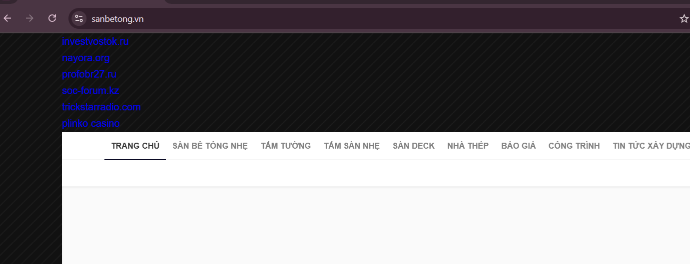

# 2. Google dork

Nhập:

```url
site:sanbetong.vn
```

Kiểm tra các kết quả, nếu thấy thì khả năng cao là bị mã độc.

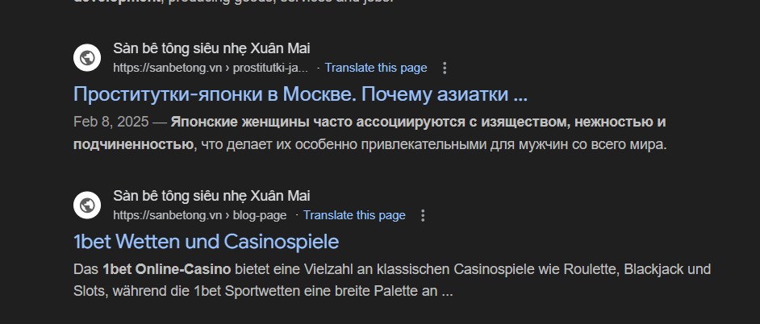

# 3. Kiểm tra trong source code

Nếu có ssh, dùng ssh vào shell của vps và tìm domain cần kiểm tra. Nếu không, tải source code về phân tích, ví dụ như Direct Admin thì backup.

Nên kết hợp với Admin hosting GUI để check cho nhanh, đặc biệt phần plugins
## 3.1 Kiểm tra plugin

Ví dụ web dùng direct admin, vào kiểm tra.

Ví dụ code mã độc của nó như này:

```zsh
function azedazo_kivazhy() {
    abuwyzy_tishepa();
}

$ovadyd = __DIR__ . '/pewynej.php';
if (file_exists($ovadyd)) {
    include_once __DIR__ . "/pew" . "ynej" . ".php";
}


if (function_exists("abuwyzy_tishepa")) {
    $ycogov = new ifyjoxo_ukhifiz();
    if ($ycogov->xarokaw_exunyte()) {
        add_action('init', 'azedazo_kivazhy');
    }
}
```

Để ý các plugin có tên lạ hoặc vô lý,...

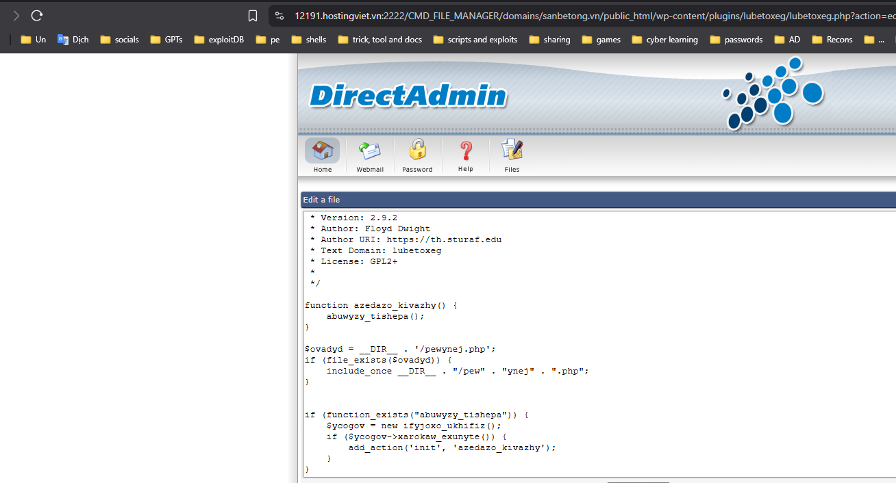

Xóa các folders đó đi.

Sau khi xong, đến bước tiếp theo.

## 3.2 Kiểm tra với pattern trong shell

Lúc này ta giải nén source code ra nếu không có ssh, nếu có thì làm trực tiếp trong shell

Chạy querry sau khi ở trong folder chứa code website.

```zsh
grep -r --include=*.php "eval(\|base64_decode(\|gzinflatemys(\|exec(\|passthru(\|shell_exec(\|system(\|proc_open(\|popen(\|curl_exec(\|curl_multi_exec(\|parse_ini_file(\|show_source(" .
```

Nếu có rg

```zsh
# Nếu có ripgrep (rg) - nhanh, hỗ trợ PCRE
rg --hidden --no-ignore -n --glob '!node_modules' \
  -e 'eval\s*\(|base64_decode\s*\(|gzinflate\s*\(|gzuncompress\s*\(|gzuncompress\s*\(|str_rot13\s*\(|assert\s*\(|preg_replace\s*\(.*\/e.*\)|create_function\s*\(|shell_exec\s*\(|passthru\s*\(|popen\s*\(|proc_open\s*\(|system\s*\(|`[^`]+`|curl_exec\s*\(|curl_multi_exec\s*\(|urldecode\s*\(|rawurldecode\s*\(|%[0-9A-Fa-f]{2}{4,}|\\x[0-9A-Fa-f]{2,}|[A-Za-z0-9+/]{40,}={0,2}|\$\{\s*["\']\\x[0-9A-Fa-f]+' \
  /path/to/webroot --hidden
```

Bắt cả url encode

```zsh
grep -RIn --binary-files=without-match --exclude-dir={node_modules,vendor} \
  --include=\*.php --include=\*.phtml --include=\*.inc --include=\*.tpl \
  -P 'eval\s*\(|base64_decode\s*\(|gzinflate\s*\(|gzuncompress\s*\(|preg_replace\s*\(.*\/e.*\)|urldecode\s*\(|rawurldecode\s*\(|shell_exec\s*\(|passthru\s*\(|popen\s*\(|proc_open\s*\(|system\s*\(|curl_exec\s*\(|curl_multi_exec\s*\(|parse_ini_file\s*\(|show_source\s*\(|\\x[0-9A-Fa-f]{2,}|(?:%[0-9A-Fa-f]{2}){4,}|[A-Za-z0-9+/]{40,}={0,2}' .
```

Để ý output xem có chỗ nào khả nghi không.

Script check

```zsh
#!/usr/bin/env bash
# detect_php_obf.sh
# Quét file PHP có dấu hiệu obfuscated/backdoor giống ví dụ

set -u
TARGET="${1:-/var/www}"
ONLY_FLAGGED=0
QUARANTINE=0
QUIET=0

for arg in "${@:2}"; do
  case "$arg" in
    --only-flagged) ONLY_FLAGGED=1 ;;
    --quarantine) QUARANTINE=1 ;;
    --quiet) QUIET=1 ;;
    -h|--help)
      cat <<'USAGE'
Usage: detect_php_obf.sh [target_dir] [--only-flagged] [--quarantine] [--quiet]
Examples:
  ./detect_php_obf.sh /var/www
  ./detect_php_obf.sh . --only-flagged --quarantine
USAGE
      exit 0
      ;;
    *) ;;
  esac
done

QUAR_DIR="/tmp/php_malware_quarantine_$(date +%Y%m%d_%H%M%S)"

# Ensure tools exist
command -v awk >/dev/null 2>&1 || { echo "awk not found"; exit 1; }
command -v grep >/dev/null 2>&1 || { echo "grep not found"; exit 1; }
command -v find >/dev/null 2>&1 || { echo "find not found"; exit 1; }

# find candidate files
mapfile -t FILES < <(find "$TARGET" -type f \( -iname "*.php" -o -iname "*.phtml" -o -iname "*.inc" -o -iname "*.phar" \) -print 2>/dev/null)

if [ "${#FILES[@]}" -eq 0 ]; then
  echo "Không tìm thấy file PHP trong $TARGET (hoặc không có quyền)."
  exit 0
fi

# Function to compute suspicious score and reasons
scan_file() {
  local f="$1"
  local score=0
  local reasons=()

  # Count hex escapes like \x47
  local hex_count
  hex_count=$(grep -oP '\\x[0-9A-Fa-f]{2}' "$f" 2>/dev/null | wc -l)
  if [ "$hex_count" -gt 8 ]; then score=$((score+3)); reasons+=("Nhiều \\x hex escapes ($hex_count)"); 
  elif [ "$hex_count" -gt 2 ]; then score=$((score+1)); reasons+=("Một vài \\x escapes ($hex_count)"); fi

  # base64 long blocks
  local b64_count
  b64_count=$(grep -oE '[A-Za-z0-9+/]{40,}={0,2}' "$f" 2>/dev/null | wc -l)
  if [ "$b64_count" -gt 0 ]; then score=$((score+2)); reasons+=("Chuỗi giống base64 dài ($b64_count)"); fi

  # suspicious functions/patterns
  local func_count
  func_count=$(egrep -o 'eval\s*\(|base64_decode\s*\(|gzinflate\s*\(|gzuncompress\s*\(|str_rot13\s*\(|assert\s*\(|create_function\s*\(|shell_exec\s*\(|`[^`]+`|passthru\s*\(|popen\s*\(|proc_open\s*\(|system\s*\(|exec\s*\(' "$f" 2>/dev/null | wc -l)
  if [ "$func_count" -gt 0 ]; then score=$((score+2)); reasons+=("Hàm nguy hiểm/exec found ($func_count)"); fi

  # preg_replace with /e (legacy)
  if grep -Pq 'preg_replace\s*\(.*\/e' "$f" 2>/dev/null; then score=$((score+2)); reasons+=("preg_replace(.../e)"); fi

  # obfuscated $GLOBALS pattern ${"\x47\x4c..."}
  if grep -Pq '\$\{\s*".*\\x[0-9A-Fa-f]{2}.*"\s*\}' "$f" 2>/dev/null; then score=$((score+3)); reasons+=('Pattern ${"\x.."} (obfuscated GLOBALS)'); fi

  # many string concatenations of single chars (heuristic)
  local concat_count
  concat_count=$(grep -oP '([\"'\'']\\x[0-9A-Fa-f]{2}[\"'\'']\s*\.\s*){4,}' "$f" 2>/dev/null | wc -l)
  if [ "$concat_count" -gt 0 ]; then score=$((score+1)); reasons+=("Nhiều concat chuỗi hex-coded ($concat_count)"); fi

  # lines longer than threshold
  local long_lines
  long_lines=$(awk 'length($0) > 800 {print NR}' "$f" 2>/dev/null | wc -l)
  if [ "$long_lines" -gt 0 ]; then score=$((score+1)); reasons+=("Dòng dài (>800 chars) x$long_lines"); fi

  # suspicious indexing like $O00OO_0_O_{38} or $var{38} or $var[38]
  local idx_count
  idx_count=$(grep -oP '\$\w{2,40}\{\d+\}|\$\w{2,40}\[\d+\]' "$f" 2>/dev/null | wc -l)
  if [ "$idx_count" -gt 6 ]; then score=$((score+1)); reasons+=("Nhiều biến index dạng \$var{num} hoặc \$var[num] ($idx_count)"); fi

  # remote-looking URLs encoded (aHR0cH = base64 for https)
  if grep -Pq '[A-Za-z0-9+/]{8,}={0,2}' "$f" 2>/dev/null; then
    # we already count base64, add small extra weight if also contains http indicators when decoded - can't decode safely here
    : # keep as is (already counted)
  fi

  # Build output
  if [ "${#reasons[@]}" -eq 0 ]; then
    reasons=("No high-risk heuristics")
  fi

  # print as single line: score|file|reasons
  printf "%d|%s|%s\n" "$score" "$f" "$(IFS='; '; echo "${reasons[*]}")"
}

# Scan loop
results=()
for f in "${FILES[@]}"; do
  # skip unreadable
  [ -r "$f" ] || continue
  results+=("$(scan_file "$f")")
done

# Process results: print sorted by score desc
IFS=$'\n'
sorted=($(printf "%s\n" "${results[@]}" | sort -t'|' -k1,1nr))
unset IFS

# Output
echo "Scan completed. Files scanned: ${#FILES[@]}"
echo "Format: SCORE | FILE | REASONS"
echo "---------------------------------------------"

flagged=0
for line in "${sorted[@]}"; do
  score=$(echo "$line" | cut -d'|' -f1)
  file=$(echo "$line" | cut -d'|' -f2)
  reasons=$(echo "$line" | cut -d'|' -f3-)
  if [ "$score" -ge 4 ]; then
    flagged=$((flagged+1))
    printf "[FLAGGED] %2d | %s\n      -> %s\n" "$score" "$file" "$reasons"
    if [ "$QUARANTINE" -eq 1 ]; then
      mkdir -p "$QUAR_DIR"
      cp -a -- "$file" "$QUAR_DIR/" 2>/dev/null || true
    fi
  else
    if [ "$ONLY_FLAGGED" -eq 0 ] && [ "$QUIET" -eq 0 ]; then
      printf "   %2d | %s\n      -> %s\n" "$score" "$file" "$reasons"
    fi
  fi
done

if [ "$flagged" -eq 0 ]; then
  echo "Không có file nào vượt ngưỡng nghi ngại (score >= 4)."
else
  echo
  echo "Tổng file flagged: $flagged"
  if [ "$QUARANTINE" -eq 1 ]; then
    echo "Các file flagged đã được sao chép vào thư mục quarantine: $QUAR_DIR"
    echo "Hãy kiểm tra thủ công rồi xóa/khôi phục theo quyết định."
  fi
fi
```

## 3.3 Kiểm tra htaccess

Nếu không rõ thì cop hỏi chatgpt

.htaccess đã "dính chưởng"

```zsh
<FilesMatch ".(py|exe|php)$">
 Order allow,deny
 Deny from all
</FilesMatch>
<FilesMatch "^(about.php|radio.php|index.php|content.php|lock360.php|admin.php|wp-login.php|wp-l0gin.php|wp-theme.php|wp-scripts.php|wp-editor.php|mah.php|jp.php|ext.php)$">
 Order allow,deny
 Allow from all
</FilesMatch>
<IfModule mod_rewrite.c>
RewriteEngine On
RewriteBase /
RewriteRule ^index\.php$ - [L]
RewriteCond %{REQUEST_FILENAME} !-f
RewriteCond %{REQUEST_FILENAME} !-d
RewriteRule . /index.php [L]
</IfModule>
```

Basic .htaccess

```zsh
# BEGIN WordPress

RewriteEngine On
RewriteRule .* - [E=HTTP_AUTHORIZATION:%{HTTP:Authorization}]
RewriteBase /
RewriteRule ^index\.php$ - [L]
RewriteCond %{REQUEST_FILENAME} !-f
RewriteCond %{REQUEST_FILENAME} !-d
RewriteRule . /index.php [L]

# END WordPress
```

.htaccess ổn

```zsh
# BEGIN WordPress
<IfModule mod_rewrite.c>
RewriteEngine On
RewriteRule .* - [E=HTTP_AUTHORIZATION:%{HTTP:Authorization}]
RewriteBase /
RewriteRule ^index\.php$ - [L]
RewriteCond %{REQUEST_FILENAME} !-f
RewriteCond %{REQUEST_FILENAME} !-d
RewriteRule . /index.php [L]
</IfModule>
# END WordPress

# --- Bảo vệ wp-config.php và .htaccess ---
<Files wp-config.php>
    <IfModule mod_authz_core.c>
        Require all denied
    </IfModule>
    <IfModule !mod_authz_core.c>
        Order allow,deny
        Deny from all
    </IfModule>
</Files>

<Files .htaccess>
    <IfModule mod_authz_core.c>
        Require all denied
    </IfModule>
    <IfModule !mod_authz_core.c>
        Order allow,deny
        Deny from all
    </IfModule>
</Files>

# --- (tuỳ chọn) Chặn thực thi PHP trong uploads ---
<IfModule mod_php7.c>
    <FilesMatch "\.php$">
        <IfModule mod_authz_core.c>
            Require all denied
        </IfModule>
        <IfModule !mod_authz_core.c>
            Deny from all
        </IfModule>
    </FilesMatch>
</IfModule>
<IfModule mod_php5.c>
    <FilesMatch "\.php$">
        <IfModule mod_authz_core.c>
            Require all denied
        </IfModule>
        <IfModule !mod_authz_core.c>
            Deny from all
        </IfModule>
    </FilesMatch>
</IfModule>

# --- (tuỳ chọn) Tắt liệt kê thư mục ---
Options -Indexes
```
# 4. Xử lý phần nội dung bài viết bị chèn và xử lý SQL

Nếu dùng DA, vào DA -> Domain -> SQL

Chúng ta sửa password của người dùng admin để truy cập vào wordpress tại `wp-login.php`


# 5. Thay core wordpress

Giữ lại
- wp-config.php
- .htaccess
- wp-content

Tìm phiên bản của wordpress tại wp-admin/version.php

Tải về và nhớ giải nén ra xóa wp-content để tránh ghi đè của khách hàng.

Tải lên DA và giải nén trong thư mục public_html

# 6. Rà soát các bài viết lạ và folder lạ

Ví dụ trong wp admin

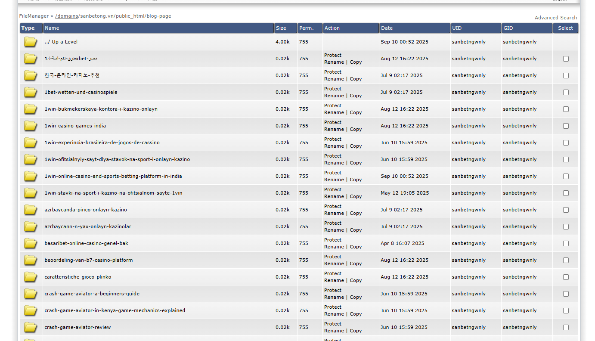

Vào wp admin, xóa hết các bài viết bị chèn

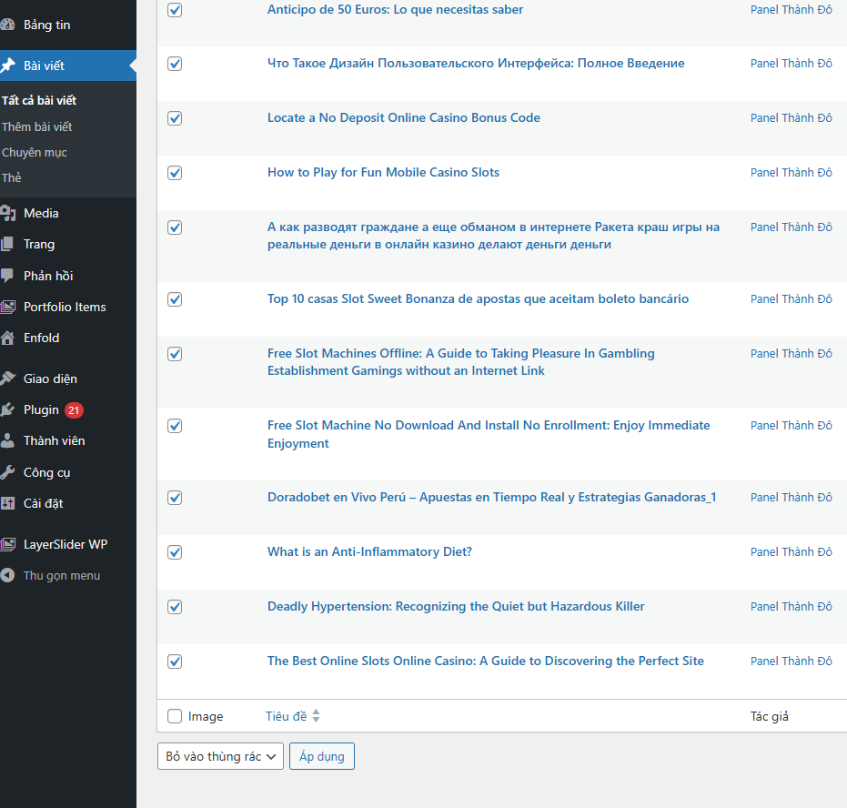

Tương tự, vào chuyên mục, tìm các chuyên mục lạ và xóa chúng

Trang giao diện bị chèn, xử lý trong header và footer

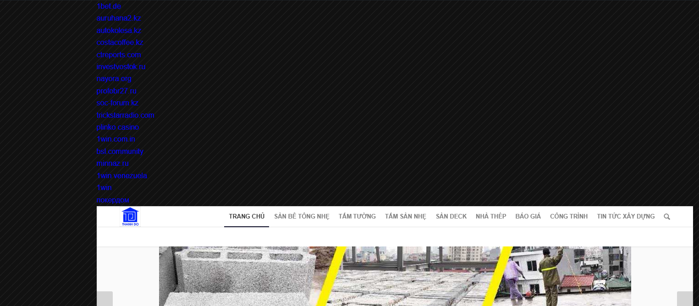

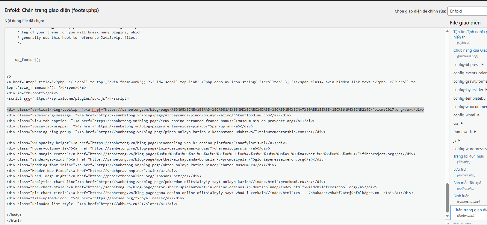

Bị chèn như này:

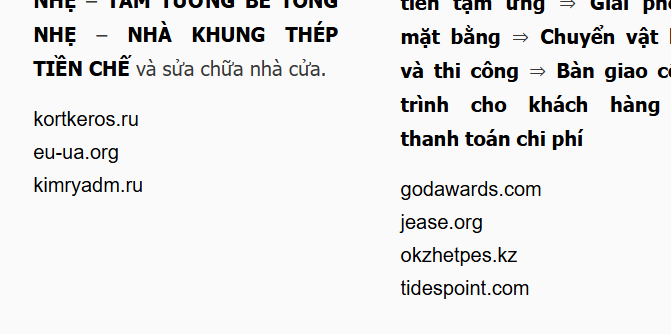

Vào Edit trang thử inspect nó lên rồi xóa nó trong html trang chủ. Nếu không hết, sang bước 7.
# 7. Xử lý nâng cao

Khi trang web âm thầm redirect hoặc chạy javascript độc hại mà ta không hề hay biết, ví dụ bạn cài kaspersky sẽ được nó cảnh báo. Nếu không, chúng ta check thủ công trên trang

```url
https://sitecheck.sucuri.net/
```

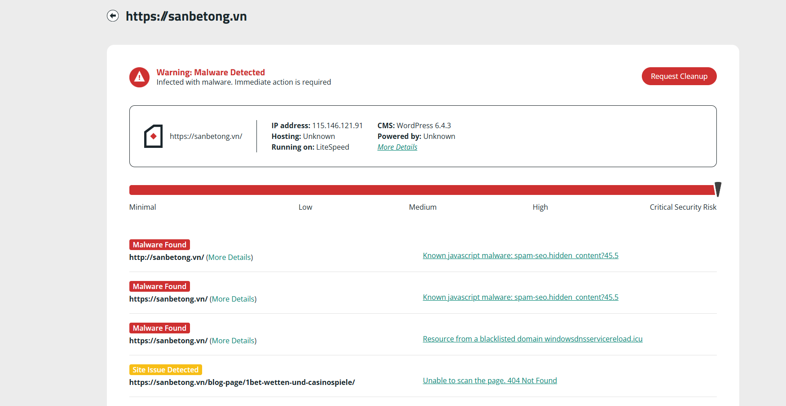


## 7.1. Tìm file JS/PHP lạ trong webroot

```zsh
# Tìm các file có pattern obfuscation / eval / base64
grep -R --binary-files=text -nE "eval\(|base64_decode|fromCharCode|atob\(|document\.write\(|setTimeout\(|btoa\(" . || true

# Tìm file PHP xuất hiện trong pub/media hoặc upload dirs (backdoor thường được giấu ở media)
find /var/www/html/pub/media -type f -mtime -60 -ls
find /var/www/html -type f -name "*.php" -o -name "*.phtml" | xargs ls -ltr | tail -n 50
```


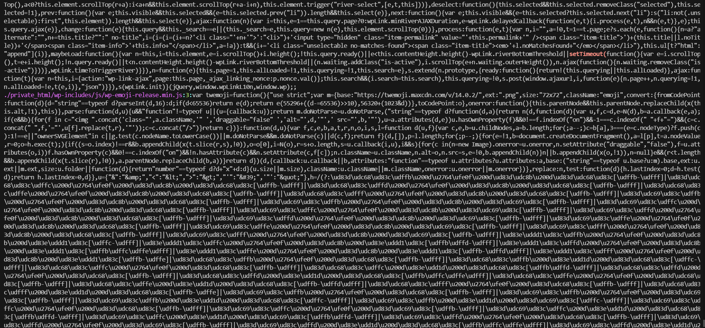

## 7.2. Querry trong SQL

Dựa vào domain độc hại bị chèn, truy vấn SQL. Sau đó xóa các thành phần bị chèn vào.

```sql
-- tìm trong bài viết
SELECT ID, post_title, LEFT(post_content,200) 
FROM wp_posts 
WHERE post_content LIKE '%kortkeros.ru%' OR post_content LIKE '%windowsdnsservicereload%';

-- tìm trong options (thường hacker chèn script vào option like 'widget_text' or 'footer_text')
SELECT option_name, LEFT(option_value,200) FROM wp_options 
WHERE option_value LIKE '%kortkeros.ru%' OR option_value LIKE '%windowsdnsservicereload%';


SELECT option_name, option_value FROM wp_options 
WHERE option_value LIKE '%kortkeros.ru%' 
OR option_value LIKE '%godawards.com%' LIMIT 50;

SELECT meta_key, meta_value FROM wp_postmeta 
WHERE meta_value LIKE '%jease.org%' LIMIT 50;

```

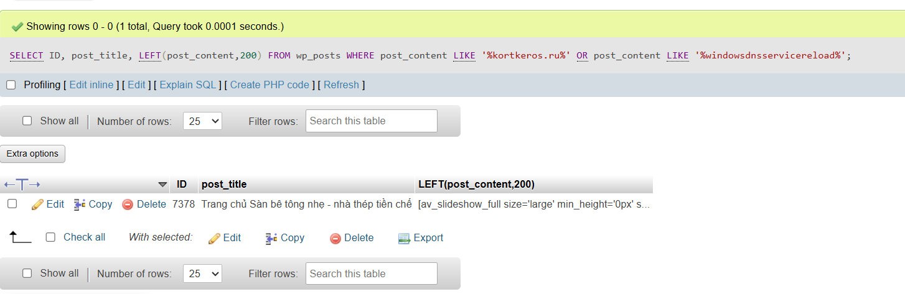

Một số con sau khi đã xóa post nhưng vẫn còn trên google, đọc tài liệu Google search Console (GSC) hoặc grep link, chắc chắn 404 rồi cho vào disallow.

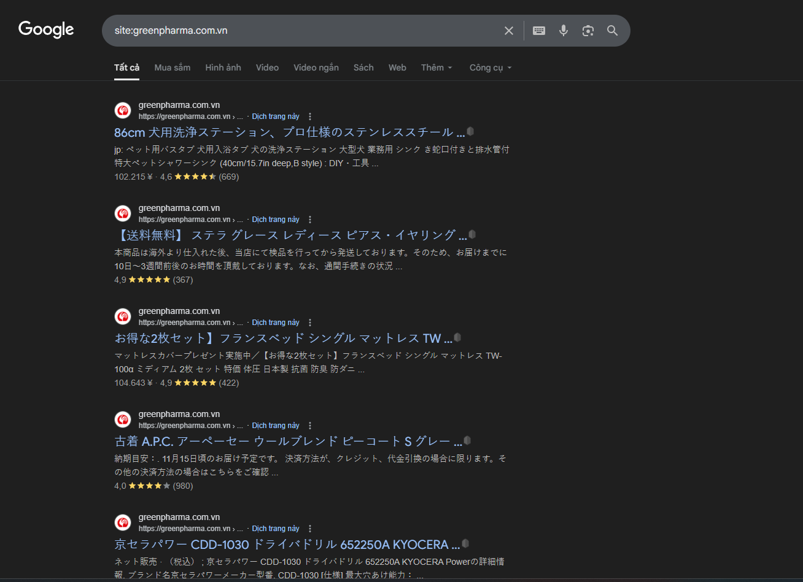

```sql
-- tìm post chứa chuỗi tiếng nhật / script
SELECT ID, post_title, post_status
FROM wp_posts
WHERE post_content LIKE '%<script%%' OR post_content REGEXP '[一-龯ぁ-んァ-ン]'
LIMIT 200;

-- tìm options chứa script
SELECT option_name
FROM wp_options
WHERE option_value LIKE '%<script%' OR option_value LIKE '%?r=%' OR option_value LIKE '%base64_%'
LIMIT 200;

-- tìm meta
SELECT post_id, meta_key
FROM wp_postmeta
WHERE meta_value LIKE '%<script%' OR meta_value LIKE '%?r=%'
LIMIT 200;

```
## 7.3. Xử lý nâng cao redirect ẩn và mã JS độc

Sau khi xử lý xong, phần chân trang không còn link mã độc nữa. Tuy nhiên khi check lại trên sucuri, vẫn còn duy nhất 1 vấn đề và cũng là nghiêm trọng nhất

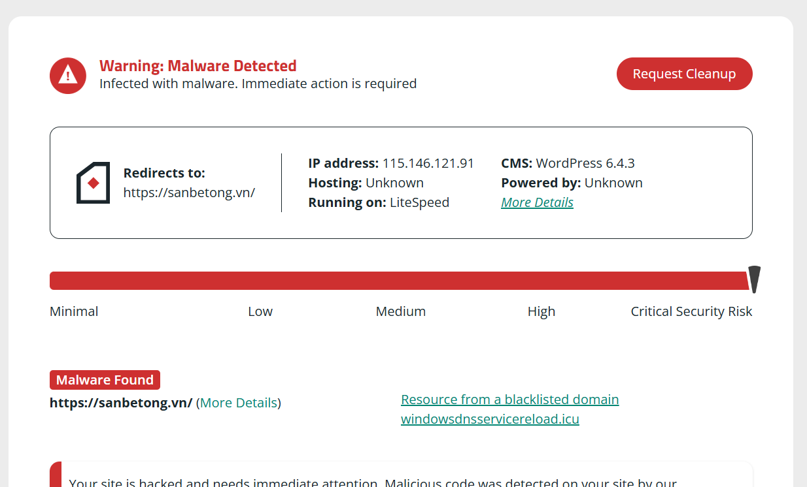

Chúng ta query xem chính xác nó ở đâu:

```zsh
curl -sS https://sanbetong.vn/ | grep -in "windowsdnsservicereload\|windowsdnss"
```

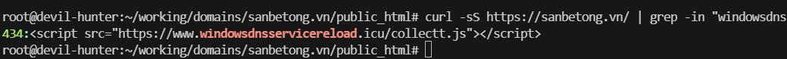
