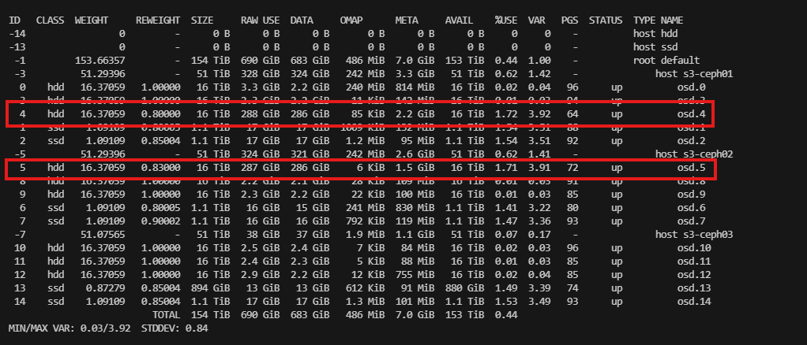

# 1. Tổng quát
Làm sao để 1 cụm ceph san data đều cho các osd luôn là vấn đề đau đầu.
Như ở đây là một case



Điều này rất dễ xảy ra khi có vài osd down hoặc phục hồi sau sự cố. Mặc dù ceph báo health ok và vẫn download/upload bình thường, read write đều các osd. Tuy nhiên nếu để lâu, osd sẽ bị đầy và crash.

# 2. Kiểm tra lại rule

```zsh
ceph osd crush rule dump
[
    {
        "rule_id": 0,
        "rule_name": "replicated_rule",
        "type": 1,
        "steps": [
            {
                "op": "take",
                "item": -1,
                "item_name": "default"
            },
            {
                "op": "chooseleaf_firstn",
                "num": 0,
                "type": "host"
            },
            {
                "op": "emit"
            }
        ]
    },
    {
        "rule_id": 1,
        "rule_name": "ssd_rule",
        "type": 1,
        "steps": [
            {
                "op": "take",
                "item": -12,
                "item_name": "default~ssd"
            },
            {
                "op": "chooseleaf_firstn",
                "num": 0,
                "type": "host"
            },
            {
                "op": "emit"
            }
        ]
    },
    {
        "rule_id": 2,
        "rule_name": "hdd_rule",
        "type": 1,
        "steps": [
            {
                "op": "take",
                "item": -2,
                "item_name": "default~hdd"
            },
            {
                "op": "chooseleaf_firstn",
                "num": 0,
                "type": "host"
            },
            {
                "op": "emit"
            }
        ]
    }
]
```

```zsh
root@s3-ceph02:~# ceph osd pool ls detail
pool 1 '.mgr' replicated size 2 min_size 1 crush_rule 0 object_hash rjenkins pg_num 1 pgp_num 1 autoscale_mode on last_change 25 flags hashpspool stripe_width 0 pg_num_max 32 pg_num_min 1 application mgr read_balance_score 15.38
pool 6 '.rgw.root' replicated size 2 min_size 1 crush_rule 0 object_hash rjenkins pg_num 32 pgp_num 32 autoscale_mode on last_change 3029 lfor 0/0/3023 flags hashpspool stripe_width 0 application rgw read_balance_score 2.33
pool 7 'htv.rgw.log' replicated size 2 min_size 1 crush_rule 0 object_hash rjenkins pg_num 32 pgp_num 32 autoscale_mode on last_change 3141 lfor 0/0/3025 flags hashpspool stripe_width 0 application rgw read_balance_score 3.30
pool 8 'htv.rgw.control' replicated size 2 min_size 1 crush_rule 0 object_hash rjenkins pg_num 32 pgp_num 32 autoscale_mode on last_change 3029 lfor 0/0/3025 flags hashpspool stripe_width 0 application rgw read_balance_score 3.73
pool 9 'htv.rgw.meta' replicated size 2 min_size 1 crush_rule 0 object_hash rjenkins pg_num 32 pgp_num 32 autoscale_mode on last_change 3029 lfor 0/0/3027 flags hashpspool stripe_width 0 pg_autoscale_bias 4 application rgw read_balance_score 2.82
pool 12 's3.ssd.data' replicated size 2 min_size 1 crush_rule 1 object_hash rjenkins pg_num 128 pgp_num 128 autoscale_mode on last_change 3078 flags hashpspool stripe_width 0 application rgw read_balance_score 1.22
pool 13 's3.ssd.index' replicated size 2 min_size 1 crush_rule 1 object_hash rjenkins pg_num 64 pgp_num 64 autoscale_mode on last_change 3079 flags hashpspool stripe_width 0 application rgw read_balance_score 1.22
pool 14 's3.hdd.data' replicated size 2 min_size 1 crush_rule 2 object_hash rjenkins pg_num 256 pgp_num 256 autoscale_mode on last_change 3097 flags hashpspool stripe_width 0 application rgw read_balance_score 1.13
pool 15 's3.hdd.index' replicated size 2 min_size 1 crush_rule 1 object_hash rjenkins pg_num 64 pgp_num 64 autoscale_mode on last_change 3098 flags hashpspool stripe_width 0 application rgw read_balance_score 1.50
pool 16 'htv.rgw.buckets.index' replicated size 2 min_size 1 crush_rule 0 object_hash rjenkins pg_num 1 pgp_num 1 autoscale_mode on last_change 3149 flags hashpspool stripe_width 0 pg_autoscale_bias 4 application rgw read_balance_score 15.38
pool 17 'htv.rgw.buckets.data' replicated size 2 min_size 1 crush_rule 0 object_hash rjenkins pg_num 1 pgp_num 1 autoscale_mode on last_change 3152 flags hashpspool,bulk stripe_width 0 application rgw read_balance_score 15.38
pool 18 'htv.rgw.buckets.non-ec' replicated size 2 min_size 1 crush_rule 0 object_hash rjenkins pg_num 1 pgp_num 1 autoscale_mode on last_change 3241 flags hashpspool stripe_width 0 application rgw read_balance_score 15.38
```

```zsh
ceph osd crush rule ls
```

Tuy nhiên — **vấn đề Balancer không hoạt động không phải do rule khác nhau SSD/HDD “bản thân”, mà do việc mỗi OSD lại thuộc **nhiều CRUSH subtrees cùng lúc**, cụ thể là cả `default` _và_ `default~ssd`/`default~hdd` cùng lúc**. Điều này đã gây ra Balancer _báo lỗi “Some osds belong to multiple subtrees”_ và ngăn Balancer sinh được _optimize plan_ để cân PG.

Balancer ở chế độ **crush-compat** (mặc định) có giới hạn:  
➡️ _Không thể hoạt động nếu một OSD xuất hiện trong nhiều CRUSH hierarchies/subtrees mà cùng dùng chung OSD trong các rules khác nhau._ [Ceph Documentation](https://docs.ceph.com/en/latest/rados/operations/balancer/?utm_source=chatgpt.com)

Trong cluster của bạn:

- Rule `replicated_rule` dùng “take default” → OSD nằm ở subtree `default`.
    
- Rule `ssd_rule` dùng “take default~ssd” → cùng OSD SSD nằm ở `default~ssd` _và_ `default`.
    
- Rule `hdd_rule` tương tự với `default~hdd`.
## 📌 Cách làm cho Balancer chạy được

### ✅ 1) **Loại bỏ hoặc điều chỉnh rule mặc định (replicated_rule)**

Hiện tại rule `replicated_rule` có:

```json
{
  "rule_name": "replicated_rule",
  "steps": [
    { "op": "take", "item_name": "default" }, …
  ]
}
```

→ Rule này khiến OSD _luôn tồn tại_ trong `default`, trùng với các rule SSD/HDD.  
👉 Bạn nên:

- **Chỉ dùng rule rõ ràng (`ssd_rule`, `hdd_rule`) cho tất cả pools**
    
- **Xóa hoặc không dùng rule `replicated_rule` nếu không cần pools dùng chung cả SSD + HDD**

Ví dụ:

Gán lại pool vào 2 rule chính:

```zsh
ceph osd pool set .mgr crush_rule ssd_rule
ceph osd pool set .rgw.root crush_rule ssd_rule
ceph osd pool set htv.rgw.log crush_rule ssd_rule
ceph osd pool set htv.rgw.control crush_rule ssd_rule
ceph osd pool set htv.rgw.meta crush_rule ssd_rule
ceph osd pool set htv.rgw.buckets.index crush_rule ssd_rule
ceph osd pool set htv.rgw.buckets.data crush_rule ssd_rule
ceph osd pool set htv.rgw.buckets.non-ec crush_rule ssd_rule
```

Lưu ý: Pools `htv.rgw.buckets.data` và `htv.rgw.buckets.non-ec` có thể rất lớn (chứa dữ liệu object user). Nếu bạn muốn dữ liệu _object chính_ nằm trên HDD để tiết kiệm, cân nhắc gán chúng sang `hdd_rule` thay vì SSD. Quyết định này tùy theo _đặc tính workload_ (cold vs hot) của bạn.

```zsh
ceph osd crush rule rm replicated_rule
```

### ✅ 2) **Gán pools vào rule phù hợp**

Sau khi xóa `replicated_rule`, bạn cần gán lại pools đang dùng rule đó sang `ssd_rule` hoặc `hdd_rule`, tùy pool đó sử dụng SSD hay HDD:

```zsh
ceph osd pool set <pool-name> crush_rule ssd_rule
# hoặc
ceph osd pool set <pool-name> crush_rule hdd_rule
```

### ✔️ 3) Kiểm tra lại balancer

1. Bật Balancer nếu đã tắt:
    
```zsh
ceph balancer on
```

2. Chọn lại mode:
    

- `crush-compat` nếu bạn muốn Balancer điều chỉnh weights.
    
- `upmap` nếu bạn muốn Balancer sử dụng upmap (thường chính xác hơn).
    

```zsh
ceph balancer mode crush-compat
```

3. Tạo và chạy plan:

```zsh
ceph balancer optimize myplan
ceph balancer show myplan
ceph balancer eval myplan
ceph balancer execute myplan
```

