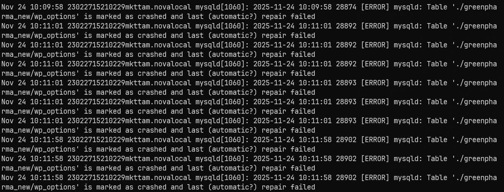
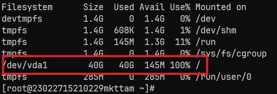
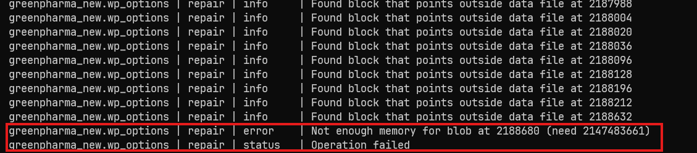
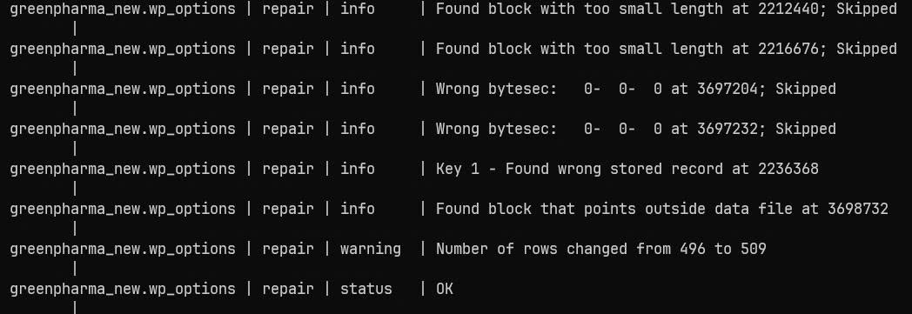

# 1. Dấu hiệu và nguyên nhân

## 1.1 Biểu hiện

Trên web


Trong VPS

```zsh
systemctl status mysql -l
```



Do bảng `wp_options` bị crash do không đủ dung lượng ổ cứng trên VPS dẫn đến lỗi
## 1.2 Nguyên nhân

Có nhiều nguyên nhân nhưng đa phần do:

Thiếu RAM -> tăng dung lượng RAM -> Bước 2.

Nếu thiếu ổ cứng -> Xóa bớt hoặc nới thêm dung lượng -> Bước 2.


# 2. Xử lý

Đầu tiên cần xóa bớt hoặc mở rộng dung lượng, sau đó vào mysql:

```zsh
mysql -u da_admin -p
```

Sau đó thử repair lại bảng bị lỗi

```zsh
use greenpharma_new;
repair table wp_options;
```

Nếu bị lỗi như này -> thiếu RAM, để ý dung lượng RAM cần khoảng 2GB, tạo swap >= RAM cần thiết



Tiến hành tạo Swap. Ví dụ tạo swap 3 GB:

```zsh
sudo dd if=/dev/zero of=/swapfile bs=1M count=3072
sudo chmod 600 /swapfile
sudo mkswap /swapfile
sudo swapon /swapfile
```

Kiểm tra

```zsh
sudo swapon --show
NAME      TYPE SIZE USED PRIO
/swapfile file   3G   0B   -2

free -h
              total        used        free      shared  buff/cache   available
Mem:           2.8G        738M        475M        329M        1.6G        1.6G
Swap:          3.0G          0B        3.0G
```

Để ý dòng cuối như này là xử lý được

```zsh
| greenpharma_new.wp_options | repair | info     | Found block with too small length at 2216676; Skipped                         |
| greenpharma_new.wp_options | repair | info     | Wrong bytesec:   0-  0-  0 at 3697204; Skipped                                |
| greenpharma_new.wp_options | repair | info     | Wrong bytesec:   0-  0-  0 at 3697232; Skipped                                |
| greenpharma_new.wp_options | repair | info     | Key 1 - Found wrong stored record at 2236368                                  |
| greenpharma_new.wp_options | repair | info     | Found block that points outside data file at 3698732                          |
| greenpharma_new.wp_options | repair | warning  | Number of rows changed from 496 to 509                                        |
| greenpharma_new.wp_options | repair | status   | OK  
```



Xóa swap (Bắt buộc sau khi xong việc)

Kiểm tra
```zsh
sudo swapon --show
```

Xóa
```zsh
sudo swapoff /swapfile
sudo rm /swapfile

sudo swapon --show
free -h
```

Kiểm tra lại web.