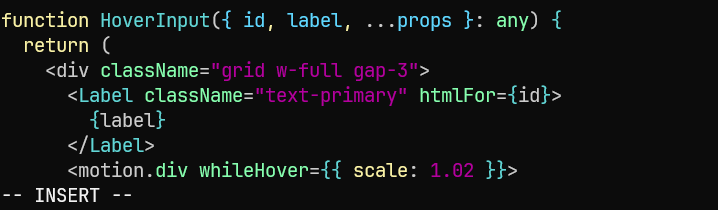
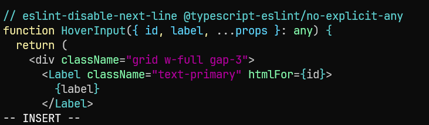
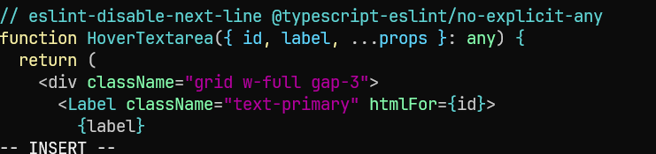
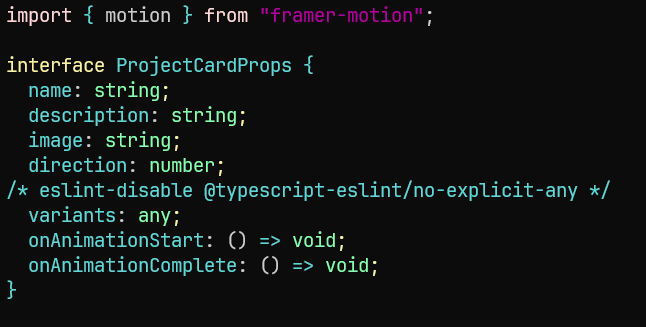
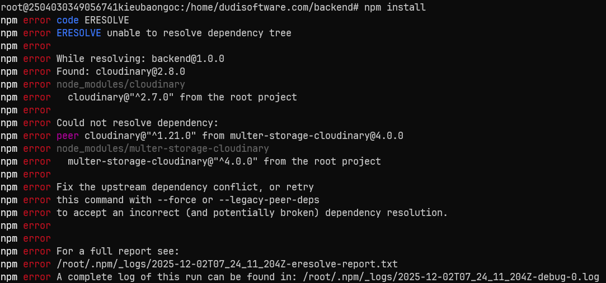

# 1. Tải source lên và giải nén ra

```zsh
scp dudi-landing-page.zip root@103.81.85.29:/home/dudisoftware.com/dudi-landing-page.zip
```

```zsh
unzip dudi-landing-page.zip
```

Cấu hình nginx

```zsh
sudo nano /etc/nginx/sites-available/dudisoftware.conf
```

```zsh
server {
    server_name dudisoftware.com;

    root /home/dudi/public;
    index index.html;

    location / {
        proxy_pass http://localhost:3000;
        proxy_http_version 1.1;
        proxy_set_header Upgrade $http_upgrade;
        proxy_set_header Connection 'upgrade';
        proxy_set_header Host $host;
        proxy_cache_bypass $http_upgrade;
    }

    location = /favicon.ico {
        access_log off;
        log_not_found off;
    }

    listen 443 ssl; # managed by Certbot
    ssl_certificate /etc/letsencrypt/live/dudisoftware.com/fullchain.pem; # managed by Certbot
    ssl_certificate_key /etc/letsencrypt/live/dudisoftware.com/privkey.pem; # managed by Certbot
    include /etc/letsencrypt/options-ssl-nginx.conf; # managed by Certbot
    ssl_dhparam /etc/letsencrypt/ssl-dhparams.pem; # managed by Certbot

}

server {
    if ($host = dudisoftware.com) {
        return 301 https://$host$request_uri;
    } # managed by Certbot


    listen 80;
    server_name dudisoftware.com;
    return 404; # managed by Certbot


}
```

Tạo shortcut

```zsh
sudo ln -s /etc/nginx/sites-available/dudisoftware.conf /etc/nginx/sites-enabled/dudisoftware.conf
```

Kiểm tra cú pháp

```zsh
sudo nginx -t
```

Nếu không lỗi, reload lại nginx

```zsh
sudo systemctl reload nginx
```
# 2. Clear sạch cấu hình build cũ tránh lỗi và install lại

```zsh
rm -rf node_modules package-lock.json yarn.lock
npm cache clean --force
npm install
```

# 3. Build

```zsh
npm run build
```

Xử lý lỗi `Unexpected any. Specify a different type.`

Lỗi này do các ông code bằng chatgpt nên chúng ta fix tạm thời cho khách hàng như sau.

```zsh
./src/sections/contact.tsx
186:46  Error: Unexpected any. Specify a different type.  @typescript-eslint/no-explicit-any
199:49  Error: Unexpected any. Specify a different type.  @typescript-eslint/no-explicit-any
./src/sections/porfolio/display-card.tsx
8:13  Error: Unexpected any. Specify a different type.  @typescript-eslint/no-explicit-any
```

Sửa các file báo lỗi, ở đây là:
`./src/sections/contact.tsx` dòng 186 + dòng 199
`./src/sections/porfolio/display-card.tsx` dòng 8


```zsh
vi ./src/sections/contact.tsx
```

Ở đây dòng 186 là một function, ta đặt dòng này vào trước hàm.

```zsh
// eslint-disable-next-line @typescript-eslint/no-explicit-any
```

Hoặc đặt ở đầu file (không khuyến khích)

```zsh
/* eslint-disable @typescript-eslint/no-explicit-any */
```





Tương tự dòng 199 là một hàm và ta lại đặt trước nó.



Sửa file còn lại

```zsh
vi ./src/sections/porfolio/display-card.tsx
```

Dòng 8 lỗi khai báo biến nên ta thêm vào trước nó.



Sau đó chạy lại

```zsh
npm run build
```

# Đối với loại project tách backend và frontend thành 2 folder riêng



Gặp lỗi này fix tạm bằng cách:

```zsh
npm install --legacy-peer-deps
```

Sau khi build xong frontend. Ta phải trỏ lại trong nginx config.

Tìm find index.html trong thư mục frontend sau khi build xong

```zsh
find . -type f -name 'index.html' | grep -vi 'module'
```

Giả sử tìm thấy file

```zsh
/home/dudisoftware.com/frontend/.next/server/app/index.html
```

Cấu hình nginx

```zsh
sudo nano /etc/nginx/sites-available/dudisoftware.conf
```

```zsh
server {
    server_name dudisoftware.com;

    root /home/dudisoftware.com/frontend/.next/server/app;
    index index.html;

    location / {
        proxy_pass http://localhost:3000;
        proxy_http_version 1.1;
        proxy_set_header Upgrade $http_upgrade;
        proxy_set_header Connection 'upgrade';
        proxy_set_header Host $host;
        proxy_cache_bypass $http_upgrade;
    }

    location = /favicon.ico {
        access_log off;
        log_not_found off;
    }

    listen 443 ssl; # managed by Certbot
    ssl_certificate /etc/letsencrypt/live/dudisoftware.com/fullchain.pem; # managed by Certbot
    ssl_certificate_key /etc/letsencrypt/live/dudisoftware.com/privkey.pem; # managed by Certbot
    include /etc/letsencrypt/options-ssl-nginx.conf; # managed by Certbot
    ssl_dhparam /etc/letsencrypt/ssl-dhparams.pem; # managed by Certbot

}

server {
    if ($host = dudisoftware.com) {
        return 301 https://$host$request_uri;
    } # managed by Certbot


    listen 80;
    server_name dudisoftware.com;
    return 404; # managed by Certbot


}
```

Tạo shortcut

```zsh
sudo ln -s /etc/nginx/sites-available/dudisoftware.conf /etc/nginx/sites-enabled/dudisoftware.conf
```

Kiểm tra cú pháp

```zsh
sudo nginx -t
```

Nếu không lỗi, reload lại nginx

```zsh
sudo systemctl reload nginx
```

# 4. Run

Chạy và test trước trên web

```zsh
npm run start
```

Sau khi chạy ổn, chạy nền bằng pm2

## Đối với loại không chia folder backend và frontend

```zsh
pm2 start npm --name "dudi-app" -- run start
```

## Đối với loại chia

Frontend (trong thư mục frontend)

```zsh
pm2 start npm --name "dudi-app-frontend" -- run start
```

Backend (trong thư mục backend)

```zsh
pm2 start npm --name "dudi-app-backend" -- run start
```

