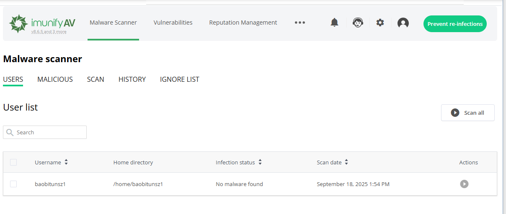
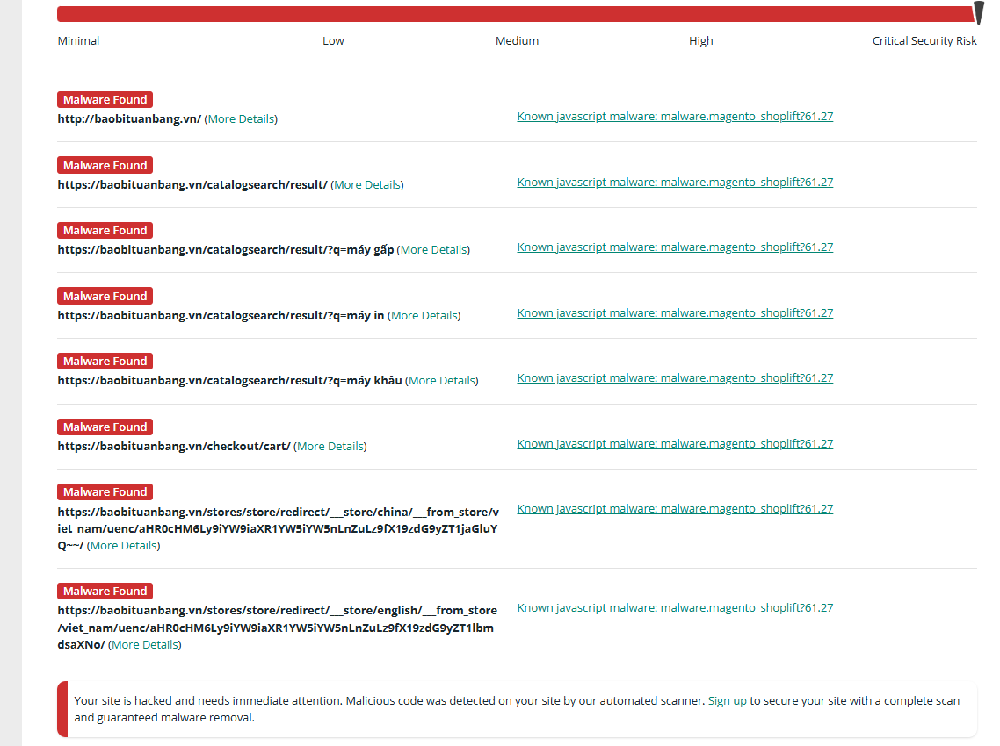
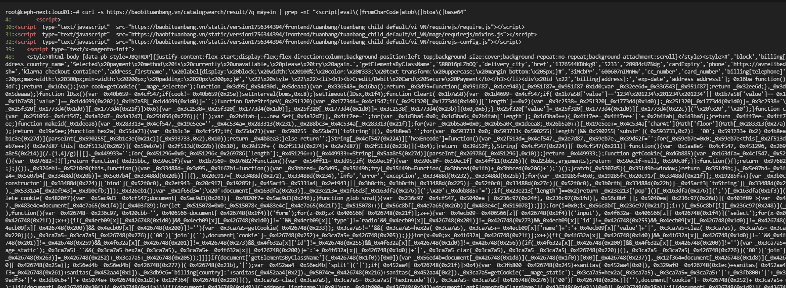
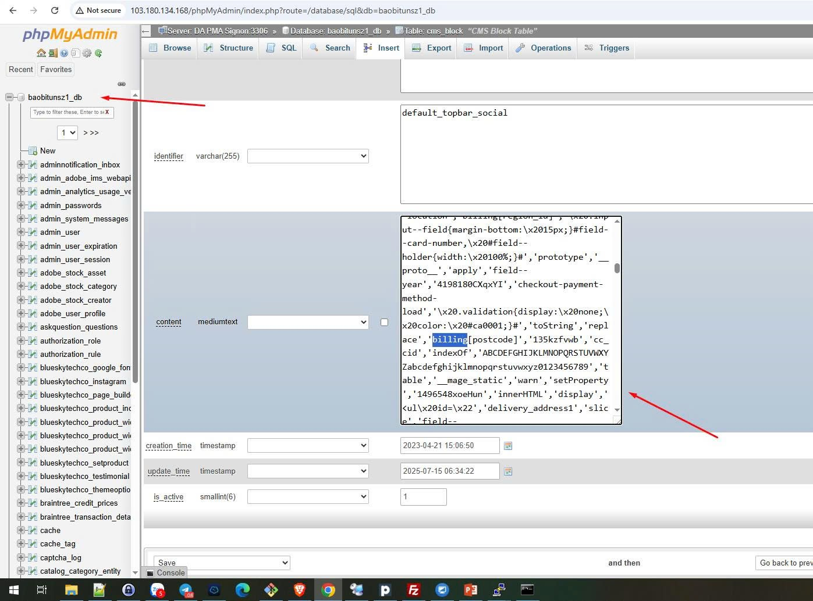
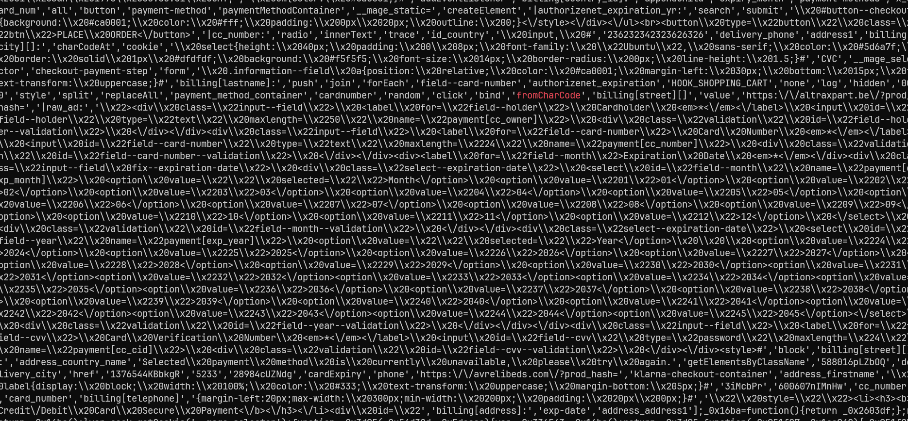

# 1. Quét mã độc bằng Plugin [ImunifyAV Plugin](http://103.180.134.168:2222/CMD_PLUGINS_ADMIN/Imunify) trên DA



# 2. Kiểm tra bằng Virustotal

# 3. Kiểm tra bằng [sucuri][https://sitecheck.sucuri.net/]

Ví dụ như này.



# 4. Từ kết quả sucuri, kiểm tra bằng request

## 1. So sánh HTML của trang checkout và trang catalog khi fetch bằng `curl` với user-agent khác (skimmer thường chỉ active cho browser thật):

```zsh
curl -s -A "Mozilla/5.0 (Windows NT 10.0)" https://baobituanbang.vn/checkout/cart/ > checkout.html
curl -s -A "Googlebot/2.1 (+http://www.google.com/bot.html)" https://baobituanbang.vn/checkout/cart/ > checkout_google.html
diff --side-by-side checkout.html checkout_google.html | sed -n '1,200p'
```

## 2. Lấy HTML của `/catalogsearch/result/` (vì Sucuri báo) và tìm `<script`/`eval(`/`atob(`:

```zsh
curl -s https://baobituanbang.vn/catalogsearch/result/?q=máy+in | grep -nE "<script|eval\(|fromCharCode|atob\(|btoa\(|base64"
```

Ví dụ bị nhiễm mã độc



# 5 Kiểm tra database

Kiểm tra trên server (Magento — cần quyền DB / file)

```sql
-- core_config_data (thường bị dùng để chèn script)
SELECT config_id, path, scope, scope_id, value
FROM core_config_data
WHERE value LIKE '%<script%' OR value LIKE '%eval(%' OR value LIKE '%fromCharCode%' OR value LIKE '%atob(%' OR value LIKE '%base64%';

-- cms_block (Magento 2 might store cms blocks in table cms_block and content in cms_block.content or cms_block.store)
SELECT block_id, title, identifier, content
FROM cms_block
WHERE content LIKE '%<script%' OR content LIKE '%eval(%' OR content LIKE '%atob(%' OR content LIKE '%base64%';

-- Nếu Magento1: cms_block.content or core_config_data similarly
```

Ví dụ bị nhiễm mã độc



# 6 **Tìm file JS/PHP lạ trong webroot**:

```zsh
# Tìm các file có pattern obfuscation / eval / base64
grep -R --binary-files=text -nE "eval\(|base64_decode|fromCharCode|atob\(|document\.write\(|setTimeout\(|btoa\(" /var/www/html || true

# Tìm file PHP xuất hiện trong pub/media hoặc upload dirs (backdoor thường được giấu ở media)
find /var/www/html/pub/media -type f -mtime -60 -ls
find /var/www/html -type f -name "*.php" -o -name "*.phtml" | xargs ls -ltr | tail -n 50
```


