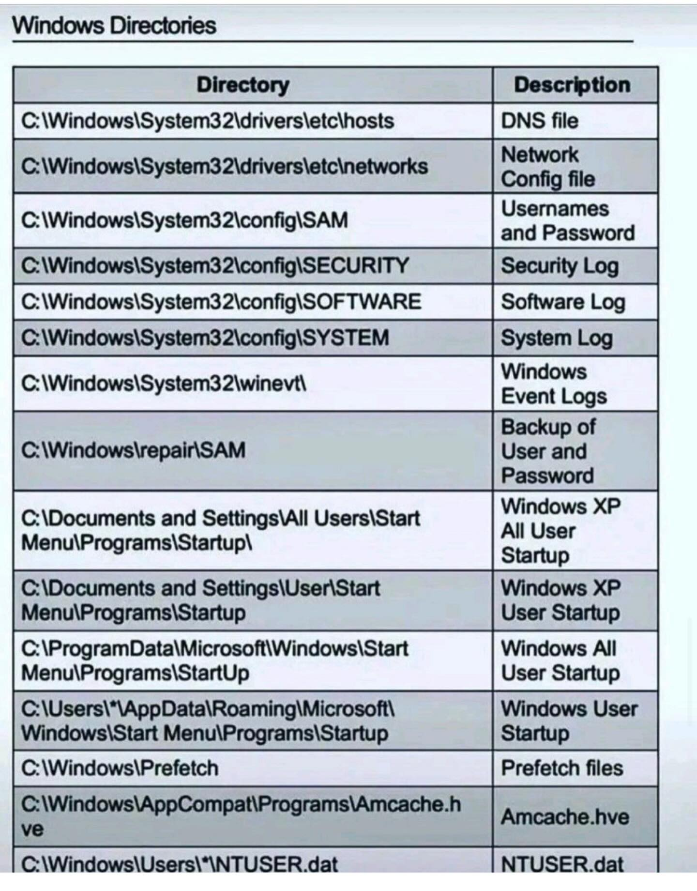

## Tài liệu quản trị Window

### Các thư mục quan  trọng



### Một số lệnh hữu ích
```
manage-bde -status
manage-bde -protectors -disable C:

Xóa cache dns
ipconfig /flushdns (Windows)
```

### Cách tắt tiếng chuông khi ấn tab trên terminal
```
Tạo thư mục profile
New-Item -ItemType Directory -Path (Split-Path $PROFILE) -Force

Tạo profile
New-Item -ItemType File -Path $PROFILE -Force

Truy cập
notepad $PROFILE

Thêm dòng
Set-PSReadLineOption -BellStyle None
```
